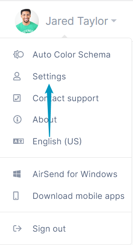
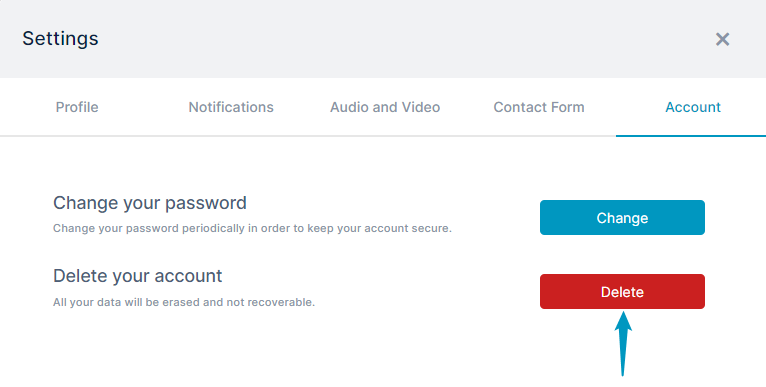
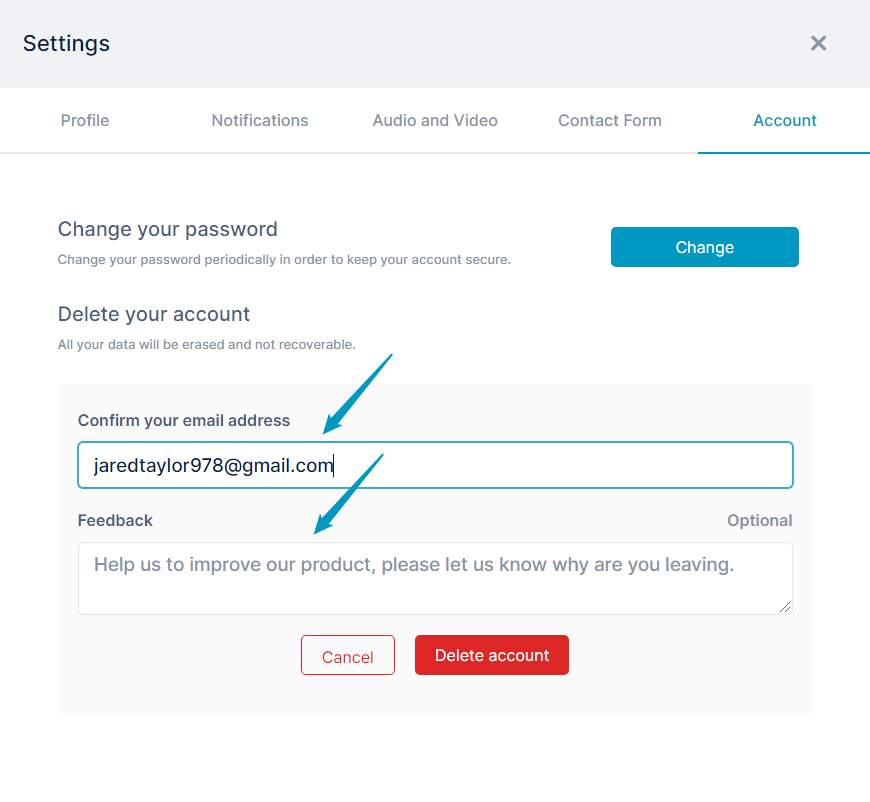

# Deleting Your Account

Any level of user can delete their own AirSend account.

**To delete your AirSend account:**

1.  In the upper-right corner of AirSend, click your username and choose **Settings**.  
      
    
2.  In the **Settings** dialog box, click the **Account** tab.
3.  Click **Delete**.  
      
    The dialog box expands.
4.  Enter your email into **Confirm your email address**.
5.  Enter your reason for leaving in **Feedback**.  
    
6.  Click **Delete account**.  
    Your account is deleted, and you are logged out of AirSend.