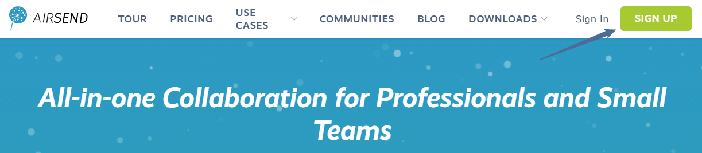
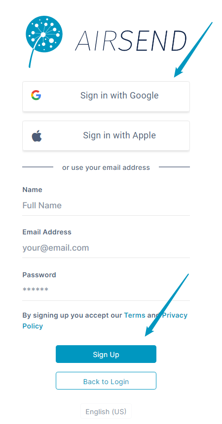
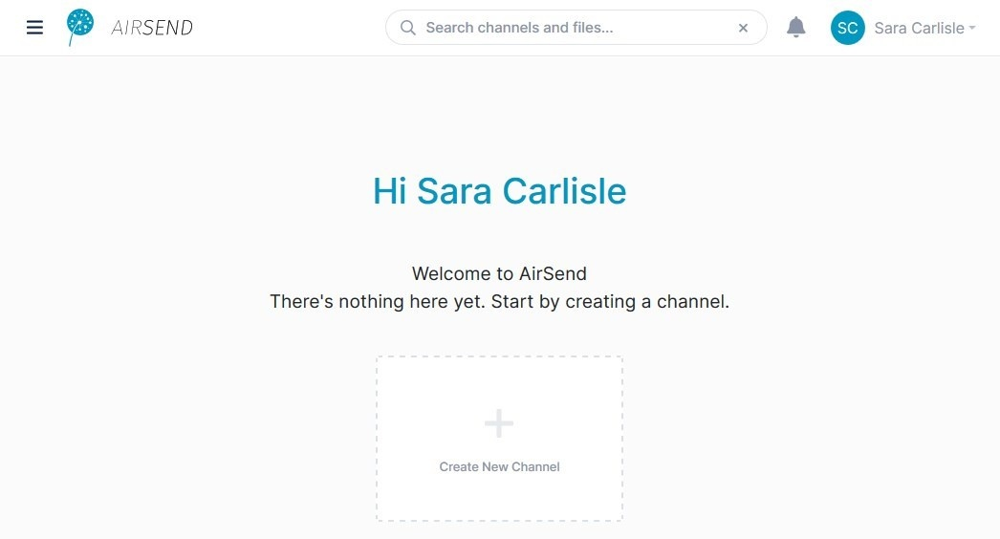

# Setting up an AirSend account

### Open the AirSend website

1.  Open the AirSend website at  [https://www.airsend.io](https://www.airsend.io).
2.  In the upper-right corner, click **SIGN UP**.  
      
      
    
3.  Either sign in with your Google or Apple account or sign up with a new account by filling in your name, email and password and clicking **Sign Up**.  
    

### 2\. Verify your email address

If you sign up using your email address, you will get an email to verify that you really own that email.

-   Click the link in the email to verify your email address  
      
::: info
If you don't get your verification email, please check your spam folder to see if your email provider has flagged it as spam.  
If your email is not in the spam folder, and you are having difficulties, please contact us by sending an email to AirSend support at [airsend.support@codelathe.com](mailto:airsend.support@codelathe.com)
:::

### 3\. Log in to AirSend

-   Once your email is verified, click the **Login** button to sign into AirSend:  
    