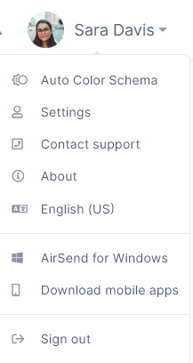
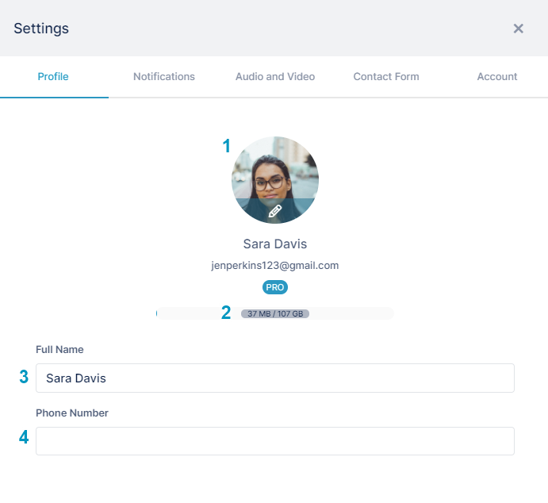
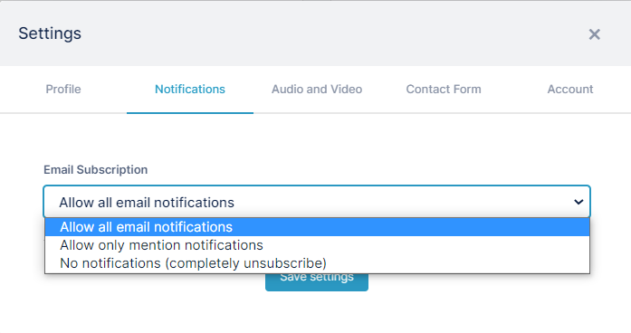
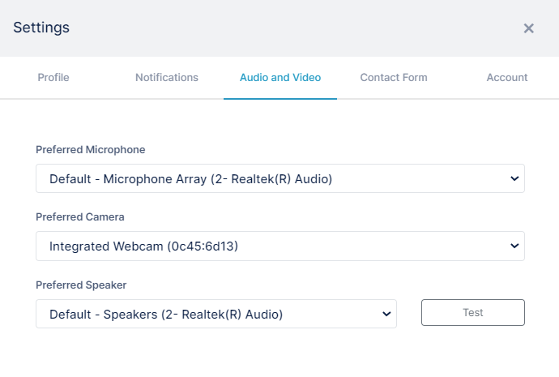
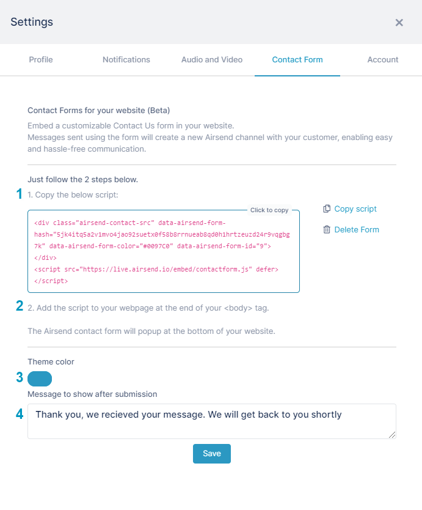
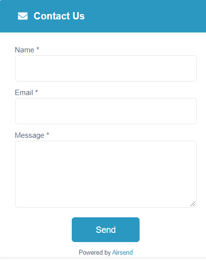
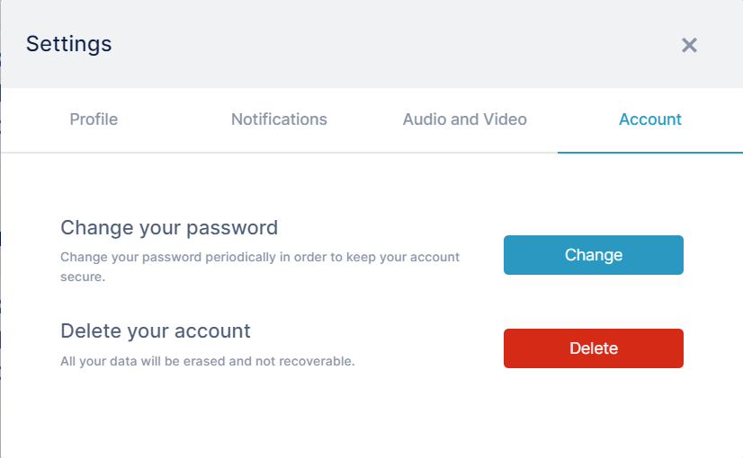

# Settings in AirSend

The user menu lets you add a picture of yourself to your account, set up the types of notifications you receive, and change your password. It also includes links for downloading AirSend mobile apps and contacting AirSend support.

To access the user menu, click the user name in the upper-right corner of the AirSend channel screen.

<table>
  <tbody>
    <tr>
      <th>Menu option</th>
      <th>Description</th>
    </tr>
    <tr>
      <td><strong>Color Schema</strong></td>
      <td>
        
By default, the background setting for AirSend is <strong>Auto Color Schema,</strong> but you may also choose<strong> Light Mode </strong>or<strong> Dark Mode.</strong>

        
<strong>Auto Color Schema </strong>- AirSend screens appear in the mode set for your operating system, either light or dark.

        
<strong>Light Mode</strong> - Screens are displayed with a white background.

        
<strong>Dark Mode</strong> - Screens are displayed with a black background.

      </td>
    </tr>
    <tr>
      <td><strong>Settings</strong></td>
      <td>
        

          
Click to open a Settings dialog box.

          
<strong>Profiles </strong>On the Profiles tab, add and change details about your user profile: 

          <ol>
            <li>Click the circle to upload an image of yourself. Listed below the image is your username, email address, and the version of AirSend that you are using.</li>
            <li>The bar displays the amount of space you have used and your total space quota. Hover your cursor over it to see how many items you have created in your system.</li>
            <li><strong>Full Name</strong> is your display name. You may change it.</li>
            <li>Entering your <strong>Phone Number</strong> is optional.</li>
          </ol>
          
 <strong>Notifications</strong> On the Notifications tab, change the type of notifications you receive. 

          <ul>
            <li>
              In the <strong>Email subscription</strong> drop-down list choose one of the following options and click <strong>Save settings</strong>:  
              <ul>
                <li><strong>Allow all email notifications - </strong>(default)&nbsp;Receive notifications about all activities performed in AirSend that affect your account.&nbsp;</li>
                <li><strong>Allow only mention notifications - </strong>Receive notifications about activities that users perform in a channel if you or a group you are a member of is mentioned. To mention another member in a message, click&nbsp;<strong>@</strong> and begin to type their username. A list of matching names appears and you can select their name.</li>
                <li><strong>No notifications (completely unsubscribe) </strong>- Do not receive notifications about any activities performed in the channel.</li>
              </ul>
            </li>
          </ul>
          
<strong> Contact Form </strong>This tab enables you to copy script for inserting a specialized contact form into a site. When users contact you using the form, an AirSend channel is automatically created where you and the user can address the question or chat. See <a href="/channels/creating-channels-from-contact-forms">Creating Channels from Contact Forms</a>.

          
<strong>Audio and Visual</strong> On the Audio and Visual tab, configure your microphone, camera, and speaker settings for meetings. 

          
To check your speaker sound, click <strong>Test</strong>. Click <strong>Stop</strong> to end the test.

        

        
 

        
<strong>Contact Form </strong>On the Contact Form tab, you can create a Contact Us form that is connected to add to a website. When a user sends you a message through the Contact Us form, a <a href="/messages/direct-messaging">direct messaging channel </a>for you and the user is created in AirSend.

        

        <ol>
          <li>Click <strong>Copy</strong> <strong>script</strong> to the right of the box to add this script to your site. It appears as shown below in step 2.</li>
          <li>In your web page, paste the script above your final body tag (&lt;/body&gt;). The following button appears at the bottom of the rendered web page:    It expands to the following form when a user clicks it:    After a user enters their information and clicks <strong>Send</strong>, AirSend creates a channel with the user and you as members. You are sent an email informing you that the channel has been created, and the user is sent an <a href="/channels/if-youve-been-added-to-a-channel">email informing them that they have been added to an AirSend channel.</a></li>
          <li>You may use a custom color for the button and Contact Us form.</li>
          <li>You may change the default message that appears after the Contact Us form is sent.</li>
        </ol>
        
<strong>Account </strong>On the Account tab, you can change your password and delete your account.

        

          

        

      </td>
    </tr>
    <tr>
      <td><strong>About</strong></td>
      <td>Click to view the latest versions and to access release notes.</td>
    </tr>
    <tr>
      <td><strong>Language</strong></td>
      <td>
        
Click to choose a different language for your user interface.

      </td>
    </tr>
    <tr>
      <td><strong>AirSend for Windows</strong></td>
      <td>Download AirSend to your own Windows computer. You can also download AirSend to OSX and Linux computers. See Download mobile apps, below.</td>
    </tr>
    <tr>
      <td><strong>Download mobile apps</strong></td>
      <td>Click to download iOS and Android versions of AirSend and to access Windows, OSX, and Linux downloads.</td>
    </tr>
    <tr>
      <td><strong>Sign out</strong></td>
      <td>Sign out of AirSend.</td>
    </tr>
  </tbody>
</table>