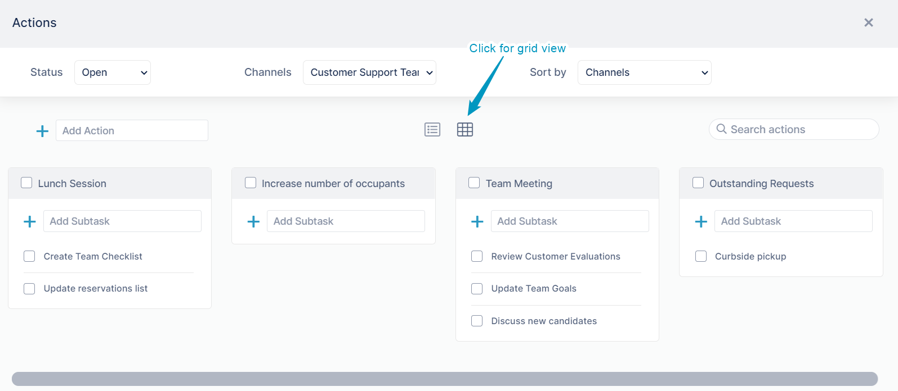

# Actions in the Kanban Board

## Opening the Kanban board

You can view all actions within a channel or across channels in Kanban board view.

**To open the Kanban board:**

1.  In the right panel, click the **Action** tab.
2.  Click the Fullscreen icon.  
      
      
    Kanban view opens.   
      
    
    
 Toggling between Grid and List views

## Toggling between grid and list views

To toggle between grid and list views, click the list  view and grid view icons above the channels.  
  

 Viewing and sorting in the Kanban board

## Viewing and sorting in the Kanban board  

The three drop-down lists at the top of the Kanban board  enable you to view and sort actions in multiple ways:  
  

<table><colgroup><col><col></colgroup><tbody><tr><td>

<strong>Status</strong>

</td><td>
<strong>Options</strong>:
<ul><li><strong>All Actions</strong> - Display all actions in the channel selected in <strong>Channels</strong>.</li><li><strong>Completed</strong> - Display completed actions in the channel selected in <strong>Channels</strong>.</li><li><strong>Open -&nbsp;</strong>Display open (incomplete) actions in the channel selected in <strong>Channels</strong></li></ul></td></tr><tr><td>

<strong>Channels</strong>

</td><td>
<strong>Options</strong>:&nbsp;
<ul><li>Current channel</li><li>Any channel you have access to</li><li><strong>All channels</strong> you have access to</li></ul></td></tr><tr><td>

<strong>Sort by</strong>

</td><td>
<strong>Options:</strong>
<ul><li><strong>Channels</strong>&nbsp;&nbsp;- Sorts tasks by channel in ascending alphabetical order.</li><li><strong>Channels (Descending)</strong>&nbsp;- Sorts tasks by channel in descending alphabetical order.</li><li><strong>Name</strong> - Sorts task by name in ascending order.</li><li><strong>Name (Descending) -&nbsp;</strong>Sorts task by name in descending order.</li><li><strong>Due Date </strong>-&nbsp;Sorts task by due date in ascending order.</li><li><strong>Due Date (Descending)&nbsp;</strong>-&nbsp;Sorts task by due date in descending order.</li></ul></td></tr></tbody></table>

 Searching in the Kanban board

## Searching in the Kanban board

To search for an action in the Kanban board, enter the search term in the search box. AirSend will only search through actions displayed by the current settings in the drop-down lists, and return matching actions with the search term highlighted.  
  

 Add an action or subaction in the Kanban board

Add actions and subactions in list view or grid view the same way you add them in the Actions tab in the right panel. See [Processing actions in a channel](/actions/processing-actions-in-a-channel).

 Processing actions in the Kanban board

## Processing actions in the Kanban board

Most actions in the Kanban board are processed the same way that actions are processed in the Action panel.

In grid view, to access the icons for performing actions, hover over the action card.  

  
In list view, to access the same icons, hover over the row for the action in the list:  

-   To assign a member or add a due date to an action, see the video on the page [Actions in AirSend](/actions/intro).
-   To move an action to another channel, edit action details, complete an action, or delete an action, see [Processing actions in a channel](/actions/processing-actions-in-a-channel).

 Rearranging actions and subactions in the Kanban board

## Rearranging actions and subactions in the Kanban board

To rearrange an action or a subaction in the Kanban board's grid view, click its grab bar and drag it to the new location.  

To change the position of an action in the grid:  

To move an action and make it a subaction

To move a subaction and make it an action  
