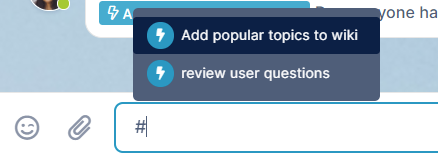
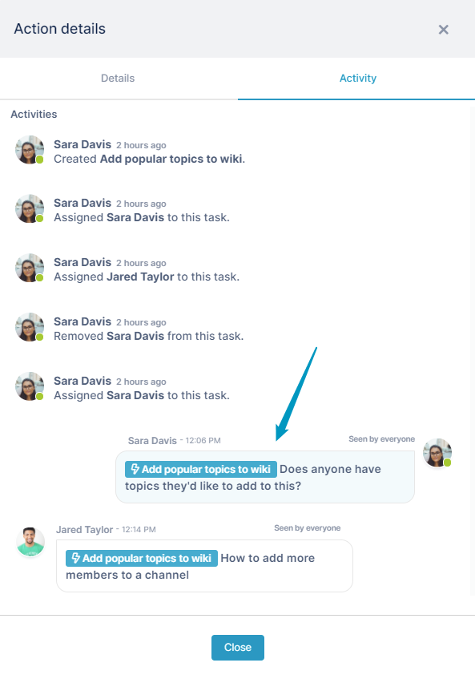

# Action-Related Messages

When you reference an action in a message:

-   Channel members who read the message know that it is connected to the action.
-   Channel members who view the action's activity can see the message.

### To reference an action in a message

1.  Enter # in the messaging input box.  
    A list of the actions for the channel pops up.  
      
      
    
2.  Click one of the actions to add it to the message as a reference.
3.  Type in your message after the reference.  
      
      
    After you click Enter, the message with the reference to the action appears in the main message area. 
4.  Click the action link.  
      
      
    The Action Detail window opens to the Activity tab, which displays all of the messages tagged with the action as well as any other activities related to the action.  
    