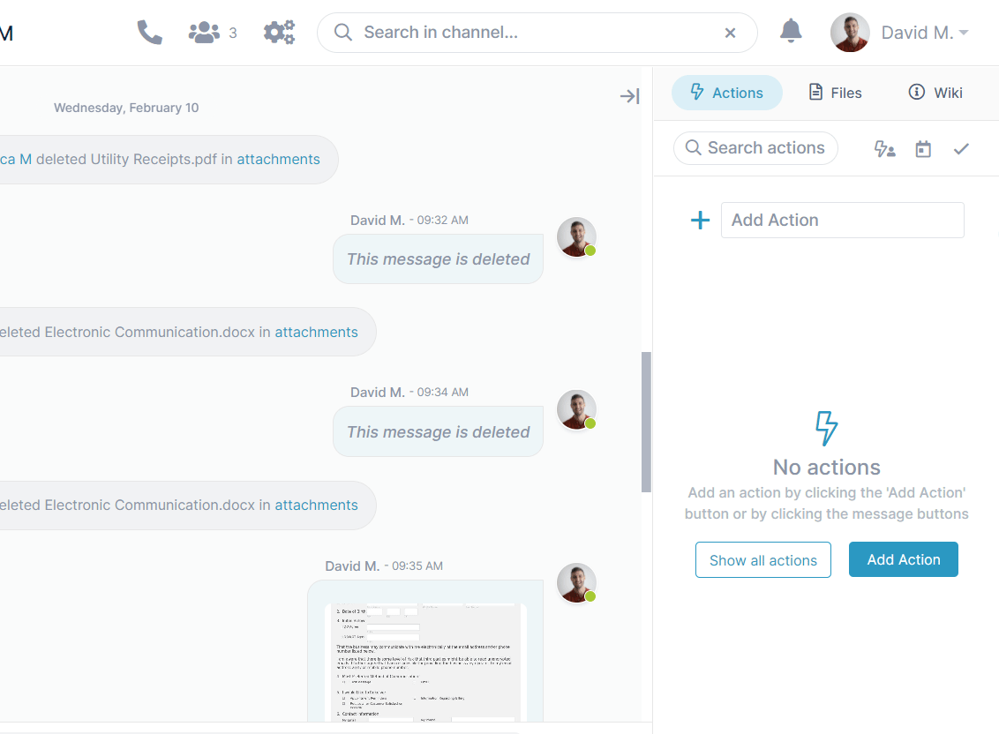
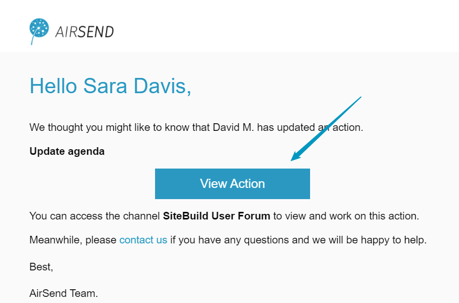
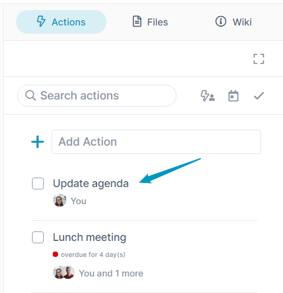
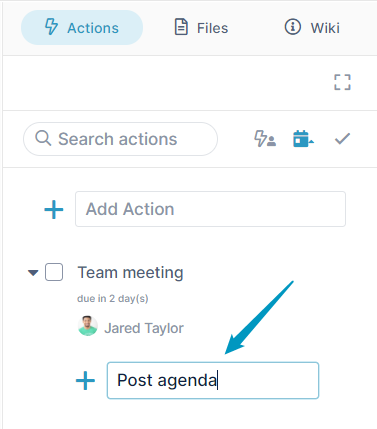
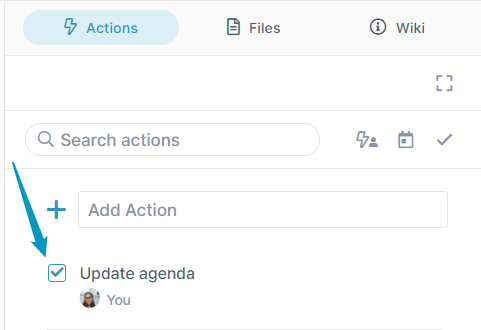
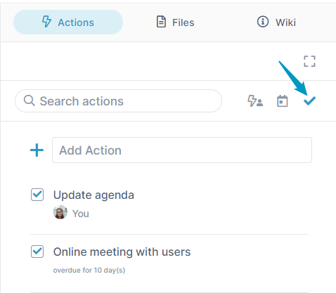
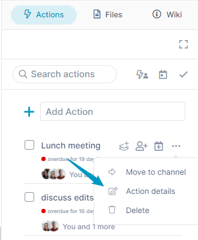
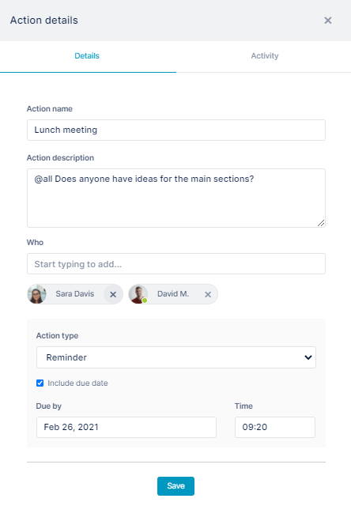
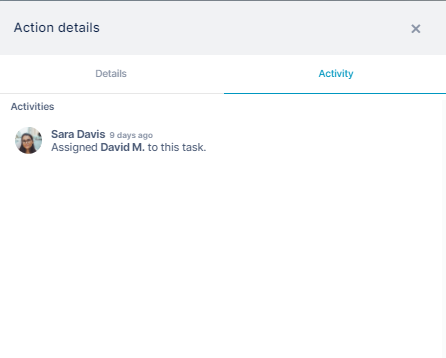
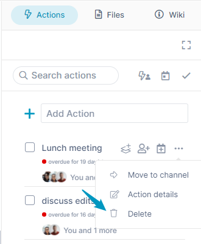

# Processing actions in a channel

The Adding Actions video on the page [Files, Actions, and Wiki](/files-actions-and-wiki) shows you how to add an action and assign a user and due date.

This page shows you how to perform additional functions related to actions.

## Adding actions

In the Actions tab of the right panel, schedule actions or tasks to be completed. After you create an action, you can assign it to specific users, add a due date, or add subtasks. When an action is complete, check it to remove it from your list of incomplete actions.  
  
::: info Note
Your [member type](/members/member-types) in a channel must be full collaborator or higher to add actions.  
::: 

When someone creates an action in an AirSend channel and assigns it to you, you will receive an email such as:  

Inside the email is a message telling you which channel the task has been created in and a link to the channel view showing the task.  

## To view the action

1.  If you are reading an email that has informed you about a new action, click **View** **Action**.  
    The channel opens in AirSend, and the Actions tab of the right panel is selected.  
    OR  
    If you are already in AirSend, open the channel and click the Actions tab in the right panel.  
    The new action is listed and shows any details, such as the assignees, below it.  
    
    
    If an action has been assigned a due date, and the date is overdue, a red dot with an overdue notice appears below the action.
    

## To add a subtask

1.  In the Action tab, hover over the action and click the Subtask icon.  
      
      
    
2.  In the text box that opens, add a name for the subtask.  
      
      
    The subtask is added.
3.  Hover over it, you will see the options for assigning a user or a date or performing other actions on it.

## To complete an action

1.  Open the channel in AirSend, and click the Actions tab in the right panel.
2.  Click the check box next to the action that you want to mark complete.  
    
    You cannot complete an action until you mark all of its subactions as complete.
    
      
      
    The action disappears, but can be viewed with other completed actions (see below).  
    

## To view completed actions

To view actions that have been checked as completed, click the check icon across from the **Search actions** box.  
  
Click it again to view only incomplete actions.

## To move an action to another channel

You can move an action to another channel, but only if users assigned to the action are also members of that channel. The following video shows you how.

<video src="../assets/actions/processing-actions-in-a-channel/move-action.mp4" muted controls></video>

## To edit an action

1.  Open the channel in AirSend, and click the Actions tab in the right panel.
2.  Click the three dots to the right of the action that you want to edit, and choose **Edit Details**.  
      
      
    The Action details dialog box opens to the Details tab.  
      
    
3.  On the Details tab, make any changes and click **Save**.  
    
4.  Click the Activity tab to view the action history:  
      
    

## To delete an action

1.  Open the channel in AirSend, and click the Actions tab in the right panel.
2.  Click the three dots to the right of the action.  
      
      
    
3.  Click **Delete**.  
    The action disappears from the Actions tab.