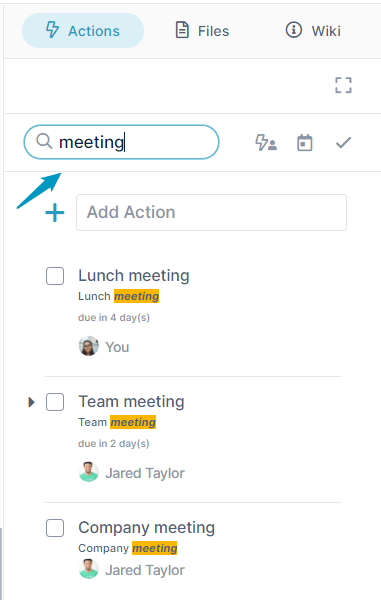
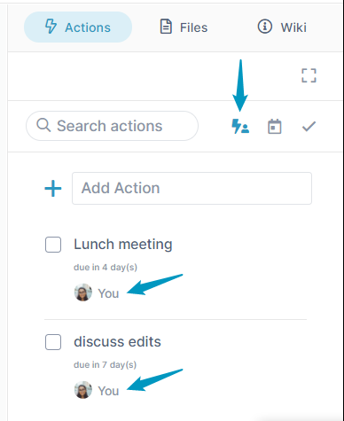
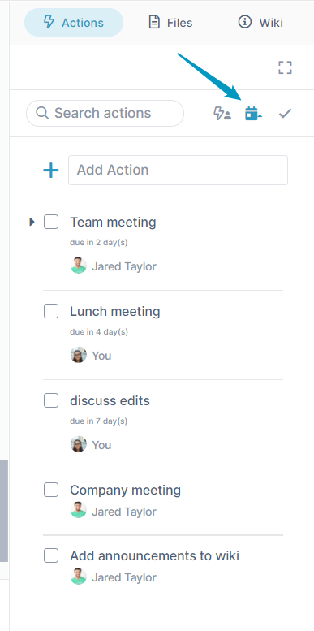
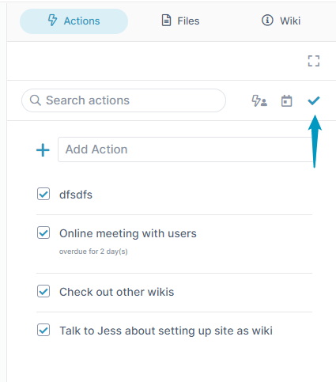

# Viewing, Searching, and Sorting in the Action Tab

There are various ways you can sort, filter, and search for actions in a channel in its Action tab.

## To search for an action

To search for an action, enter the search term in the search box.  
  

## To toggle the view between your actions and all actions

1.  Click the assignee icon to view only actions assigned to you.  
      
    
2.  Click the icon again to view all actions.

## To sort actions by due date

1.  Click the due date icon.
2.  To switch between ascending and descending sort by due date, click the due date icon again.  
      
    

  

## To toggle between incomplete and completed actions

1.  To view incomplete actions, click the check icon.
2.  To view completed actions again, click the check icon again.  
    