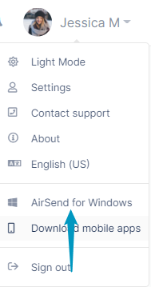
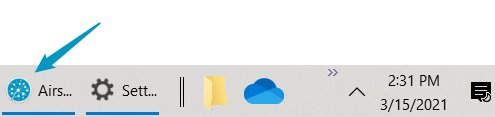
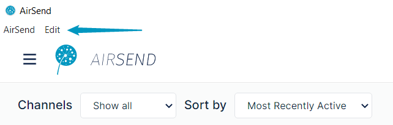
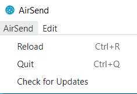
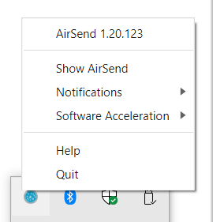

# AirSend desktop app

Using the AirSend desktop app gives you the option of configuring AirSend as a startup application as well as the ability to run AirSend in the background while receiving native system notifications.

You can access the download link either at [AirSend.io](https://airsend.io) or from the online version in the  
drop-down list next to your username.

  
  

The desktop app has the same functionality as the online version, but you access it by clicking an icon on your desktop or in your taskbar.  

### AirSend and Edit menus

It also includes AirSend and Edit menus in the upper left corner of the screen that include actions such as checking for updates and copying and pasting:  
  
  
  
The AirSend menu includes options for reloading the screen, quitting AirSend, and checking AirSend for updates:  
  
  

### Desktop tray right-click menu 

When you open the desktop app, an AirSend icon appears in the desktop tray.Right-click on the icon for several additional actions:  
  
  
In addition to displaying the AirSend version, the right-click menu includes the following actions:

<table><colgroup><col><col></colgroup><tbody><tr><td><strong>Show AirSend Notifications</strong></td><td><strong>Allow </strong>(default) or <strong>Mute</strong> AirSend pop-up notifications.</td></tr><tr><td><strong>Software Acceleration</strong></td><td><strong>Enable</strong>&nbsp;or <strong>Disable </strong>(default)&nbsp;software acceleration. Enabling software acceleration is recommended to ensure the fastest rendering in your user interface.</td></tr><tr><td><strong>Help</strong></td><td>Open the&nbsp;<strong>AirSend Support</strong> page.</td></tr><tr><td><strong>Quit</strong></td><td>Quit AirSend session.</td></tr></tbody></table>