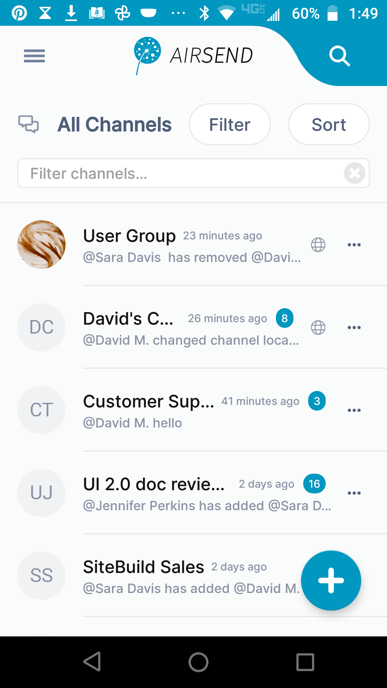
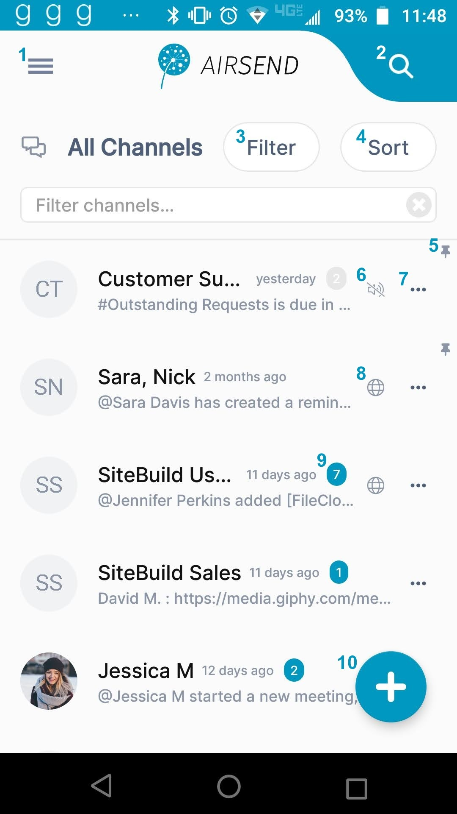
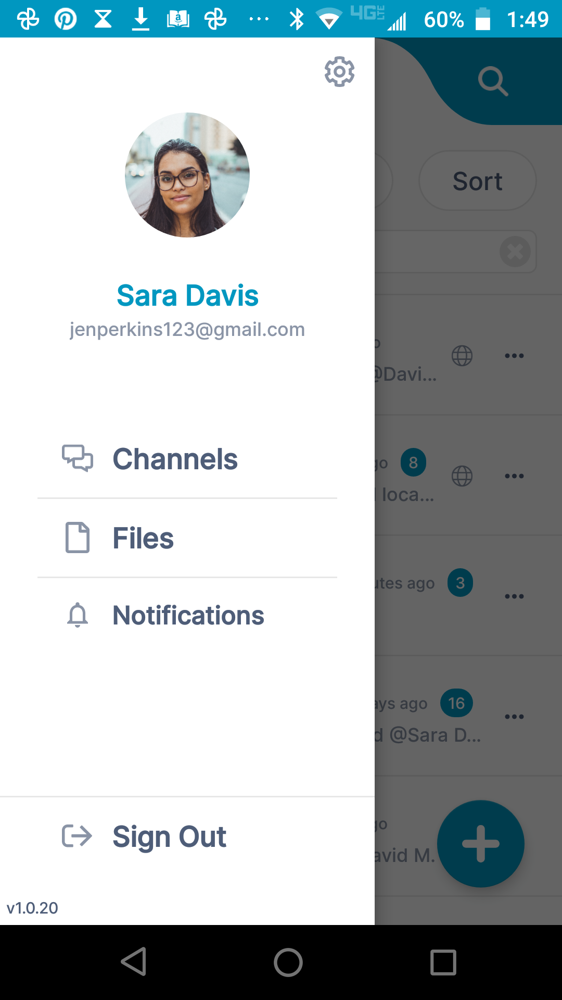
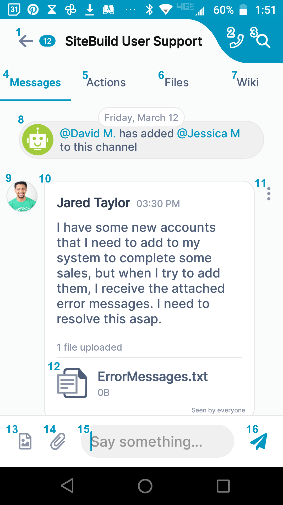
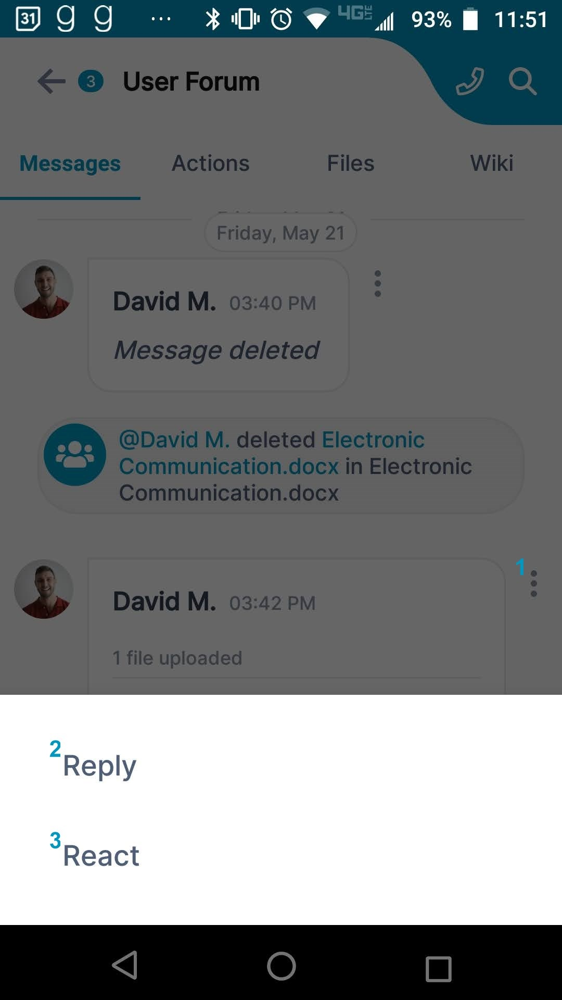
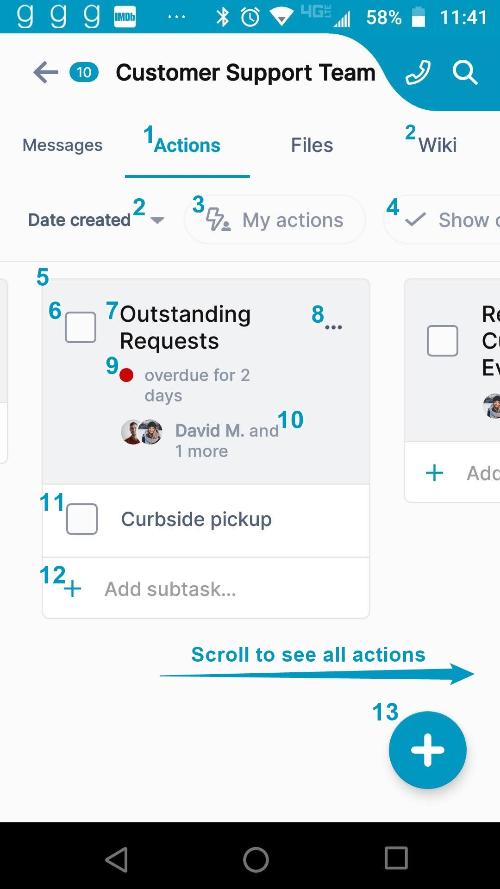
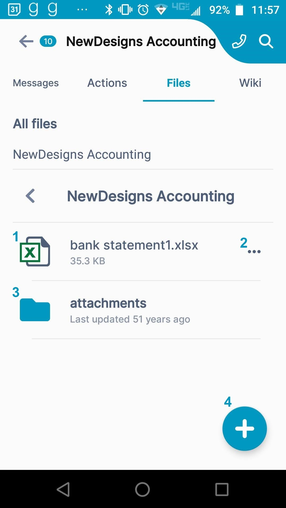

# AirSend on Android

The AirSend Android app enables you to use your AirSend account on your Android phone in the same way you use it on your desktop computer. For the most part, you can refer to the general AirSend help topics for information about using  AirSend features on your Android device.

For help installing and logging in to AirSend from your phone and finding features that are located in different places on the mobile interface, refer to this page. 

### Installing the AirSend Android app and creating an account 

1.  From the Google Play Store, [download the AirSend app](https://play.google.com/store/apps/details?id=com.airsend.android).
2.  Open the Android app.
3.  If you already have an AirSend account, enter your email address and password or sign in with Google.  
    If you do not have an AirSend account, tap **Sign up**, and enter the sign-up information.

### Logging in to AirSend from your Android phone

1.  After you have installed the AirSend app and created an account if you need one, open it on your phone.
2.  Enter your email address and password.
3.  Tap **Login**.  
    If you are not a member of any channels, the initial screen is empty; otherwise, it lists each channel you are a member of.   
    

### Using the Android dashboard

<table><colgroup><col><col></colgroup><tbody><tr><td>

</td><td><ol><li><strong><strong>Triple-bar icon&nbsp;</strong></strong>- Tap this icon to open the navigation panel. See <a href="#navigation-panel">Navigation panel</a>, below.</li><li><strong>Search </strong>- Tap and enter a term to search for in channel names, messages, file names, actions, and usernames.</li><li><strong>Filter</strong> - Tap and choose to show all channels, active channels, or closed channels.</li><li><strong>Sort</strong> - Tap to sort channels by one of the following options: <ul><li>Most recently active</li><li>Least recently active</li><li>New channels</li><li>Oldest first</li></ul></li><li><strong>Pin icon</strong> - Pin a channel to move it to the top of your list.</li><li><strong>Mute icon</strong> -&nbsp;The icon showing a slashed bell indicates that notifications in the channel have been muted. That means that you are not notified by a sound when there is activity in the channel. The gray background for the notification counter also indicates that notifications are muted.</li><li>
<strong><strong>Channel options </strong></strong>- Options displayed vary for channel owner and members who are not the owner.

<table><tbody><tr><th>Option</th><th>Visible to owner?</th><th>Visible to non-owner?</th></tr><tr><td><strong>Mark all as read, </strong>appears if there are unread messages&nbsp;</td><td>yes</td><td>yes</td></tr><tr><td><strong>Mute channel</strong></td><td>yes</td><td>yes</td></tr><tr><td><strong>Duplicate channel</strong></td><td>yes</td><td> </td></tr><tr><td><strong>Close</strong></td><td>yes</td><td> </td></tr><tr><td><strong>Delete</strong></td><td>yes</td><td> </td></tr><tr><td><strong>Leave channel</strong></td><td> </td><td>yes</td></tr><tr><td><strong>Members</strong></td><td>view, add, delete, change role, approve</td><td>view</td></tr><tr><td><strong>Settings&nbsp;</strong></td><td>channel name, description, email, permissions, link</td><td>
channel name, description, email
</td></tr></tbody></table>
</li><li>Indicates that this is a public channel. Tap to copy its url and send it to users for viewing and joining.</li><li>Number of unread notifications in channel.&nbsp; To remove this alert, either tap&nbsp; the icon and view the messages, open the channel and view the messages, or tap the <strong>...</strong> icon, and select <strong>Mark all as read</strong>.</li><li>Create a new channel.</li></ol></td></tr></tbody></table>

**Navigation panel  
**

<table><colgroup><col><col></colgroup><tbody><tr><td>

</td><td>
You can access different views of the Android AirSend app from the navigation panel.&nbsp; <strong>Channels</strong> view is described above under <a href="/#">Using the Android Dashboard</a>.&nbsp;
<ul><li>For information about Files view, see <a href="/#">View a Channel's Files in the Android App</a>, below.</li><li>For information about Notifications view, see information about the Alerts icon in&nbsp;<a href="/notifications">Notifications in AirSend</a>.</li></ul></td></tr></tbody></table>

### **Viewing a channel's messages in the Android app**

<table><colgroup><col><col></colgroup><tbody><tr><td>

</td><td><ol><li><strong>Back</strong> button - Tap to go back to the dashboard.</li><li>Tap to start a meeting.</li><li>Search in this channel's messages, actions, file names, and usernames.</li><li><strong>Messages</strong> tab - Tap to view and add messages.&nbsp;</li><li><strong>Actions</strong> tab -&nbsp;Tap to view and add actions that all members of the channel can see.&nbsp;</li><li><strong>Files</strong> tab - Tap to attach files to the channel and access files that other users have added to the channel.&nbsp;</li><li><strong>Wiki</strong> tab -&nbsp; Tap to access a section for displaying important information such as instructions, updates, and frequently accessed data. See&nbsp;<a href="/wiki/intro">Wiki: Displaying Important Information</a>.</li><li><strong>Notification</strong>.</li><li><strong>Channel member&nbsp;</strong>who posted the message.</li><li><strong>Message</strong>.</li><li>Tap to reply or react to the message (see the screenshot below).</li><li>File attached to message.</li><li><strong>Image </strong>button - Tap to attach an image to a message.&nbsp;The image is saved to the channel and&nbsp;is accessible from <strong>Attachments</strong> folder in the&nbsp;<strong>Files</strong>&nbsp;tab.</li><li><strong>Attachment</strong> button - Tap to add an attachment to a message.&nbsp;The attachment is saved to the channel and&nbsp;is accessible from the&nbsp;<strong>Attachments</strong> folder in the&nbsp;<strong>Files</strong>&nbsp;tab.</li><li><strong>Message input </strong>box&nbsp;- Type in your message here, then tap Enter or the send icon.</li><li><strong>Send</strong>&nbsp;icon&nbsp;- Tap to send your message.&nbsp;</li></ol></td></tr><tr><td>

<strong>Reply/React to a message  </strong>

</td><td>
 

To reply or react to a message, tap the vertical 3-dot icon next to the comment.
<ol><li><strong>3-dot icon</strong>&nbsp;- Tap to open the&nbsp;<strong>Reply</strong>&nbsp;and&nbsp;<strong>React</strong>&nbsp;buttons at the bottom of the screen.</li><li><strong>Reply button</strong>&nbsp;- Tap to open a message box for replying to this message.</li><li><strong>React button -&nbsp;</strong>Tap to select an emoji for reacting to this message.</li></ol></td></tr></tbody></table>

### View a channel's actions in the Android app

<table><colgroup><col><col></colgroup><tbody><tr><td>

</td><td><ol><li><strong>Actions tab</strong>&nbsp;- Tap to open the Actions screen.</li><li><strong>Date created</strong>&nbsp;- Tap to toggle sort between&nbsp;<strong>Date created</strong> and&nbsp;<strong>Date due</strong>.</li><li><strong>My actions</strong>&nbsp;- Only show actions that I am assigned to.</li><li><strong>Show completed</strong>&nbsp;- Show completed actions only. To complete an action, check its box. To mark it incomplete again, uncheck it.</li><li><strong>Action</strong>&nbsp;- The checkbox and title shown in the shaded portion represent an action.&nbsp;</li><li><strong>Checkbox</strong>&nbsp;- When unchecked, action is incomplete; when checked, action is completed.</li><li><strong>Action title</strong></li><li><strong>3-dot icon -&nbsp;</strong>Tap to open menu with options for moving the action to another channel, adding or editing action details, and deleting the action.</li><li><strong>Due/Overdue date</strong>&nbsp;- Action's due date. Yellow dot indicates that action is due in the future, red dot indicates that action is overdue, and green dot indicates that action was completed within the due date (and only appears when completed actions are viewed).</li><li><strong>Members</strong>&nbsp;- Members assigned to action.</li><li><strong>Subtask</strong>- Actions with checkboxes appearing in the white area under an action are subtasks. They have the same features as actions.</li><li><strong>Add subtask button</strong>&nbsp;- Tap to add a subtask to the action.</li><li><strong>Add action button</strong>&nbsp;- Tap&nbsp; to add a new action.</li></ol>
For help with actions, see&nbsp;<a href="/actions/intro">Actions in AirSend</a>.
</td></tr></tbody></table>

### View a channel's files in the Android app

<table><colgroup><col><col></colgroup><tbody><tr><td>

</td><td><ol><li><strong>File</strong> - File uploaded to channel.</li><li><strong>3-dot icon</strong> - Tap to open menu with options for opening, downloading, copying, moving, and deleting file.</li><li><strong>Attachments folder</strong> -&nbsp; Default folder where files dropped into messages are stored.</li><li><strong>Plus icon</strong> - Tap to upload a file or create a new folder.</li></ol>
For more help, see&nbsp;<a href="/files">Files</a>.
</td></tr></tbody></table>