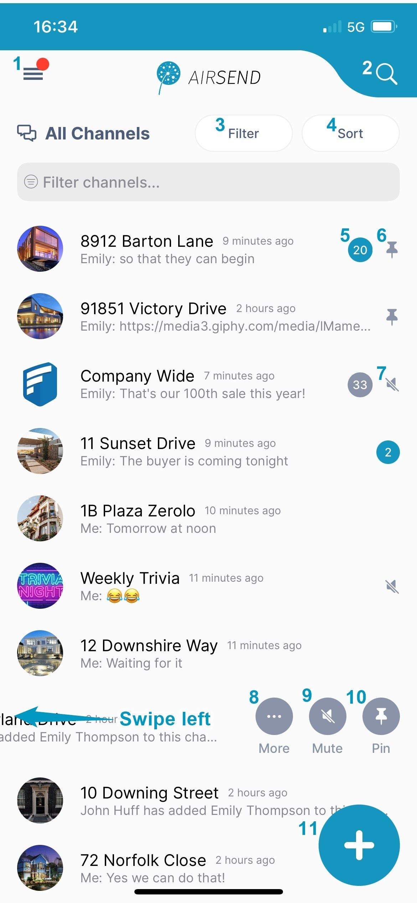
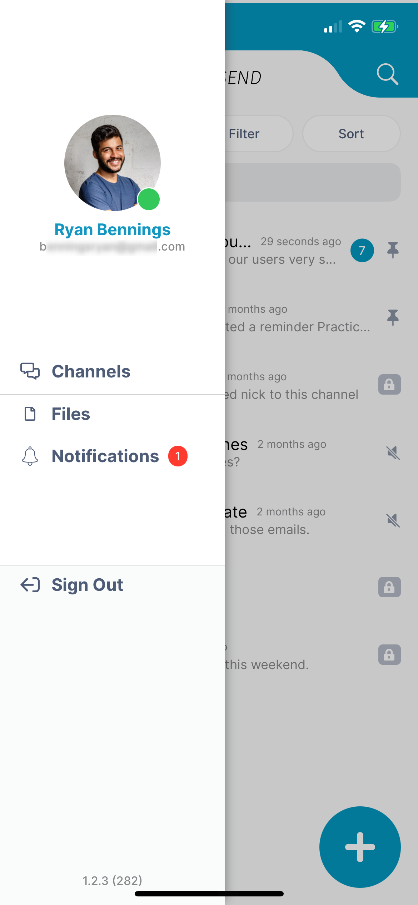
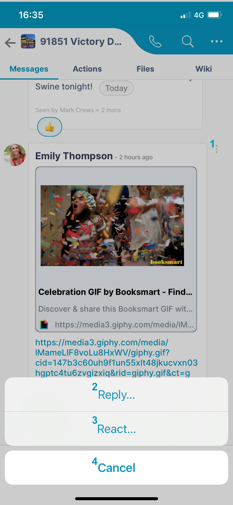

# AirSend on iOS

The AirSend iOS app enables you to use your AirSend account on your iOS device in the same way you use it on your desktop computer. For the most part, you can refer to the general AirSend help topics for information about using AirSend features on your iOS device.

For help installing and logging in to AirSend from your phone and finding features that are located in different places on the mobile interface, refer to this page. 

### Installing the AirSend iOS app and creating an account 

1.  From the Apple Store, download the AirSend app.
2.  Open the AirSend app.
3.  If you already have an AirSend account, enter your email address and password to sign in.  
    If you do not have an AirSend account, tap **Sign up**, and enter the sign-up information.

### Logging in to AirSend from your iOS device

1.  After you have installed the AirSend app and created an account if you need one, open it on your phone.
2.  Enter your email address and password.
3.  Tap **Login**.  
    If you are not a member of any channels, the initial screen is empty; otherwise, it lists each channel you own or are a member of.   
     

### Using the iOS dashboard

<table><colgroup><col><col></colgroup><tbody><tr><td>

</td><td><ol><li><strong><strong>Triple-bar icon&nbsp;</strong></strong>- Tap this icon to open the navigation panel. See&nbsp;<a href="/#">Navigation panel</a>, below.</li><li><strong>Search&nbsp;</strong>- Tap and enter a term to search for in channel names, messages, file names, actions, and usernames.</li><li><strong>Filter</strong>&nbsp;- Tap and choose to show all channels, active channels, or closed channels.</li><li><strong>Sort</strong>&nbsp;- Tap to sort channels by one of the following options: <ul><li>Most recently active channel</li><li>Least recently active channel</li><li>Newest to oldest channel</li><li>Oldest to newest channel</li></ul></li><li><strong>Number&nbsp;</strong>– Number of unread notifications in channel.</li><li><strong>Pin icon&nbsp;</strong>- Pin a channel to move it to the top of your list.</li><li>
<strong>Mute icon</strong>- The icon showing a slashed bell indicates that notifications in the channel have been muted. That means that you are not notified by a sound when there is activity in the channel. The gray background for the notification counter also indicates that notifications are muted.  <strong>Swipe left on a channel to view the More/Mute/Pin icons.</strong>
</li><li>
<strong>More</strong> - More channel options.

<table><tbody><tr><th>Option</th><th>Visible to owner?</th><th>Visible to non-owner?</th></tr><tr><td><strong>Duplicate channel</strong></td><td>yes</td><td> </td></tr><tr><td><strong>Close</strong></td><td>yes</td><td> </td></tr><tr><td><strong>Delete</strong></td><td>yes</td><td> </td></tr><tr><td><strong>Leave channel</strong></td><td> </td><td>yes</td></tr><tr><td><strong>Members</strong></td><td>view, add, delete</td><td>view</td></tr><tr><td><strong>Settings&nbsp;</strong></td><td>channel name, description, email</td><td>
channel name, description, email
</td></tr></tbody></table>
</li><li><strong>Mute</strong>&nbsp;<strong>button</strong> - Mute/unmute notifications for the channel. When you mute a channel the slashed bell icon appears next to it, and its notification count is shown with a gray background.</li><li><strong>Pin button</strong> - Pin/unpin channels. When you pin a channel, the pin icon appears next to it, and it appears at the top of the channel list with other pinned channels.</li><li>
<strong>Add icon</strong> - Tap&nbsp;to create a new channel.
</li></ol></td></tr></tbody></table>

### **Navigation panel**

<table><colgroup><col><col></colgroup><tbody><tr><td>

</td><td>
You can access different views of the iOS AirSend app from the navigation panel.&nbsp;&nbsp;<strong>Channels</strong>&nbsp;view is described above under&nbsp;<a href="/#">Using the IOS dashboard</a>.&nbsp;
<ul><li>For information about Files view, see <a href="/files/intro">View a channel's files in the iOS app</a>, below.</li><li>For information about Notifications view, see information about the Alerts icon in&nbsp;<a href="/notifications">Notifications in AirSend</a>.</li></ul></td></tr></tbody></table>

### **Viewing a channel's messages in the iOS app**

<table><colgroup><col><col></colgroup><tbody><tr><td>

</td><td>
<ol><li><strong>Back</strong>&nbsp;button - Tap to go back to the dashboard.</li><li>Tap to start a meeting.</li><li>Search in this channel's messages, actions, file names, and usernames.</li><li>Tap to access channel settings.</li><li><strong>Messages</strong>&nbsp;tab - Tap to view and add messages.&nbsp;</li><li><strong>Actions</strong>&nbsp;tab -&nbsp;Tap to view and add actions that all members of the channel can see. See&nbsp;<a href="/actions/intro">Actions in AirSend</a>.</li><li><strong>Files</strong>&nbsp;tab - Tap to attach files to the channel and access files that other users have added to the channel.&nbsp;</li><li><strong>Wiki</strong>&nbsp;tab -&nbsp; Tap to access a section for displaying important information such as instructions, updates, and frequently accessed data. See&nbsp;<a href="/wiki/intro">Wiki: Displaying Important Information</a>.</li><li><strong>Message</strong></li><li><strong>Image of channel member&nbsp;</strong>who posted the message. The green dot indicates that the member is active on AirSend.</li><li><strong>Reaction&nbsp;</strong>to message.&nbsp;</li><li><strong>Image</strong> included in message.</li><li><strong>Right arrow - </strong>Opens camera, image, and attachment icons.&nbsp; </li><li><strong>Message input&nbsp;</strong>box&nbsp;- Type in your message here, then tap Enter or the send icon.</li><li><strong>Send</strong>&nbsp;icon&nbsp;- Tap to send your message.</li></ol>
 

</td></tr><tr><td>
<h4> Reply/React to a message </h4>
</td><td>
 

To reply or react to a message , tap&nbsp;the vertical 3-dot icon next to the comment.
<ol><li><strong>3-dot icon</strong> - Tap to open the <strong>Reply</strong> and <strong>React</strong> buttons at the bottom of the screen.</li><li><strong>Reply button</strong> - Tap to open a message box for replying to this message.</li><li><strong>React button - </strong>Tap to select an emoji for reacting to this message.</li><li><strong>Cancel button</strong> - Tap to return without replying or reacting.</li></ol>
 
</td></tr></tbody></table>

### **  

View a channel's actions in the iOS app**

<table><colgroup><col><col></colgroup><tbody><tr><td>

</td><td><ol><li><strong>Actions tab</strong> - Tap to open the Actions screen.</li><li><strong>Date created</strong> -&nbsp;Tap to toggle sort between&nbsp;<strong>Date created</strong>&nbsp;and&nbsp;<strong>Date due</strong>.</li><li><strong>My actions</strong> - Only show actions that I am assigned to.</li><li><strong>Show completed</strong> - Show completed actions only. To complete an action, check its box. To mark it incomplete again, uncheck it.</li><li><strong>Action</strong> - The checkbox and title shown in the shaded portion represent an action.&nbsp;</li><li><strong>Checkbox</strong> - When unchecked, action is incomplete; when checked, action is completed.</li><li><strong>Action title</strong></li><li><strong>3-dot icon - </strong>Tap to open menu with options for moving the action to another channel, adding or editing action details, and deleting the action.</li><li><strong>Description</strong> - Information about action.</li><li><strong>Due date</strong> - Date when action is due. Yellow dot indicates that action is due in future, red dot indicates that action is overdue, and green dot indicates that action was completed within due date (and only appears when completed actions are viewed).</li><li><strong>Members</strong> - Members assigned to action.</li><li><strong>Subtask</strong>- Actions with checkboxes appearing in the white area under an action are subtasks. They have the same features as actions.</li><li><strong>Add subtask button</strong>&nbsp;- Tap to add a subtask to the action.</li><li><strong>Add action button</strong> - Tap to add a new action.</li></ol>
For help with actions, see&nbsp;<a href="/actions/intro">Actions in AirSend</a>.
</td></tr></tbody></table>

### **View a channel's files in the iOS app**

<table><colgroup><col><col></colgroup><tbody><tr><td>

</td><td><ol><li><strong>File</strong> - File uploaded to channel.</li><li><strong>3-dot icon</strong> - Tap to open menu with options for opening, downloading, copying, moving, and deleting file.</li><li><strong>Plus icon</strong> - Tap to upload a file or create a new folder.</li></ol>
For more help, see&nbsp;<a href="/files">Files</a>.
</td></tr></tbody></table>