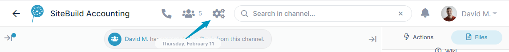
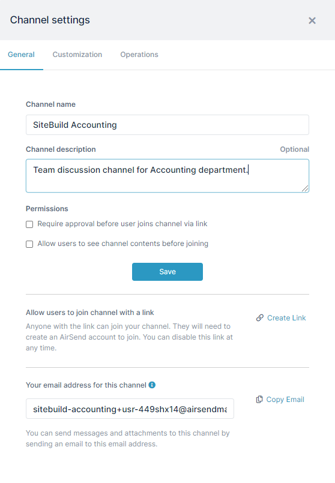
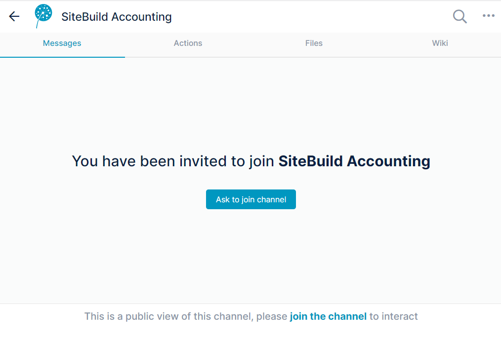
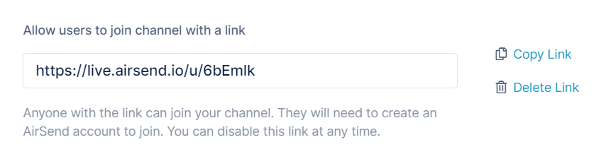
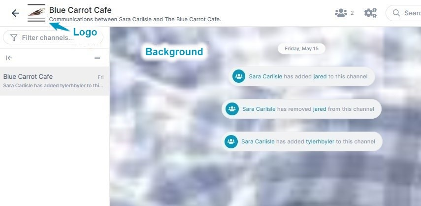
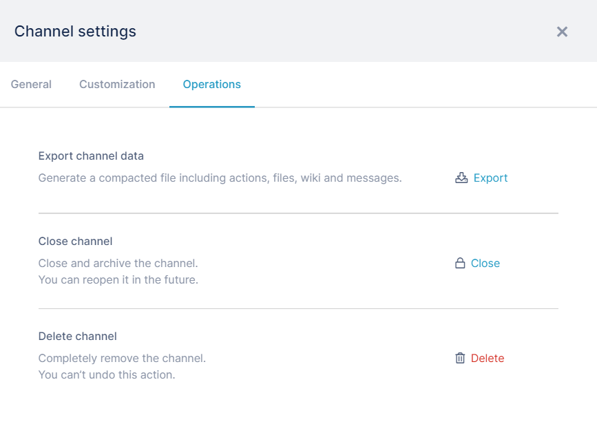

# Channel settings for a channel owner

Channel settings give you access your channel's email address, customize your channel's look, and perform other channel maintenance functions.

To view and configure channel settings, click the gear icon in the toolbar.  
  

## General tab

**Channel name** - Initially, the name that you gave the channel when you create it, but you may change it. If you change the name, click the Enter key or **Save** to save it. 

**Channel description** - Optional description of channel.

**Permissions** 

*   **Require approval before user joins channel via link** - If you share the channel with users by sending them a link to the channel (see [Public channels](/channels/public-channels)), by default, they can join the channel by accessing it (and creating an AirSend account if they do not already have one). If you check this option, when new users enter the link , they see:  

*   **Allow users to see channel contents before joining** -  If you share the channel with users by sending them a link to the channel by default, they can join the channel by accessing it (and creating an AirSend account if they do not already have one). If you check this option, when new users enter the link , they see:

**Allow users to join channel with a link** - This option enables you to publish a link that users can click to join the channel. Click **Create Link** to generate and view the link. Click **Copy Link** to copy it into a web page or other location. (A channel that users join by click a link is a  [Public channel](/channels/public-channels)).

**Your email address for this channel** - Members of the channel can send messages and attachments to the channel at this email address. When the channel sends messages to users, this is the sending address. Click **Copy** to copy the email address.

## Customization tab

**Background** - Click anywhere on the background icon and upload a background image to appear in the message section of the channel screen. Click **Change background**. 

**Logo** - Click anywhere on the logo icon and upload a thumbnail image to represent the channel. Click **Change Logo**.

When the example customization is applied, the channel appears as:  

## Operations tab

**Export Channel** - Click **Export** to export a zip file containing the contents (files, wiki, actions, and messages) of the channel.

**Close Channel** - Click **Close** to inactivate the channel so it no longer appears on your AirSend dashboard when you are viewing Active Channels, but remains in your system so you can re-activate it. See closing and re-activating a channel for more information.

**Delete Channel** - Click **Delete** to permanently delete a channel.