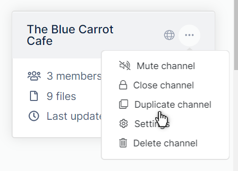
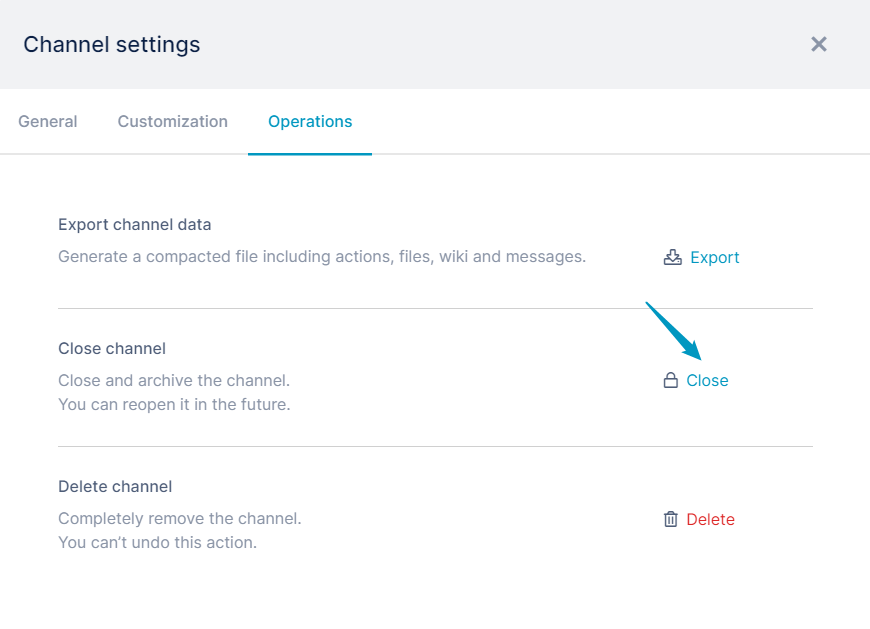
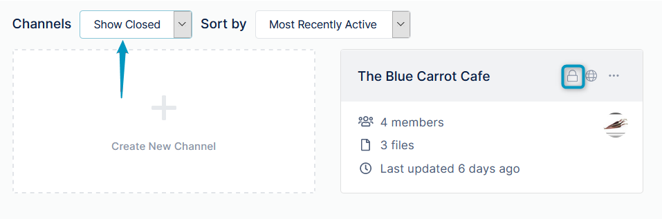
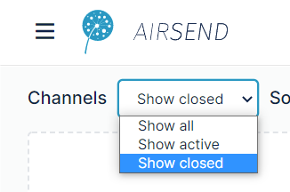
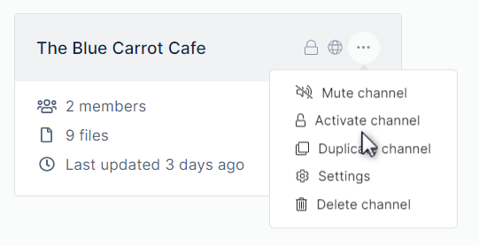
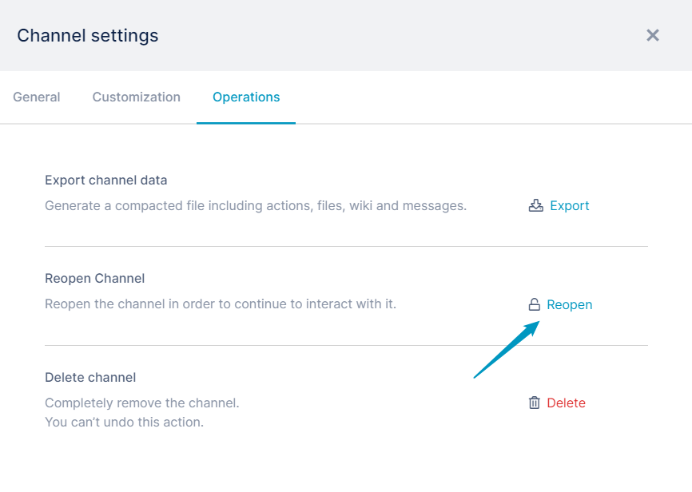
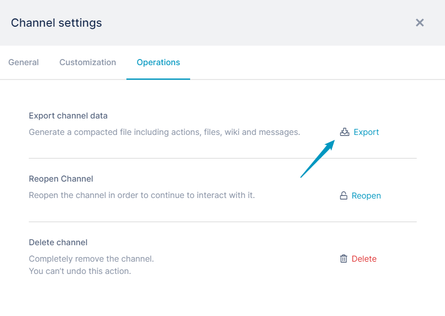
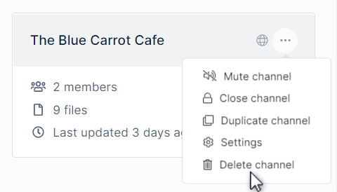
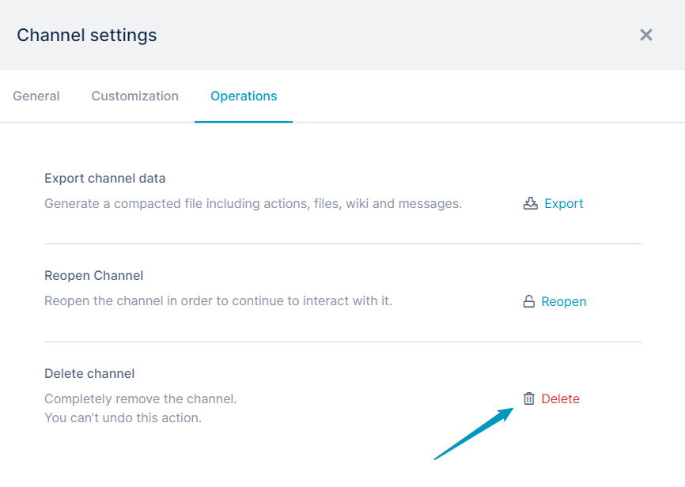

# Closing, deleting, or archiving a channel

The only member of a channel who can close or delete it is the channel owner.  Members who can archive (export the data) of a channel are the owner, admins, and managers.

::: info
This page shows you how to close, reopen and delete channels from the channel icon in the desktop. You can also complete these actions from the channel sidebar which you can access from within any channel. See [Channel Sidebar: Finding Channels](/channels/sidebar) for help.
:::

## Closing a channel

Closing a channel makes it inactive, but as the owner, you can reactivate it. You can either close a channel from the AirSend dashboard or within the channel from the Channel's settings. 

<table><colgroup><col><col></colgroup><tbody><tr><td><strong>Either close the channel from the AirSend dashboard</strong></td><td><strong>Or close the channel from within the channel.</strong></td></tr><tr><td>

In the AirSend dashboard, click the three dots in the upper-right of the channel icon, and choose <strong>Close Channel</strong>. 

</td><td>
<ol><li>Open the channel, and in the channel toolbar, click the settings button:   &nbsp;The Channel settings dialog box opens.</li><li>Click <strong>Operations</strong>.</li><li>Next to&nbsp;<strong>Close Channel</strong>, click<strong> Close.  </strong></li></ol>
</td></tr></tbody></table>

The channel disappears from the default AirSend channel view, **Show Active**. However, you can view it in **Show All** or **Show Closed** view. The lock icon on the channel indicates that it is closed.  

## Reopening a channel

You can reopen a closed channel if you are the channel owner.

To find the closed channel, in the **[AirSend dashboard](/using-airsend/airsend-dashboard)**'s **Channel** drop-down list, choose **Show Closed** or **Show All.   
**   
The channel appears on the desktop.  
  

1.  Either reopen the channel from the AirSend dashboard:   
    Click the three dots in the upper-right corner of the channel icon, and click **Activate channel**.  
      
      
    
2.  Or reopen the channel from within the channel:
    1.  Open the channel, and in the channel toolbar, click the settings button:  
          
         The Channel settings dialog box opens.
    2.  Click **Operations**.
    3.  Next to **Activate Channel**, click **Activate.  
        **

## Archiving a channel

Before you delete a channel or any time you want to back up its contents, archive it by clicking the **Export** button in the **Operations** tab of the **Channel** **settings** dialog box.

1.  Open the channel, and in the channel toolbar, click the settings button:  
      
     The Channel settings dialog box opens.
2.  Click the **Operations** tab.  
    
3.  Click the **Export** button next to **Export channel data**.  
    The channel's contents are downloaded as a zip file that contains files storing messages, tasks, files, and wiki contents.

## Deleting a channel

The only member of a channel who can delete it is the owner. Deleting a channel permanently removes it from the system, and it cannot be reactivated.  Archive the channel (see above) before deleting it in case you need the contents later.

Either:

From the dashboard, click the three dots in the upper-right corner of the channel icon, and click **Delete channel**.  

Or:

1.  Open the channel, and in the channel toolbar, click the settings button.  
      
     The Channel settings dialog box opens.
2.  Click **Operations**.
3.  Next to **Delete Channel**, click **Delete.  
    **