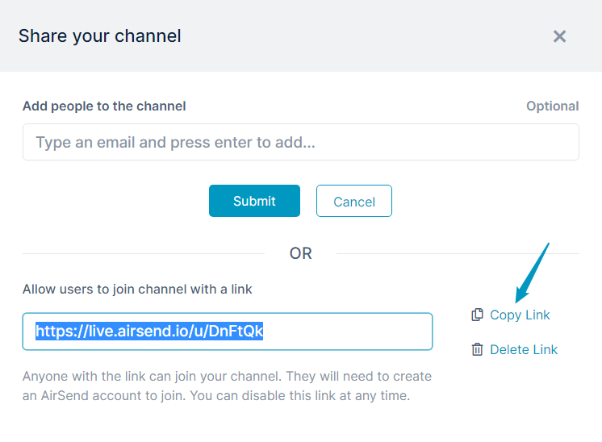

# Creating a channel

### To create a channel

1.  Log in to the dashboard and click the **Create New Channel** icon.  
    
    
    ::: info Sidebar
       
    You can also click the Create Channel button in the channel sidebar. See [Channel Sidebar: Finding Channels](/channels/sidebar).

    :::
    
    A **Create a New Channel** dialog box opens.
    
2.  In **Channel name** enter a name that makes it easy to identify the channel, such as a subject, a client name, or a transaction name. This field is required. In the example, the client's name is entered.  
      
      
    
3.  To  enter a description for the channel or copy the format of an existing channel, click **Advanced**.
4.  If you click **Copy from channel**, a drop-down list displays the other channels that you have access to.  Choose the channel that you want to copy. The new channel will include the same files, actions, and wiki content as the copied channel, and have the same background and logo if you have customized them.  
5.  Click **Create channel**.  
    A **Share your channel** dialog box opens.   
    Note that your channel has been created at this point, so you may close this box and add members or generate a link for joining the channel later.
6.  Either enter names of users to add as members of the channel, or create a link to make available to potential members.
    1.  To add members directly to the channel, enter the names of existing AirSend users or the emails of potential users and click Enter.  
        Their names and/or emails appear below the text field.
        
    ::: info Note
       
     Note: You can enter multiple people at a time by separating the names/emails with commas.

    :::
        
      
          
        
    2.  To generate a link to the channel, click **Create Link**.  
        A link appears. Click **Copy Link** so you can paste the link into a site or send it by email to potential channel members.  
          
          
        
7.  Close the dialog box.  
    Your new channel appears similar to:  
      