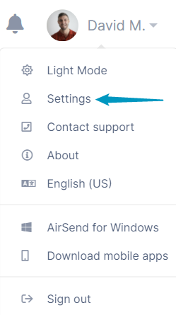
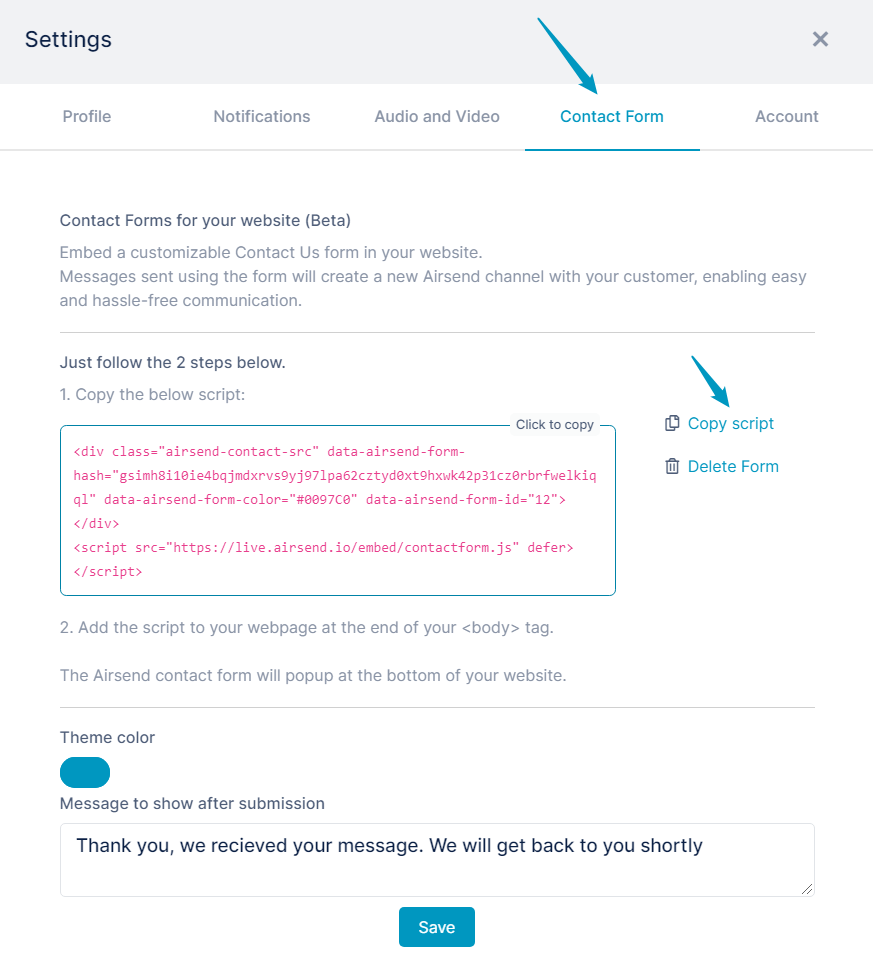
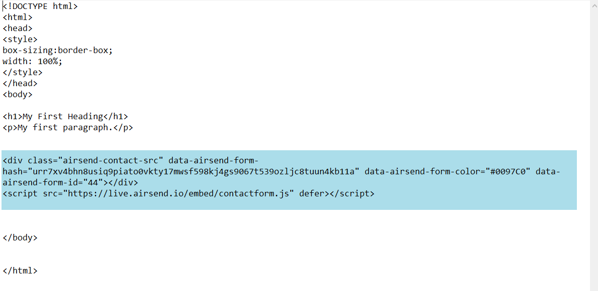
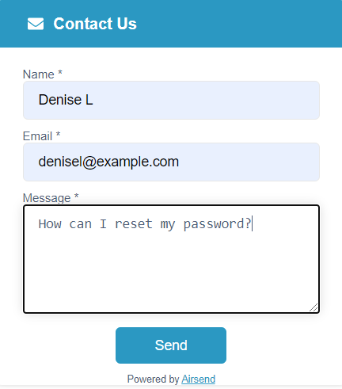
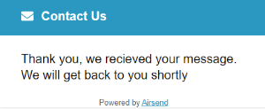
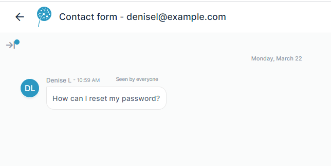
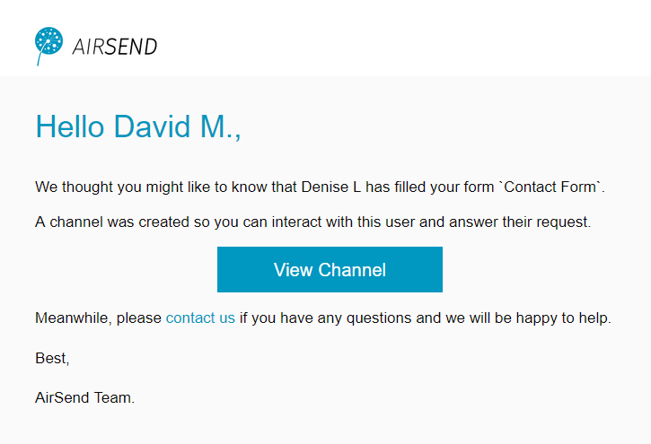

# Creating Channels from Contact Forms

AirSend provides you with the ability to use website "Contact Us" forms that are connected to your AirSend account. When a user sends a query using the form, AirSend creates a channel for you and the user where you can respond to the query and communicate.

To insert the contact form into a website:  
  

1.  In the upper-right corner of the AirSend screen, click on your username and choose **Settings**.  
      
      
    The Settings dialog box opens.  
    
2.  Click the Contact Form tab.
3.  If you want the Contact Us button and form to appear in a different color than the default blue, click **Theme color** and change it.
4.  Click **Copy script** to copy the script that inserts the form into a web page.
5.  To display a different message on the website after the user clicks send, edit the text in **Message to show after submission.**
6.  Click **Save.**
7.  Open the source code for the Web page and insert the script before the end `</body>` tag.  
      
      
    When the Web page is rendered in a browser, it displays a **Contact us** button:   
      
    When a user clicks the button, a Contact us form opens. The user fills in the form and clicks **Send**.  
      
      
    After the user clicks **Send**, the text in **Message to show after submission** appears on the website:  
      
    Now, the following happens:

-   A channel is created in your AirSend account that includes you and the user who sent the form as members.
-   An email is sent to you informing you that the user has responded to the form and the channel has been created.
-   An email is sent to the user who sent the form informing them that the channel has been created in AirSend. If the user does not yet have an account in AirSend, they must create one to be able to directly communicate in the channel, but they can send email messages to it.

For example:  
Sara Davis has copied the script for the contact form into her website and Jared T has filled out the form and clicked **Send**.  
  
A channel is created in Sara's account that includes Jared and Sara as members.  
The first message in the channel is the message Jared entered in the form.  

  
David receives a message telling him that Denise has filled out a form and a channel has been created where they can communicate.   
  
  
Denise receives a message telling her that a channel has been created.