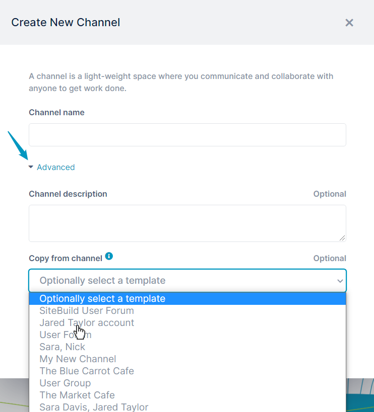

# Creating channels from templates

In AirSend, any channel can be a template for another channel; however, you can create a channel and just use it as a template. The new channel will include the same files, actions, and wiki content as the template, and have the same background and logo if you have customized them.  

To use a channel as a template, click Advanced when you create the new channel, and choose the template channel from the **Copy from channel** drop-down list.  
