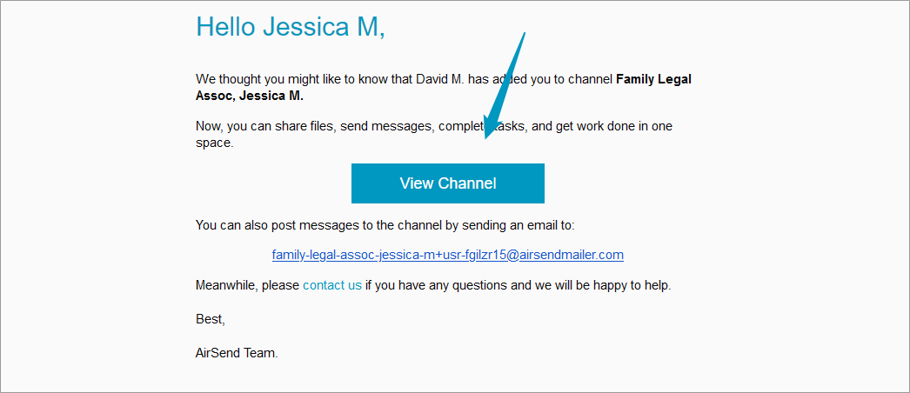
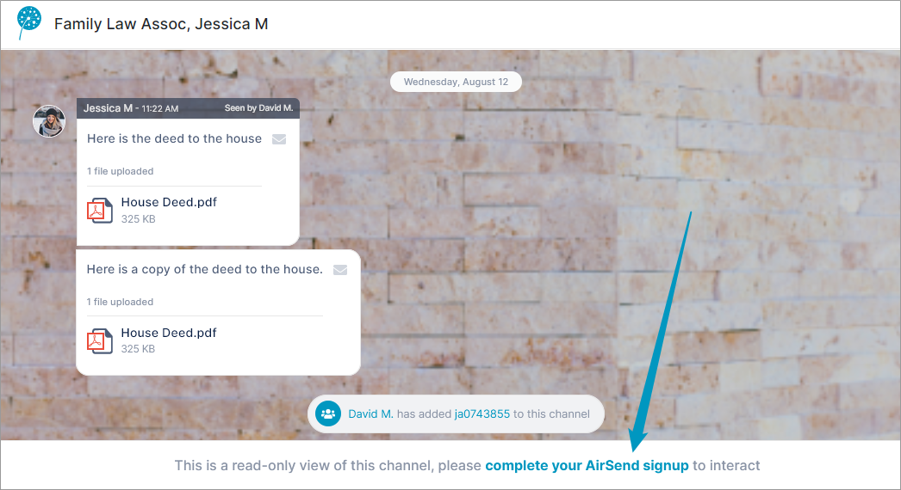
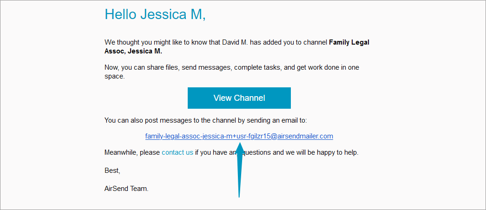

# If you've been added to a channel

If you're reading this page, you have probably received a message that someone has added you to a channel in AirSend and are wondering what to do next.  

  
Begin by opening the message and clicking the **View Channel** button to open the channel.

  
If this is the first time you're accessing AirSend, you probably can't enter messages from within the channel, but you can view them. You can send messages by email to the channel, but to be able to chat from inside the channel, you must register for an AirSend account.

## Getting an account

If you want to be able to interact with other members while you're in the channel, [sign up for an account](/account/setting-up-an-airsend-account).

## Sending messages without an account

If you prefer all of your interaction with the AirSend channel to occur through email, you can use AirSend without an account. 

Above, we looked at the email message received by a user who was added to a channel. In addition to the **View channel** button, the message included an email address for sending messages to the channel. 

Anytime you want to send a message and have it appear in the channel, send it to this email address. If you attach a file to your email message, it is uploaded with the message into AirSend. Whenever a message is entered into the channel, you receive an email with the message, and you can reply to the email directly to send a message back to the channel.

For more information about corresponding with AirSend through email, see [The AirSend - Email connection](/email).