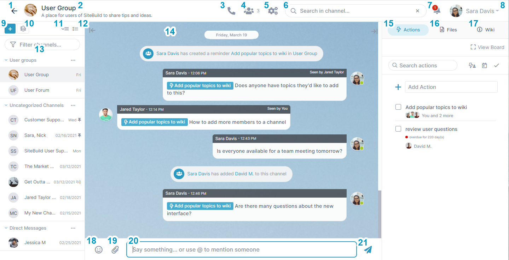

# Inside an AirSend channel

### The AirSend channel screen

1.  Go to **[Dashboard](/using-airsend/airsend-dashboard).**
2.  **Name** of the channel.  
    In this example, the channel name is **User Group.**
3.  **[Meeting](/meetings/intro).** Click to start a meeting.
4.  **[Members](/members/adding-more-members-to-a-channel).** Click to see a list of members in the channel or to add new members. The number on the icon indicates the number of members including the owner.
5.  **[Settings](/channels/channel-settings-for-a-channel-owner)**. Click to see channel information and configuration opens. 
6.  **[Search box](/using-airsend/search-in-airsend)**. Enter a search term to search through messages, channels, users, files, and actions.
7.  **[Notifications](/notifications)**. Click to display recent notifications . See [AirSend Dashboard](/using-airsend/airsend-dashboard) for more information. The number on the icon indicates the number of unread messages.
8.  **User** and [**user settings**](/account/settings-in-airsend). User signed in to the channel. Click the down arrow to see a user menu with user settings. 
9.  **[Add a channel](/channels/creating-a-channel).** Click to add a new channel.
10. **Add a group**. Click to create a Group that includes multiple channels. See [Channel Sidebar: Finding Channels](/channels/sidebar) for more information about adding groups.
11.  **Expand/Collapse channel categories**. See [Channel Sidebar: Finding Channels](/channels/sidebar) for more information about expanding/collapsing the sidebar.
12.  **Full/Compact sidebar view** toggle. See [Channel Sidebar: Finding Channels](/channels/sidebar) for more information about listing channels in the toolbar in full or compact view.
13.  **[Channel sidebar](/channels/sidebar)**. List of all active channels. Lets you view and switch to other channels while a channel is open.
14.  **[Message section](/messages/messaging-inside-an-airsend-channel)**. Section that displays messages and notifications when actions occur.
15.  **[Actions](/actions/intro)**. Click this tab to view and add actions that all members of the channel can see. 
16.  **[Files](/files/add-a-file-to-the-files-tab)**. Click this tab to attach files and access files that other users have added. 
17.  **[Wiki](/wiki/intro)** - Click this tab to view and add important information such as instructions, updates, and frequently accessed data. 
18.  **Emoji** - Click to add an emoji to your message.
19.  **[Attachment icon](/files/add-a-file-to-a-message)** - Click to attach a picture or file to your message. The picture or file is saved to the channel and is accessible in the **Attachments** folder of the **Files** tab in the right panel.
20.  **[Message input box](/messages/messaging-inside-an-airsend-channel)** - Type in your message here, then click Enter or the send icon.
21.  **Send** **icon** - Click to send your message and display it in the **Message section**.