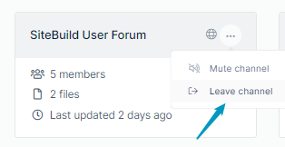
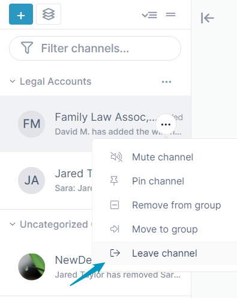

# Leaving an AirSend channel

Members can leave a channel either: 

-   from their AirSend dashboard by clicking the three dots on the icon and choosing **Leave channel**.  
      
    
-   from the channel sidebar within a channel by hovering over the channel, clicking the three dots, and choosing **Leave channel**.  
    