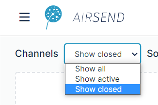
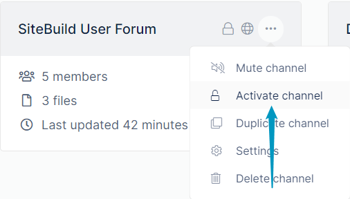
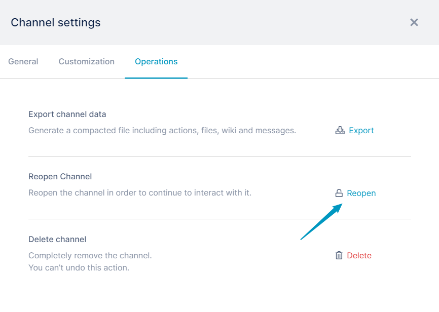

# Reopening a closed channel

If you are the owner of a channel, you have the ability to close it. See [Closing, deleting, or archiving a channel](/channels/closing-deleting-or-archiving-a-channel).  
  
Closing a channel makes it inactive, but as the owner, you can reopen (and reactivate) it. 

**To reopen a closed channel:**

1.  To find the closed channel, in the **[AirSend dashboard](/using-airsend/airsend-dashboard)**'s **Channel** drop-down list, choose **Show Closed** or **Show All.   
    **   
    The channel appears on the desktop.
2.  Reactivate the channel from the dashboard or from the open channel:  
      
    -   **From the dashboard**: click the More icon (three dots) on the channel and choose **Activate channel**.  
          
        The channel is reopened.  
          
    -   **From the open channel**: open the channel, and in the channel toolbar, click the Channel settings icon:  
          
        The Channel settings dialog box opens.  
        Click the **Operations** tab, and next to **Reopen Channel**, click **Reopen**.
          
    
        Then confirm that you want to reopen the channel.  
        The channel is reopened.