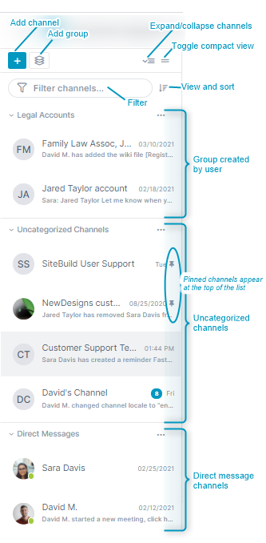

# Channel Sidebar: Finding Channels

## How the Channel Sidebar is organized

The channel sidebar, which appears in the left panel of open channels, displays a navigable list of your channels and allows you to reorder and group them to make them easy for you to locate. 

**Add channel** - Click to open the Create New Channel dialog box. For help see [AirSend Channels](/channels) and [Creating a channel](/channels/creating-a-channel).

**Add group** - Create your own channel grouping. See [Creating Groups](#creating-groups), below.

**Expand/collapse channels** - Toggle between viewing the channel sidebar with channels listed under categories as in the view shown to the left or in the following collapsed view, which lists categories without their listed channels under them:  

**Toggle compact view** - Toggle between a view showing channels with their last action or message as shown to the left or in a view that only shows channel name:  
 

**View and sort** - Options for viewing and sorting:

*   **Show categories** (default) or **Hide categories**. Whether to display channels under their categories or as an uncategorized list.
*   **Sort** channels by most recently to least recently active (default), highest to lowest number of unread messages, or newest to oldest.
*   **View** all channels, active channels (default), or closed channels.

**Filter** - Only display channels with names that match the string.

**Group created by user** - Channel groups created by you. See [Creating Groups](#creating-groups), below.

 - Pin. Indicates that you have pinned this channel as a favorite. Pinned channels appear at the top of their group or list for easy access.

**Uncategorized channels** - List of all channels that do not appear in groups or direct messages.

**Direct messages** - Channels that you have created as direct messages. For help, see [Making Your Experience Easier](/making-your-experience-easier) and [Direct Messaging](/messages/direct-messaging).

## Channel sidebar icons

## Creating groups

Groups are categories created by you for storing multiple channels together to make them easier for you to find in the sidebar. For example, you could create a group for all channels associated with a certain department or project.   

**To create a group:**

Open any channel, and in the channel sidebar on the left, click the Create Group button. Enter a name for the group, and then drag and drop channels into the group.

If you cannot drag and drop channels into a group because their names do not appear on the sidebar, move them into the group one of the following ways:

1.  Expand the group, and click the message **Drag and drop or click here to add channels to the group** below the group name  
        
      
          
    Click to open a selection box, and then drag channels from the left box to the right box to add them to the group, and click **Add Channels**.  
    
      
          
        
    Click the More (three dot) icon for a channel in the channel sidebar, and choose **Move to group**.  
          
          
    A box listing the groups in your account opens. Click a group to move the channel into it.  
          
          
        
    A channel can only belong to one group at a time, but you can move a channel from one group to another. 
        

## Moving groups and categories up and down in the sidebar

By default, the sidebar displays your groups and categories in this order:

Groups you have created

uncategorized Groups

Direct Messages

But you can change the order to what is most convenient for you.

**To move a group or category up or down:**

1.  Click the group or category's **More options** button (three dots) in the sidebar.
2.  Choose **Move Group up** to move it before the previous category; choose **Move Group down** to move it after the next category.  
    

  

## Removing channels from a group

**To remove a channel from a group:**

-   Click the channel's **More** (three dots) icon in the sidebar, and choose **Remove from group**.  
      
      
    OR
-   Click the group's More (three dot) icon, and choose **Add/Remove Channels**.  
    An Add Channels to group dialog box opens:  
      
    Hover over the channel that you want to remove from the group and click **x**.

## All channel sidebar actions

The actions that appear in the drop-down list when you click the More icon for a channel in the sidebar vary depending on your member type and your previous actions on the channel.   
Here are some of the actions you may see on a channel; these actions and additional ones are described in the table below.  
  
  

<table>
   <colgroup>
      <col>
      <col>
      <col>
   </colgroup>
   <tbody>
      <tr>
         <th>Channel action</th>
         <th>What it does</th>
         <th>Who sees it</th>
      </tr>
      <tr>
         <td>Mute/unmute channel</td>
         <td>Turns off alerts for the channel. See&nbsp;<a href="/notifications">Notifications in AirSend</a>.</td>
         <td>all channel members</td>
      </tr>
      <tr>
         <td>Mark all as read</td>
         <td>Appears when the logged in user has unread notifications for the channel. Marks the notifications as read so the notification icon (a number overlaid on a circle) no longer appears.&nbsp;See&nbsp;<a href="/notifications">Notifications in AirSend</a>.</td>
         <td>all channel members with unread notifications</td>
      </tr>
      <tr>
         <td>Pin/unpin channel</td>
         <td>Displays a pin icon next to the channel and moves it to the top of its group or category in the sidebar</td>
         <td>all channel members</td>
      </tr>
      <tr>
         <td>Move to group/remove from group</td>
         <td>
            
Moves the channel to the group you select or removes it from its current group. Both options appear for channels that are already in groups.

         </td>
         <td>all channel members</td>
      </tr>
      <tr>
         <td>Close channel</td>
         <td>Inactivates the channel. This removes it from the channel sidebar. To reactivate the channel, you must&nbsp; access it from the desktop or from inside the open channel.&nbsp;See&nbsp;<a href="/channels/closing-deleting-or-archiving-a-channel">Closing, deleting, or archiving a channel</a>.</td>
         <td>channel owners and managers</td>
      </tr>
      <tr>
         <td>Delete channel</td>
         <td>Deletes channel. This action is permanent; the channel cannot be reactivated. Archiving the channel before deleting it is recommended. See&nbsp;<a href="/channels/closing-deleting-or-archiving-a-channel">Closing, deleting, or archiving a channel</a>.</td>
         <td>channel owners</td>
      </tr>
      <tr>
         <td>Leave channel</td>
         <td>Removes the logged in user as a member of the channel. See&nbsp;<a href="/channels/leaving-an-airsend-channel">Leaving an AirSend channel</a>.</td>
         <td>non-owner members of the channel</td>
      </tr>
   </tbody>
</table>