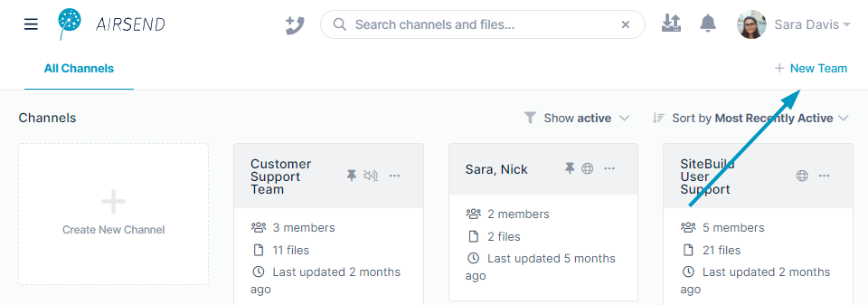

# Teams in AirSend

AirSend Teams make it easier for members to keep track of their channels and to keep information sorted by project or application.

A team includes channels and team members who belong to any number of channels in the team. Any user can create a team and include other AirSend members in it. The user who creates the team is the owner, and can add channels and members to the team. 

Channels can only belong to one team. The team owner or manager may add a color to a team that appears in a half circle icon on its channels to help you identify them. Tabs for teams that you are a member of appear across the top of the AirSend screen.  
  
  
  
Click a team tab to access the team's dashboard.  
The team dashboard displays all of the team's channels, any announcements added by the team owner or team managers, statistics about the team, and a list of the channels that are public (that any member of the team may join).  
  

  

 To add a team

1.  In the upper right of the AirSend screen, click **New Team**.  
      
      
    A **Create New Team** dialog box opens.
2.  Enter a **Team Name** and click **Create Team**.  
      
      
    A new tab opens at the top of the screen for the team's dashboard. At this point the team does not have any channels. You are the owner and the only member of the team.  
    

## Adding and managing team channels

If there are existing channels that you want in the team, you can add them to the team.  You can also add new channels to the team or copy existing channels.

  

 To attach an existing channel to a team

1.  Click the tab for the team, and in the upper-right corner of the screen, click **Manage Team**.  
      
      
    The **Team Settings** dialog box opens.
2.  In the left panel, click **Channels**, and then click **Add channel**.  
      
      
    When you click **Add channel**, a drop-down list that enables you to create a new channel or transfer existing channels opens.  
    **Transfer channels** lists channels that you own (but not Direct Message channels). You cannot transfer channels owned by other users or Direct Message channels to your teams.
3.  Click the channel under **Transfer channels** that you want to add to the team.  
      
      
    
4.  You must retype the name of the team into the field indicated to confirm that you want to attach the channel to the team, and then click **Save**.  
      
      
    The channel is now listed in the window:  
      
      
    When you close the **Team Settings** dialog box, the channel appears in the dashboard for the team.
    
    <table><colgroup><col><col></colgroup><tbody><tr><td>

 

</td><td>

</td></tr></tbody></table>
    
    Attaching a channel to a team does not automatically add members of the channel to the team.  
    Members outside the team continue to be able to access the channel through the **All Channels** tab, but do not see your team's tab unless you specifically add them as members.
    
      
    

 To add new channel to a team

1.  Click the tab for the team.
2.  EITHER
    -   Click the Create New Channel icon:  
          
          
        

OR

1.  -   In the upper-right corner of the screen, click **Manage Team** to open **Team Settings**, and in the navigation panel, click **Channels**.In the upper-right corner, click **Add Channel** and choose **Create New Channel**.  
            
          
        The **Create New Channel** dialog box opens.
2.  Enter a **Channel name**, and leave the current team selected in **Add to Team**.  
    

  

1.  Click **Create channel**.  
    An **Add Members** dialog box opens.
2.  Type any number of users' emails into **Add people to the channel** and/or  
    Click **Create Link** to create a link that you can copy and send to users who you want to give access to the channel. If you create a link for joining the channel, it becomes a public channel in AirSend. To make it a public team channel see [To make a channel a public team channel](/channels/public-channels), below.  
    
3.  Click **Add**.  
    The channel is created and opens like any other channel that you create in AirSend:  
    
4.  Click the arrow in the upper-left corner of the screen to close the channel and go back into the team dashboard.   
    Your new channel appears there and lists the number of members including you.  
    

 To add a copy of a channel to a team

Copying a channel to create a new channel is useful if you want a channel with the same settings as the original channel. The new channel will include the same files, actions, and wiki content as the original channel, and have the same background and logo if you have customized them.  

1.  Click the tab for the team, and in the upper-right corner of the screen, click **Manage Team**.  
      
      
    The **Team Settings** dialog box opens.
2.  In the navigation panel, click **Channels,** then click **Add channel**.  
      
      
3.  Click **Create New Channel**.  
    The **Create New Channel** dialog box opens.
4.  Enter a **Channel name.**
5.  Click **Advanced**.  
    The dialog box expands to display **Channel description** and **Copy from channel** fields.
6.  Choose a channel in **Copy from channel**.  
    
7.  Click **Create Channel**.  
    A **Share your channel** dialog box opens.
8.  Enter emails to add users to the channel and/or copy the channel link to send to users to invite them to become members.  
    By creating the link, you make it a public AirSend channel. To make it a public team channel, see [To make a channel a public team channel](/channels/public-channels), below.
9.  Click **Add** to create the channel and open it.   
    The channel is now visible in the channel dashboard and the main dashboard of AirSend.

 To make a channel a public team channel

A public team channel is a channel that any member of a team can join. This differs from an AirSend public channel, which is a channel that anyone with a link to the channel can join. Public team channels appear on the team's dashboard in a Public Team Channels box even for users who have not joined them. Public team channels that a user has joined also appear on the user's team dashboard

**To make a team channel a public team channel:**

1.  Click the tab for the team, and in the upper-right corner of the screen, click **Manage Team**.  
      
      
    The **Team Settings** dialog box opens.
2.  In the navigation panel, click **Channels**.
3.  Hover over the three dots to the right of a channel and choose **Enable Public Team Channel**.  
      
      
    Now the public team channel appears in the **Public Team Channels** list on the site dashboard. If the user is a member of the channel, it also appears separately on the dashboard.  
    
    
      
    

 To join a public team channel

If you are a member of a team, when you go to the team dashboard tab, its public team channels are listed in a box on the screen.

To join one a the public team channels:

1.  Click on the three dots next to the channel in the **Public Team Channels** box, and click **Join Channel**:  
      
      
    
2.  The channel opens.  
    If you return to the team tab, the channel appears on the dashboard.

## Adding Members to a Team

To add members to a team:

When you create a team, you are automatically a member of the team and the owner. Next, you can add team members.

After you create a team, the tab for the team is automatically selected.

1.  Click **Manage Team** in the upper right corner of the screen.  
      
      
    The **Team Settings** dialog box opens.
2.  Click **Members**, and then click **Invite User**.  
      
      
3.  In **Add people to the team**, enter emails or AirSend usernames of people to add to the channel.
4.  To add users to team channels now, enter the channel names into **Automatically include users to channels**.  
    You may also add members to team channels later.  
      
      
    
5.  Click **Add**.  
    The new member appears in the team.  
    

Also see the video in **Managing Members**, below 

## Managing teams

Changing team settings

You can change team settings by clicking on the tab for the team, and then clicking **Manage Team** in the upper-right corner.   
The **Team Settings** dialog box opens, and from there, click any of the setting titles in the navigation pane to change the associated settings.  
This video shows you how:

<video src="../assets/channels/teams-in-airsend/changing-team-settings-video.mp4" muted controls></video>

<table>
  <colgroup>
    <col>
    <col>
    <col>
  </colgroup>
  <tbody>
    <tr>
      <th>Setting title</th>
      <th>Settings&nbsp;</th>
    </tr>
    <tr>
      <td><strong>Settings</strong></td>
      <td>
        
<strong>Usage </strong>- Space used by team.

        
<strong>Team Name </strong>- To change the team name, enter it here.

        
<strong>Color Tags</strong> - Click a color to mark team channels with.&nbsp;

        
<strong>Announcements - </strong>Enter text to display as an announcement on the team dashboard.

      </td>
    </tr>
    <tr>
      <td><strong>Members</strong></td>
      <td>
        
<strong>Possible actions&nbsp;</strong> <strong>Invite user</strong> - Click to add users to the team. The users are not automatically added to team channels, but you may enter team channels to add the new users to.&nbsp; <strong>Change team role </strong>- If there is a down arrow next to the team role, you may choose a different role for the member. <strong>Remove User</strong> - Click <strong>x</strong> in the final column to remove the user from the team. See <strong>Managing Members</strong>, below, for a video that shows you how to complete these operations.

      </td>
    </tr>
    <tr>
      <td><strong>Channels</strong></td>
      <td>
        
<strong>Possible actions&nbsp; Manage channel members</strong> - Click this to access the same options listed for <strong>Members </strong>in the preceding row. <strong>Enable/Disable Public Team channel</strong> - Clicking <strong>Enable Public Team Channel</strong> allows any member of the team to join this channel. Clicking <strong>Disable Public Team Channel</strong> removes public status, and restricts membership to existing members and members added in the future by channel owners and admins. <strong>Transfer channel ownership</strong> - Click this and choose the member to transfer ownership to. A channel owner has all channel permissions and is the only member who can manage Admins and close or delete the channel.

      </td>
    </tr>
    <tr>
      <td><strong>Public Team Channels</strong></td>
      <td>Lists each public team channel with a link that opens the channel.&nbsp;</td>
    </tr>
    <tr>
      <td><strong>Announcements</strong></td>
      <td>Displays announcements entered in <strong>Settings</strong>.</td>
    </tr>
  </tbody>
</table>

## Managing members

The following video shows you how to add a member to a team, change a member's role, and remove a member from a team.

<video src="../assets/channels/teams-in-airsend/manage-team-members.mp4" muted controls></video>