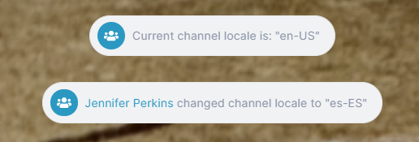
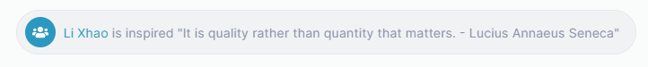
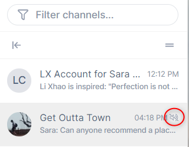
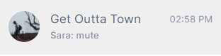

# Inline commands

There are a variety of commands that you can enter directly in a channel's chat bar - and the list is growing.

**To enter a slash command:**

1.  Open a channel.
2.  In the chat bar, enter / (a forward slash).  
    A list of available commands appears above the chat bar.   
    The commands you see depend on your [member type](/members/member-types).  
    
3.  Select the command, and then enter any additional information shown in brackets.

## Commands

`/call`

Starts an AirSend meeting initiated by you.	

---

`/channel_locale [new locale (optional)]`

Shows the channel locale and optionally, changes it.

---

`/inspire`

Shows an inspiring message.	

---

`/invitee_role [manager|collaborator|member|viewer (optional)]`

Shows the current default role for users invited to the channel and optionally changes it.

---

`/join_role [collaborator|member|viewer (optional)]`

Shows the current default role for users who join the channel by public link and optionally, changes it.	

---

`/kick [@user] [--ban (optional)]`

---

`/me [emote message]`

Message is preceded by your name.

---

`/mute`

Disables notifications from the channel.

---

`/unmute`

Enables notifications from the channel if they have been disabled.

---

`/transfer_ownership [@user]`

Transfers ownership of the channel to the target user.

---
