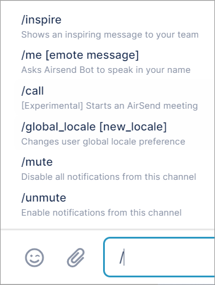
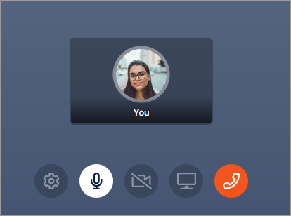
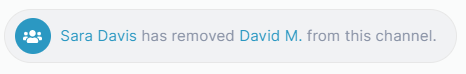

# Inline commands

There are a variety of commands that you can enter directly in a channel's chat bar - and the list is growing.

**To enter a slash command:**

1.  Open a channel.
2.  In the chat bar, enter / (a forward slash).  
    A list of available commands appears above the chat bar.   
    The commands you see depend on your [member type](/members/member-types).  
    
3.  Select the command, and then enter any additional information shown in brackets.

## Commands

<table><colgroup><col><col><col></colgroup><tbody><tr><th>Command</th><th>DefinitionS</th><th>Effect</th></tr><tr><td>/call</td><td>Starts an AirSend meeting initiated by you.</td><td>

</td></tr><tr><td><pre>/channel_locale [new locale (optional)]</pre></td><td>Shows the channel locale and optionally, changes it.</td><td>

</td></tr><tr><td><pre>/global_locale [new locale]</pre></td><td>Changes the user's global locale.</td><td>

 

</td></tr><tr><td><pre>/inspire</pre></td><td>Shows an inspiring message.</td><td>

</td></tr><tr><td><pre>/invitee_role [manager|collaborator|member|viewer (optional)]</pre></td><td>Shows the current default role for users invited to the channel and optionally changes it.</td><td> </td></tr><tr><td><pre>/join_role [collaborator|member|viewer (optional)]</pre></td><td>Shows the current default role for users who join the channel by public link and optionally, changes it.</td><td> </td></tr><tr><td><pre>/kick [@user] [--ban (optional)]</pre></td><td>Removes a user from the channel and optionally bans them from re-joining.</td><td>

</td></tr><tr><td><pre>/me [emote message]</pre></td><td>Message is preceded by your name.</td><td>

</td></tr><tr><td><pre>/mute</pre></td><td>Disables notifications from the channel.</td><td>

</td></tr><tr><td><pre>/transfer_ownership [@user]</pre></td><td>Transfers ownership of the channel to the target user.</td><td>

</td></tr><tr><td><pre>/unmute</pre></td><td>Enables notifications from the channel if they have been disabled.</td><td>

</td></tr></tbody></table>