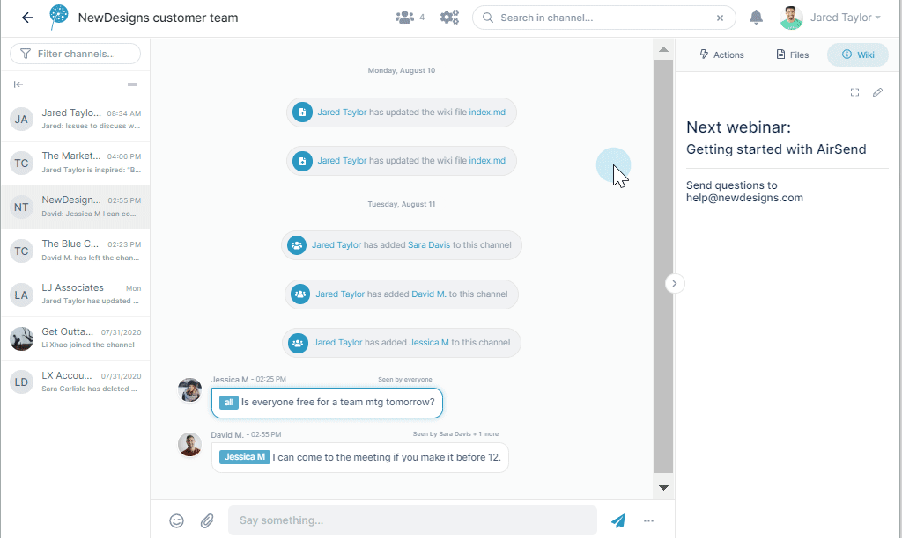
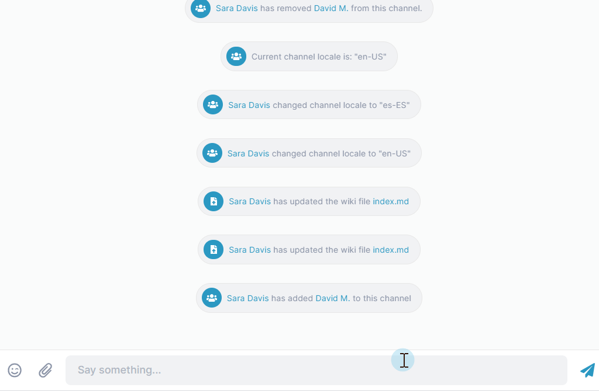

# Style and Customization

In addition to first-rate tools that increase your efficiency, AirSend provides you with features that help you promote your brand, polish your messages, and add character to your communication.

## Customize your channels

Advertise your identity and your professionalism by adding a custom logo and background.

## Highlight key points with markup

Add markup as you write messages for better emphasis and organization.

Enter markup like this:  

to create bold and bulleted text like this:  

For all of the markup features you can use in messages, see [Formatting message content](/messages/formatting-message-content).

## Accomplish more with inline commands

Use inline commands to quickly perform a wide range of functions. Below, a user enters the /inspire command to post an inspirational quote to the channel. To explore more commands, see [Inline commands](/commands-and-shortcuts/inline-commands).

  

## Express yourself!

Just for fun, add an emoji to your message: 