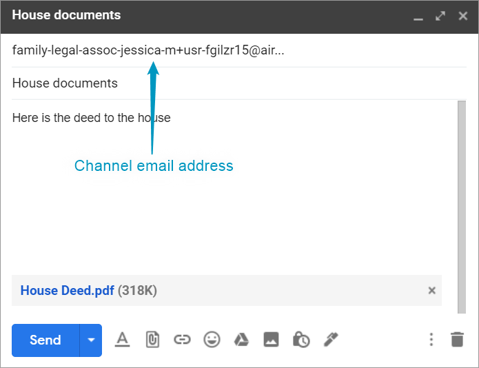
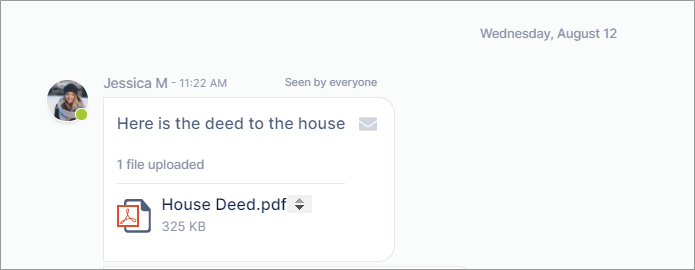
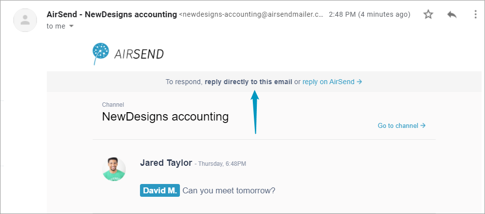
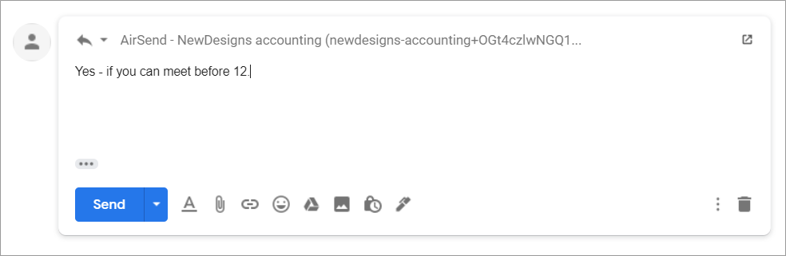
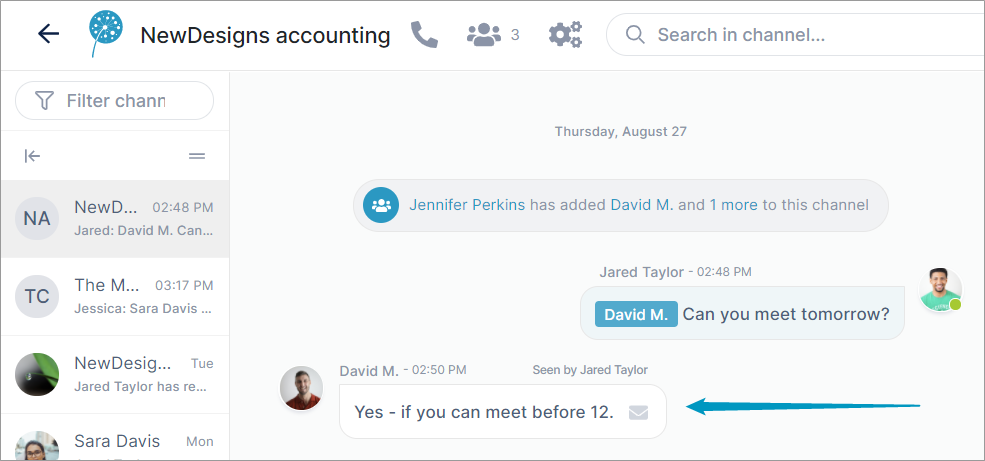
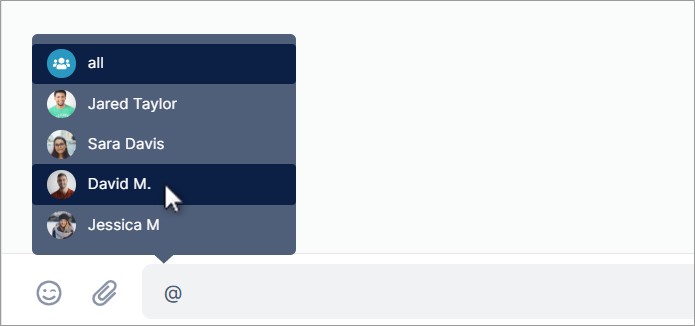

# The AirSend - Email connection

::: info Email
AirSend and email work together seamlessly, making it easy for you to:

-   Continue to work in AirSend while you interact with channel members who don't have AirSend accounts.
-   Receive notifications about your channels' actions when you're not logged in to AirSend.
-   Forward email messages to an AirSend channel to keep the email content at hand or to create a task from it.
:::

  

From email, you can send a message to the channel's email address:  

The message appears in the AirSend channel:  

**From email notifications of messages, you can send a reply that appears in the channel:**

1.  Open the notification in email.  
    
2.  Reply to the email notification directly in email.  
    
3.  Your reply appears in the AirSend channel.  
    

**From the channel, you can send a message to a member's email inbox.**

1.  Enter @ in the message and choose the member.  
    
2.  Complete the message and send it.  
      
    In addition to appearing in the channel, the message appears in an email sent to the @ user.

::: info Notifications
By default, you receive notifications about all AirSend channel actions by email, but you can [change notification settings](/using-airsend/changing-notification-settings) to just receive notifications related to you or to turn off notifications entirely. 
:::