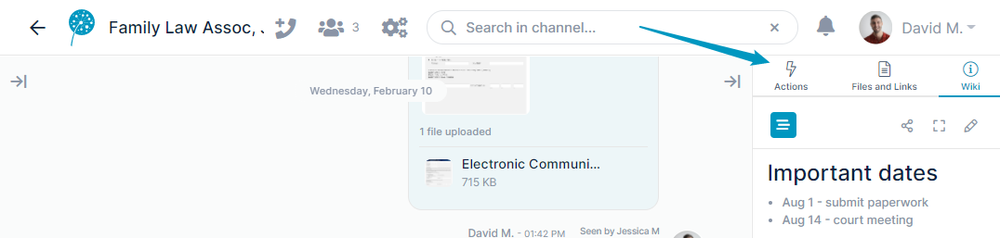
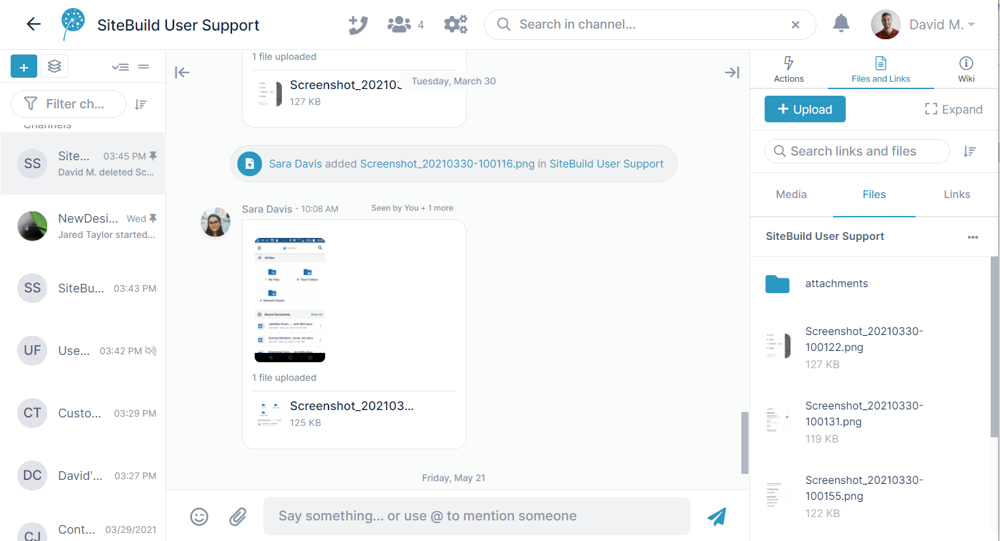
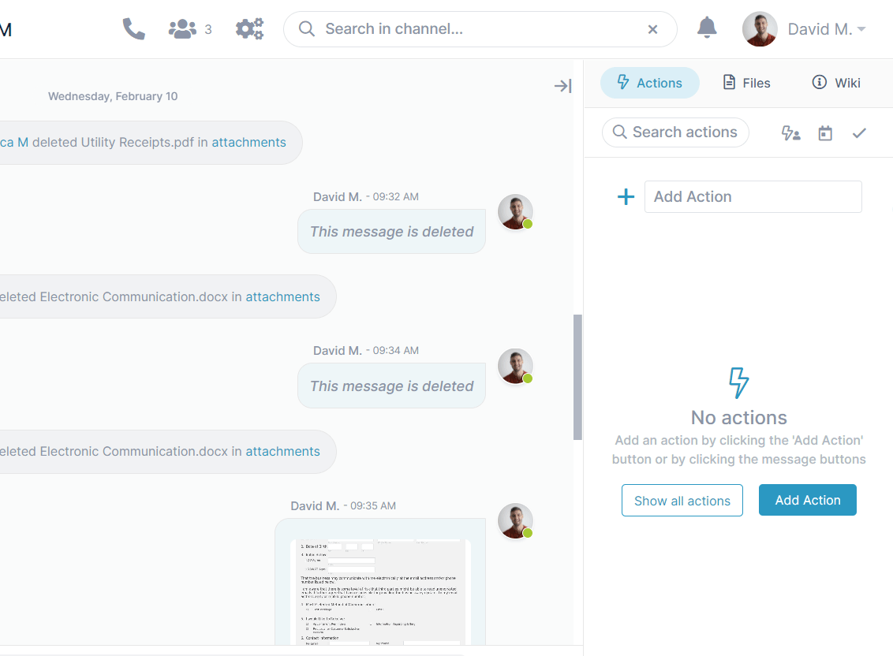
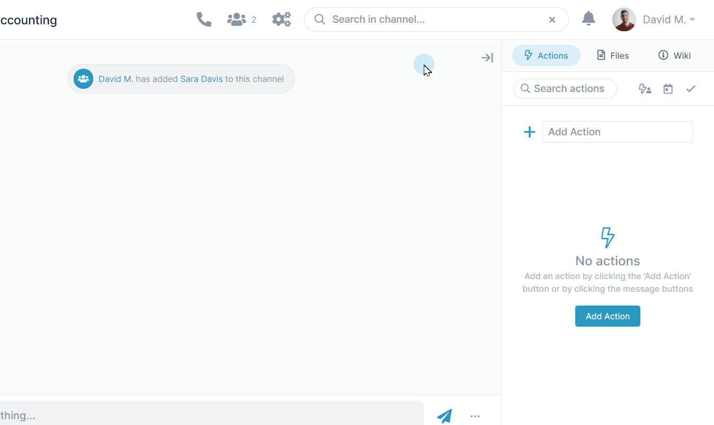

# Files, Actions, and Wiki

## Access a channel's actions, files and links, and Wiki in its right panel.

## Uploading files

Drag and drop a file onto the messaging section to add it to a new message and share it with other channel members. After you send the message, the file appears in the **Attachments** folder in the Files tab of the right panel as well as in the message. Other members can download it from either of these locations.

  
  

## Adding actions

In the Actions tab of the right panel, schedule actions or tasks to be completed. After you create an action, you can assign it to specific users, add a due date, or add subtasks. When an action is complete, check it to remove it from your list of incomplete actions.  
  
**Note:** Your [member type](/members/member-types) in a channel must be full collaborator or higher to add actions.  

## Editing the Wiki

Click the Wiki tab to view notes, links, and other useful information about the channel. If you see a pencil icon when you open the Wiki, you have edit access and can enter new information and enhance its appeal with [markup](/wiki/formatting-wiki-content).

To save changes you make to the Wiki, click **Publish** before closing the editor.

