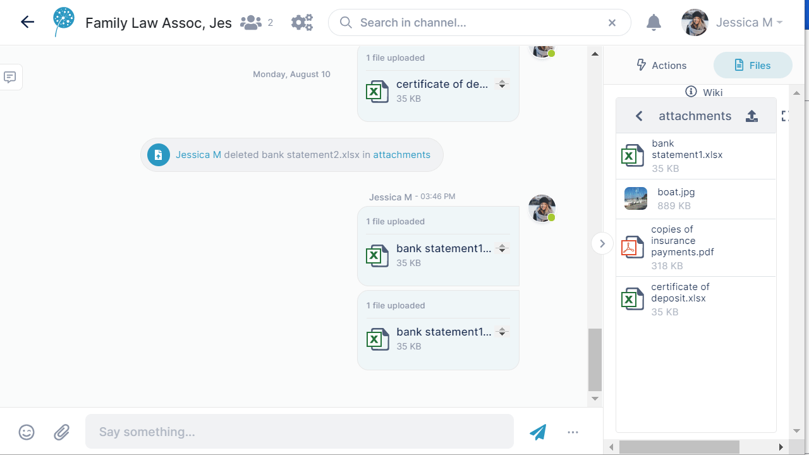

# Add a file to a message

**To add a file or image to a message:**

1.  Either:
    -   Click the attachment (paperclip) icon when you are entering the message and upload the image or file.  
        or:
    -   Drag and drop the image over the messaging section. It appears in the message field, ready to be entered.
2.  Click Enter.  
    The file appears in the same box as the message.  
    It also appears in the Files tab.  
      
    