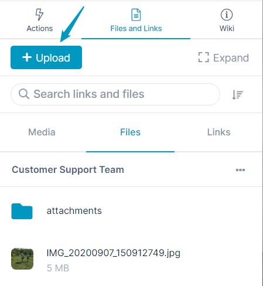
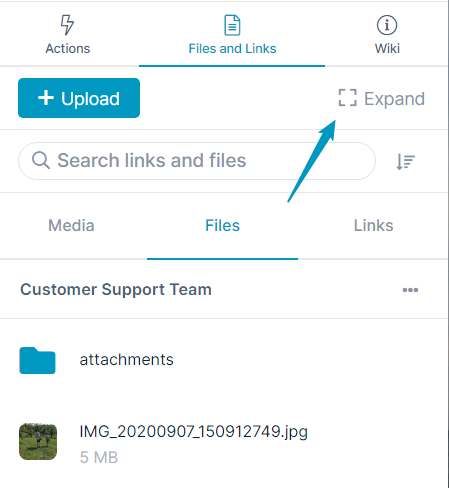
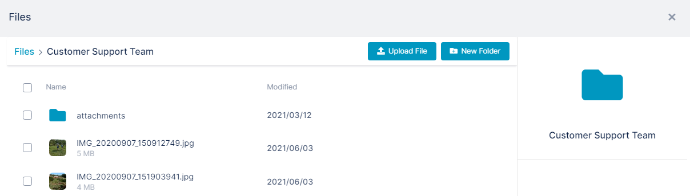

# Add a File to the Files Tab

1.  Open the channel.
2.  In the right panel, click the **Files** tab.  
    The **attachments** folder is included by default.
    
3.  Either use the upload button to upload a file to the tab or drag and drop the file.  
    1.  Drag and drop: if you want to insert it at the top level of the **Files** tab drop it anywhere on the tab away from the **attachments** folder. If you want to insert it into the **attachments** folder, drop it on the **attachments** folder.
    2.  Upload:  
        If you want to upload the file at the top level of the **Files** tab, leave the tab as it is. If you want to upload the file into the **attachments** folder, click the **attachments** folder to open it.  
        Then, click the upload button and upload the file from your file system.
        
          
          
        
        To work in an expanded view of the **File** tab, click the **Expand** button:  
            
          
        
        
        You can [create additional folders and sub-folders](/files/create-additional-folders-in-the-files-tab) in the **Files** tab  
          
        Also see: [Managing files and folders in Files view](/files/managing-files-and-folders-in-files-view).