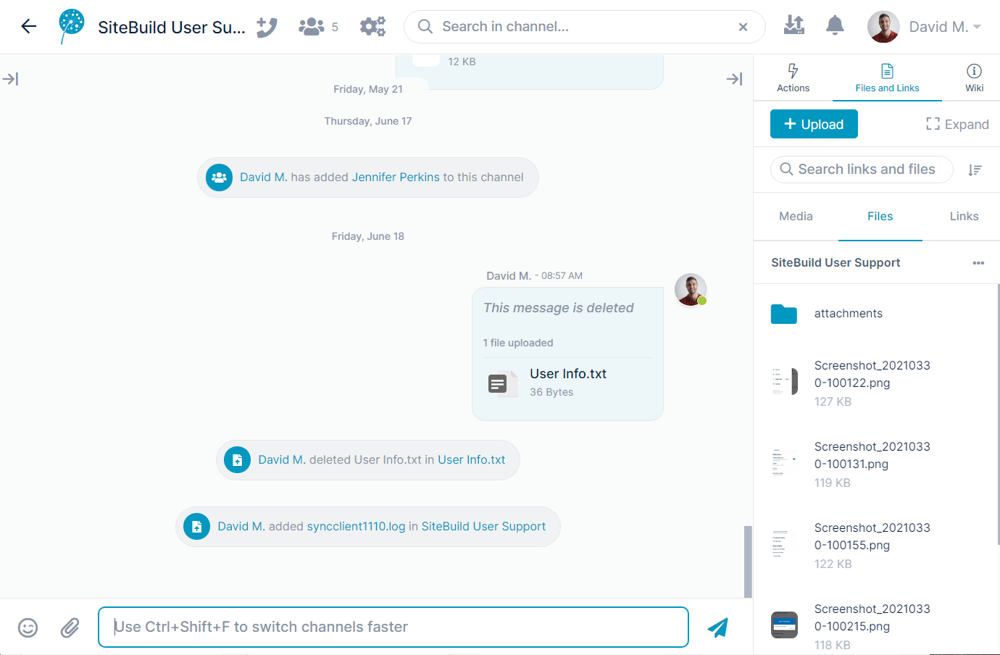

# Confirming File Actions

When you perform an operation on a file anywhere in AirSend, the File Operations icon at the top of the screen displays a counter alerting you to the number of file actions that it is currently processing. To view a confirmation of the action (or a warning if it failed) click the icon.

The File Operations icon does not confirm file operations performed by other channel members.