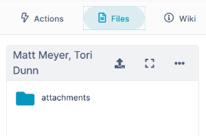
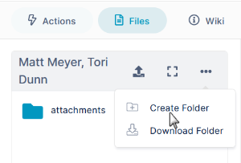
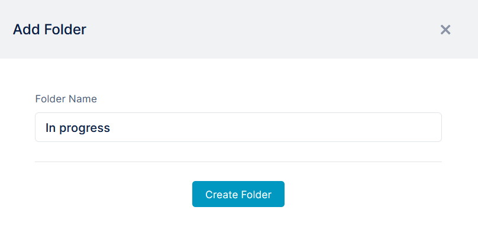
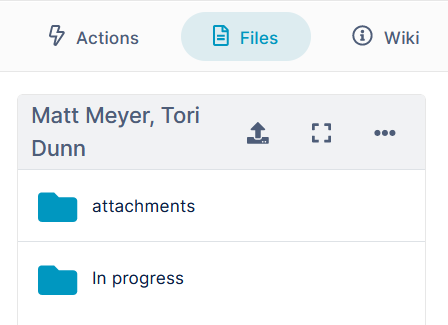
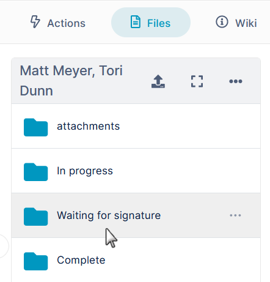
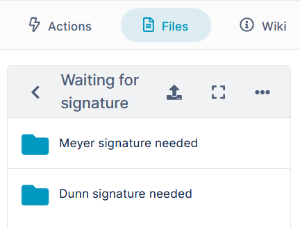

# Create Additional folders in the Files Tab

fYou can add your own folder structure to the Files section of a channel. This procedure shows you how to add folders through the Files tab. You can also [add folders in Files view](/files/managing-files-and-folders-in-files-view) for the channel.  
In this example, we will add the following folder structure using the Files tab.

-   In progress
-   Waiting for signature
    -   Meyer signature needed
    -   Dunn signature needed
-   Complete

**To add the folder structure using the Files tab:**

1.  Open the channel.
2.  In the right-panel, click **Files**.  
      
      
    
3.  Click the 3 dots in the toolbar, and choose **Create Folder**.
    
      
    An **Add Folder** dialog box opens. Enter the name of the first folder that you want to create. In this example, the folder is **In progress**.  
      
      
    
4.  Click **Create Folder**.  
    
5.  Repeat this procedure to create the folders **Waiting for signature** and **Complete**. 
6.  Click **Waiting for signature** to open it.  
    
7.  Click the 3 dots in the toolbar, and choose **Create Folder**, then enter the first sub-folder's name, **Meyer signature needed**.
8.  Repeat to create the second sub-folder, **Dunn signature needed**.  
      
    The folder structure is now complete, and you can now keep your files organized.