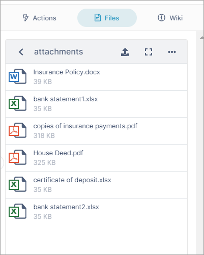
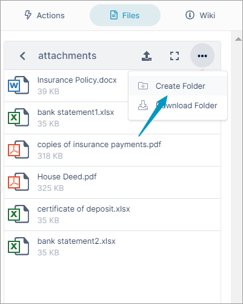
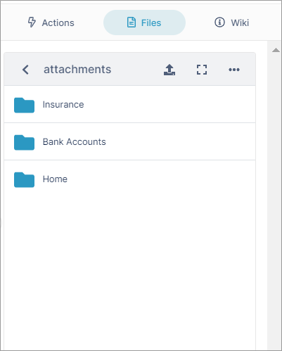

# Creating a Folder Structure in the Files Tab

All of the files that you attach to messages in an AirSend channel appear in the Attachments folder in its Files tab in the right panel, but you can create your own folder structure to organize your disparate documents. You can also upload files directly to the channel without including them in a message.

<table><colgroup><col><col><col></colgroup><tbody><tr><td>

 
<ol><li>All files appear together under <strong>attachments</strong>.  </li></ol>

</td><td>

 

2. Click <strong>Create Folder</strong> to add folders for organization.  

</td><td>

 

3. Create a logical structure and drag and drop files into folders.

</td></tr></tbody></table>

For more information about creating a folder structure, see:

[Files view](/files/files-view)

[Managing files and folders in Files view](/files/managing-files-and-folders-in-files-view)

[Create Additional folders in the Files Tab](/files/create-additional-folders-in-the-files-tab)