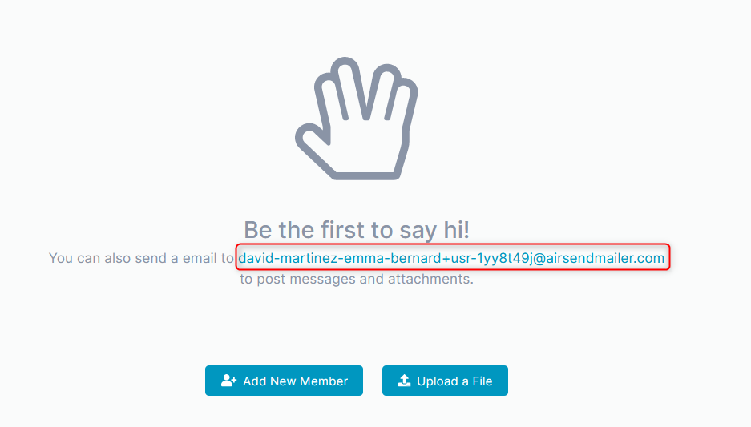
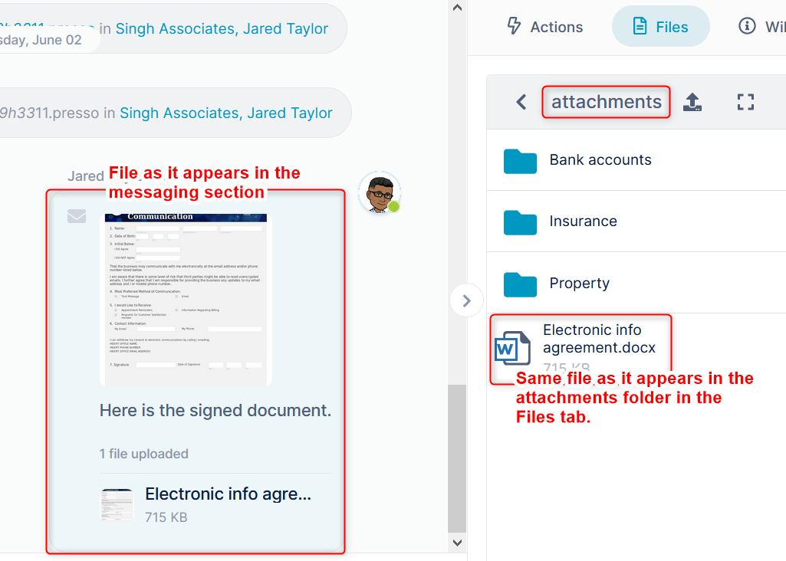

# Email a file to a channel

Each channel in AirSend has an email address. 

<table><colgroup><col><col></colgroup><tbody><tr><td>

When you initially create a channel, the email address appears in the messaging section. 

</td><td>

When you invite someone to join a channel, they receive the email address in a message. 

</td></tr></tbody></table>

When you or another user sends a message to the email address with a file included in it, the file appears in the messaging section and in the attachments folder of the Files tab or Files section.  
