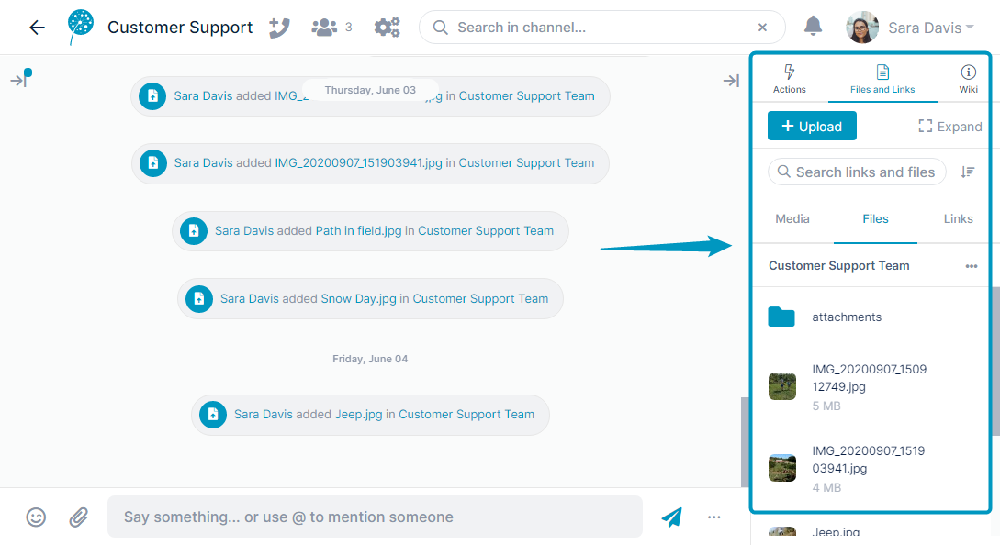
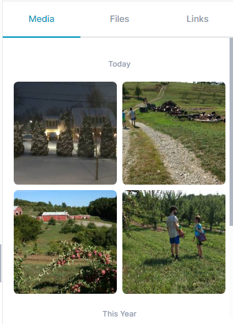
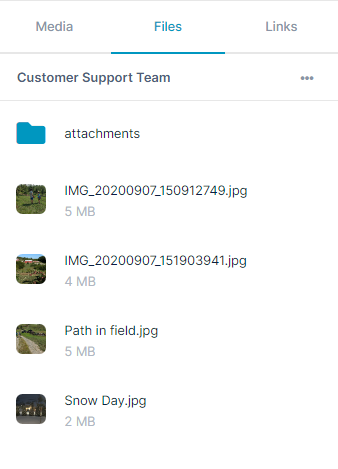
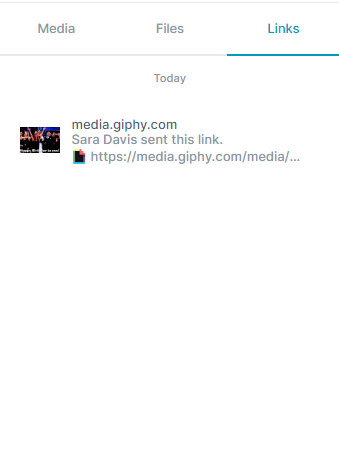

# Files and Links Tab

The right panel includes a **Files and Links** tab:  
  
  
  
It has three sub-tabs, **Media**, **Files**, and **Links**.  

## Media Tab

The **Media** tab includes media files (image and video) added to messages or to the **Files** tab. All media files also appear in the **Files** tab.  
  

## Files Tab

The **Files** tab includes all files uploaded to the channel, the **attachments** folder (the default folder for message attachments) , and folders that you add.  

## Links Tab

The **Links** tab includes all links that you copy into messages.  
  
