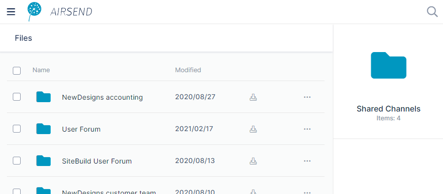

# Files view

Files view displays all of your AirSend files, including the files added to channels you created and files added to channels that you are a member of.

## Accessing Files view

1.  Open AirSend.
2.  In the upper left corner, click the triple-bar icon.  
      
      
    The side navigation panel opens:
3.  Click **Files**.  
      
    Files view opens. It displays the folders **My Files**, which stores files for channels that you have created and files that you are storing outside channels, and **Shared Channels**, which stores files for channels that you have not created but are a member of.   
     

## My Files

Click the **My Files** folder to view folders for each channel that you have created, a folder for files that you have deleted, and any files or folders that you have added to My Files directly in this screen, outside of any channels.   
 To view your channel folders, click the **Channels** folder.  
The view shows a folder for each channel that you have created:  

To view the sub-folders of a channel folder, click the folder. Each **My Files** channel folder includes the sub-folders **files**, **wiki**, and **deleted items**.   
  
The **files** folder and **wiki** folder correspond to the Files tab and Wiki tab in the right-panel of an opened channel. Files added in the files folder here or the Files tab in the channel are are accessible in both places. Likewise, any files added in the wiki folder here or in in the Wiki tab in the channel are accessible in both places. Any file or folder that you delete in a channel automatically appears in the **deleted items** folder.

To add, move, upload and delete files and folders from **My Folders**, see [Managing files and folders in Files view](/files/managing-files-and-folders-in-files-view)

## Shared Channels

Click the **Shared Channels** folder to view folders for each channel that you have been added to by another user.  
  

  

To view the files and sub-folders in a channel folder, click the folder. Each **Shared Channels** folder includes a default **attachments** sub-folder where channel members may store files and folders. Members can also store files and folders outside of the **attachments** folder:  
  

To add, move, upload and delete files and folders from **Shared Channels**, see [Managing files and folders in Files view](/files/managing-files-and-folders-in-files-view).

For help working with files while in an AirSend channel, see [Files in AirSend](/files/intro).