# Managing files and folders in Files view

### Uploading files to channel folders

1.  [Open Files view](/files/files-view).
2.  Navigate to the folder for the channel that will store the file in **My Files** or in **Shared Channels**.
    
    If you want to be able to see the file in one of the tabs for the channel, you must add it to the **files** or **wiki** folder. Otherwise, you will only be able to access the file by navigating back to Files view.
    
    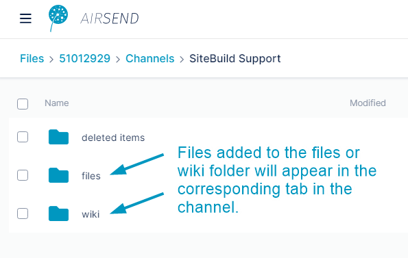  
    For information about the file structure in Files View, see [Files view](/files/files-view).
    
3.  Drag and drop the file onto the files or wiki folder or one of their subfolders,  
    or click **Upload File** and select a file or drag and drop a file over the main section of the screen.
    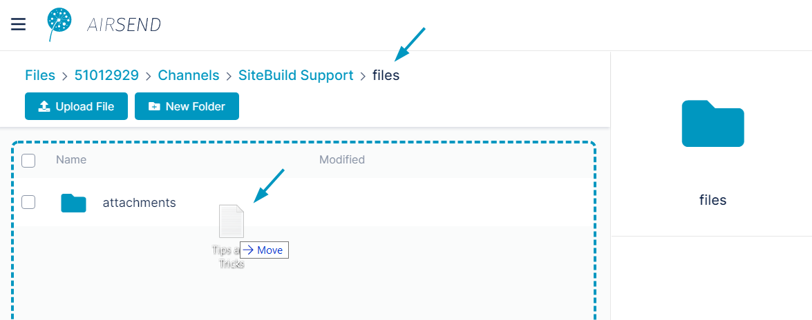  
      
    The file is uploaded to the folder and appears in the main section of the screen, which displays the contents of the folder.  
    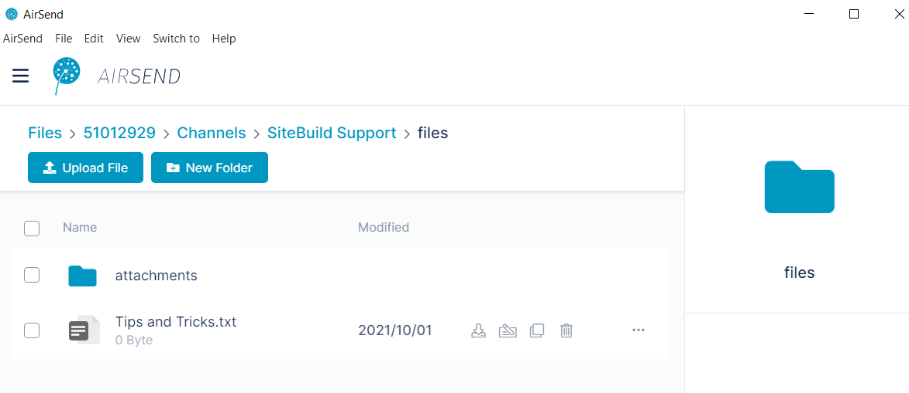  
      
    If you leave Files view and open the channel, you can see the file in the Files and Links tab when you click the Files sub-tab or, if you added it to the Wiki folder, when you edit the wiki.  
    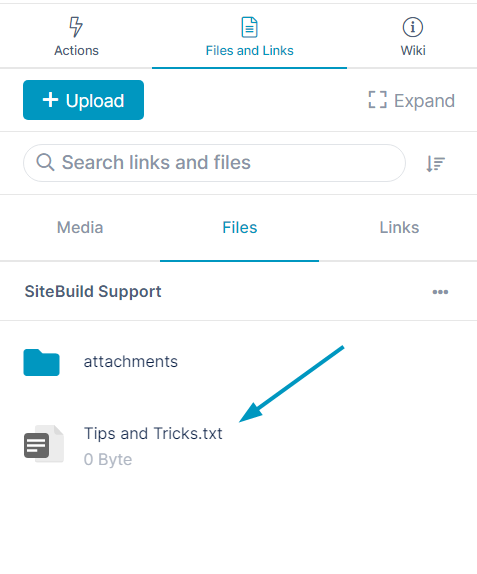

  

## Moving files and folders

You can move a file or folder in AirSend into another folder.

1.  [Open Files view](/files/files-view).
2.  Navigate to the file or folder that you want to move.
3.  Either:
    -   Hover over the file or folder until the icons in the row are visible and click the move icon:  
        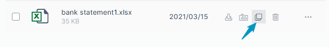  
        or:
    -   Click the three dots to the right of the file or folder and choose **Move**.  
        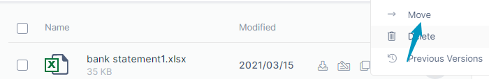  
          
        A Move Files dialog box opens.
4.  Navigate to the location where you want to move the folder:  
    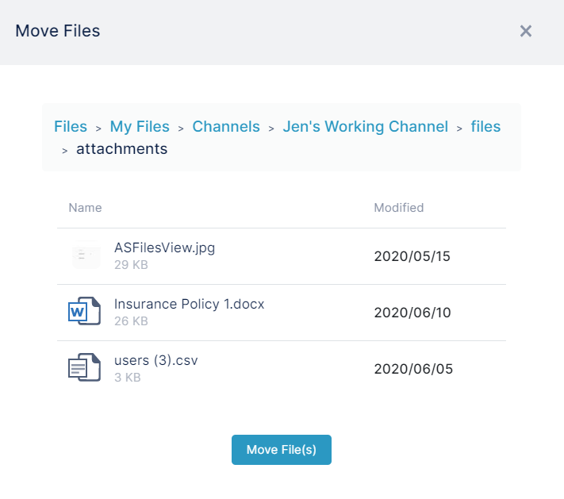
5.  Click **Move File(s)**.  
    The file or folder is moved into the new location.  
    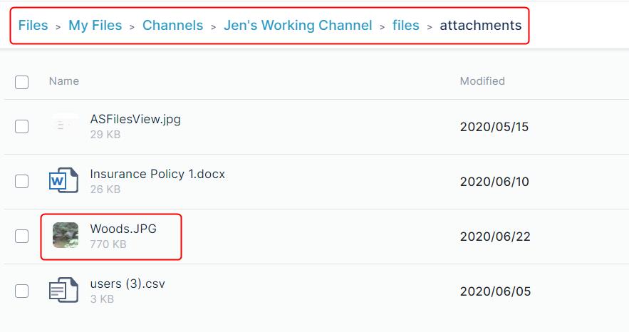

## Downloading files and folders

You can download both files and folders in AirSend. When you download a folder, the folder and its contents are downloaded in zip format.

To download a single file or folder,  
either:

-   Hover over the file or folder until the icons in the row are visible and click the download icon:  
    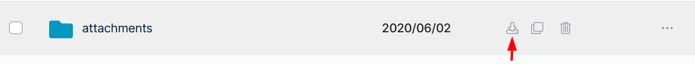

or:

-   Click the three dots to the right of the file or folder and choose **Download**.  
    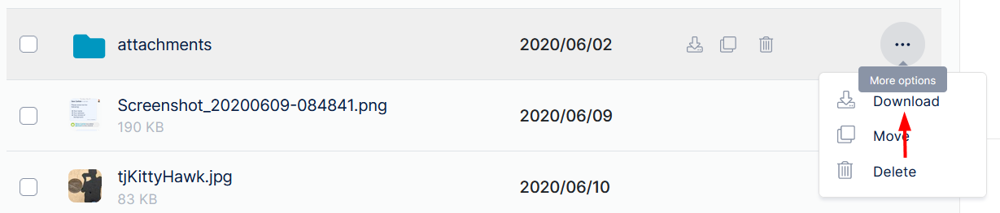  
      
    

## Adding subfolders

You can add sub-folders anywhere within the **My Files** or **Channels** folders.

1.  [Open Files view](/files/files-view).
2.  Navigate to the folder that will store the sub-folder in **My Files** or **Channels**.
3.  Click **New Folder**.  
    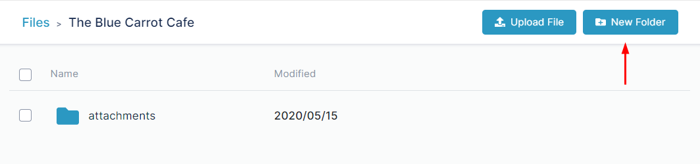  
    A **New Folder** dialog box opens.  
    
4.  Enter a name for the folder.  
    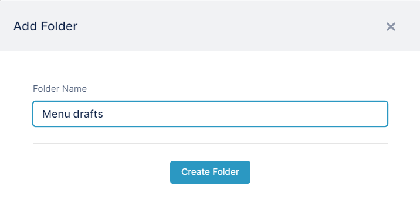
5.  Click **Create Folder**.  
    The new sub-folder is created.  
    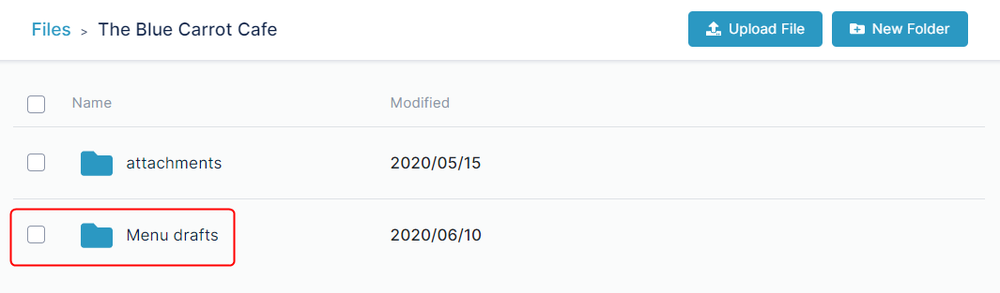  
    
## Deleting files and folders

To delete a single file or folder,  
either:

-   Hover over the file or folder until the icons in the row are visible and click the delete icon:  
    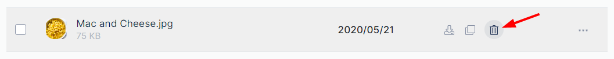

or:

-   Click the three dots to the right of the file or folder and choose **Delete**.  
    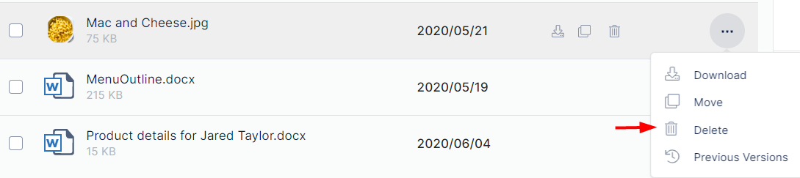

To delete multiple files or folders:

1.  Check the boxes for all of the files and folders that you want to delete.
2.  In the toolbar, click **Delete**.