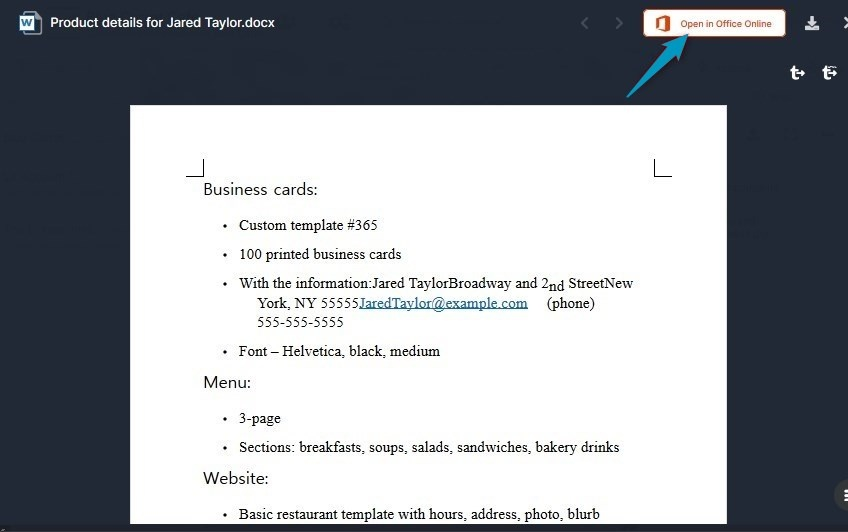
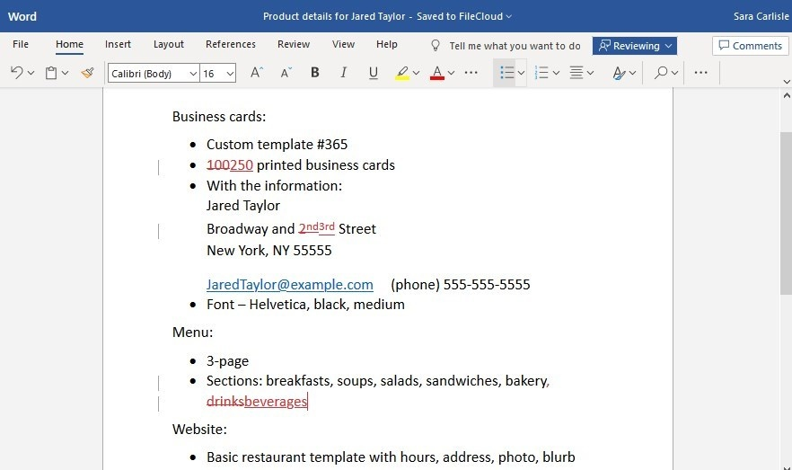

# Opening Office files in AirSend

AirSend completely integrates with Office 365, which means that you and a client can collaborate on documents in Word or Excel or another Office application without leaving AirSend. This enables you to save time and make fewer mistakes by avoiding the process of downloading the file, editing it, and re-uploading it or resending it to the channel.

Note: You must have Office 365 account in order to edit files in Office applications. If your credentials are not saved, the application will ask you to enter them before opening.

To edit a document with and Office application in AirSend:

1.  Open the document in any of the locations it appears in AirSend, [Files view](/files/files-view), the [Files tab of the channel](/files/add-a-file-to-the-files-tab), or even the [messaging section](/channels/inside-an-airsend-channel) of the channel.  
    The file opens for preview:  
    
2.  Click the Open in Office Online button in the upper-right corner.
3.  The document opens in its Office application.
4.  From there, make any edits. Your changes are automatically saved.  
    
5.  Close the file.  
    It appears again in preview.
6.  Close the preview.