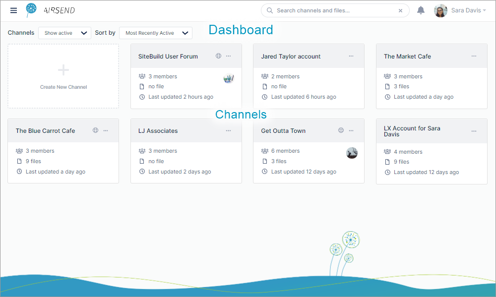
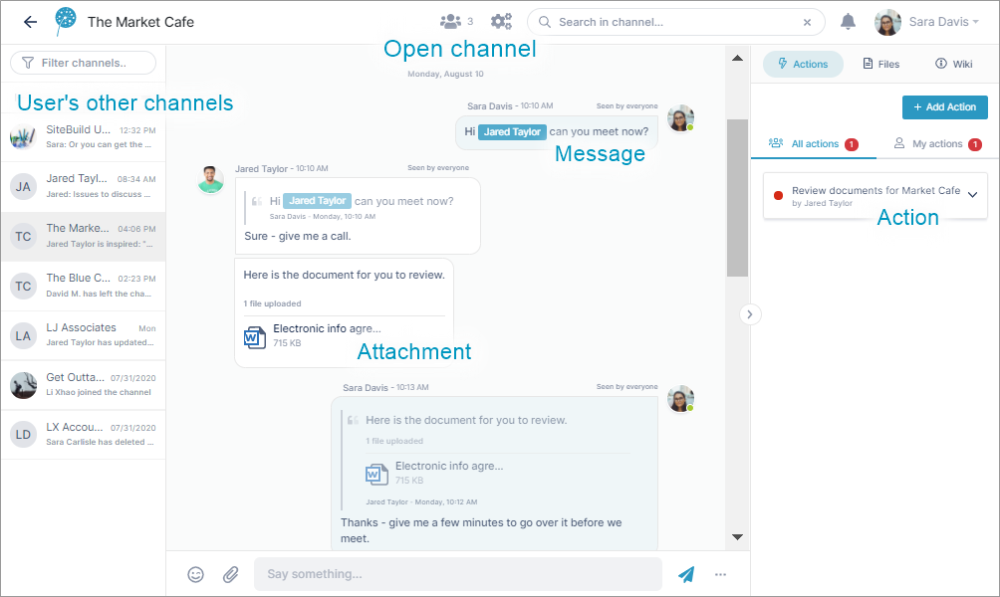
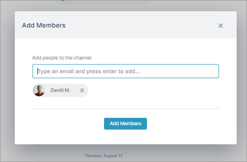
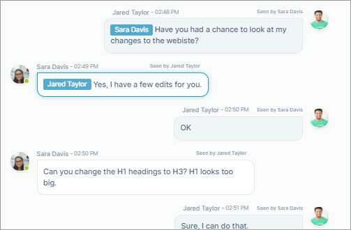
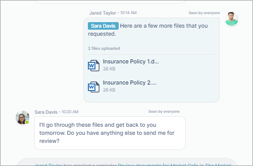
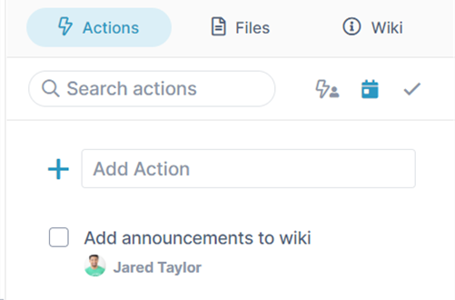

# What is AirSend?

AirSend's mission is to help you get things done. Like Slack or Microsoft Teams, AirSend helps you:

-   [send messages](/messages/messaging-inside-an-airsend-channel)
-   [upload images](/files/add-a-file-to-a-message)
-   [meet with channel members](/meetings/intro)
-   [announce events](/wiki/intro)
-   [assign tasks](/files-actions-and-wiki)

What's different is that AirSend's primary focus is quick and easy collaboration. With AirSend you can:

-   [Instantly share files by dragging and dropping them](/files/intro)[.](/files-actions-and-wiki)
-   [Shift between channels with a single mouse click.](/channels/inside-an-airsend-channel)
-   [Work seamlessly with email to include members who don't have AirSend accounts.](/email)

::: tip
For best results, use the [AirSend desktop app](/apps/airsend-desktop-app) or the Chrome web browser. 
:::

## The AirSend Dashboard

The dashboard is the workspace in AirSend where your channels for different clients, teams, and projects are located. It is the first page you see after logging in to AirSend. 

## What are channels?  

Channels are the places where you collaborate with team members and clients by sharing messages, files, and actions​.

## How can I collaborate in AirSend?

<table><tbody><tr><td>
<h4><a href="/members/adding-more-members-to-a-channel">Add members</a> </h4>
</td><td>
<strong><a href="/messages/messaging-inside-an-airsend-channel">Send messages</a> </strong>
</td></tr><tr><td>
<h4><a href="/files/intro">Share files</a></h4>
</td><td>
<h4><a href="/actions/intro">Add tasks and reminders</a></h4>
</td></tr></tbody></table>

## What else can I do in AirSend?

-   [Create wiki pages for posting instructions and important information](/files-actions-and-wiki)
-   [Integrate with email](/email)
-   [Use templates to create channels](/channels/creating-channels-from-templates)
-   [Perform content searches](/making-your-experience-easier)
-   [Employ inline commands](/customization)
-   Work through our mobile [Android](/apps/airsend-on-android) and [iOS](/apps/airsend-on-i-os) apps