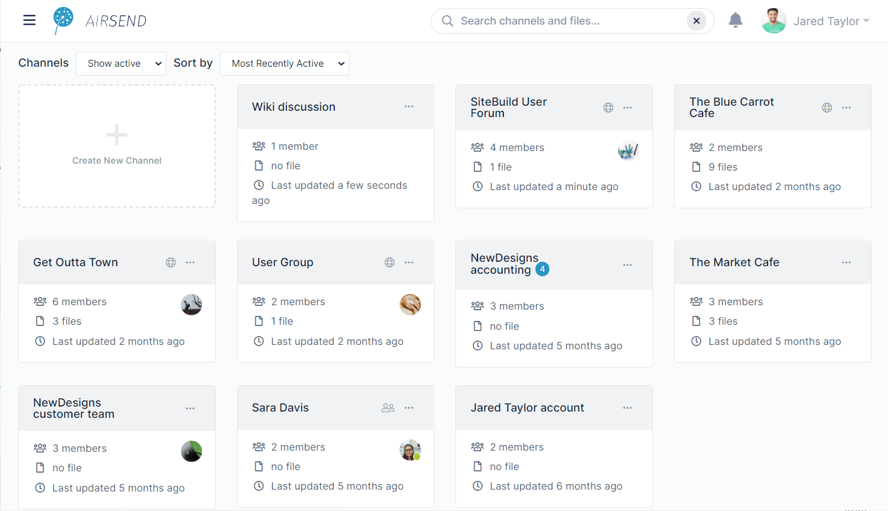
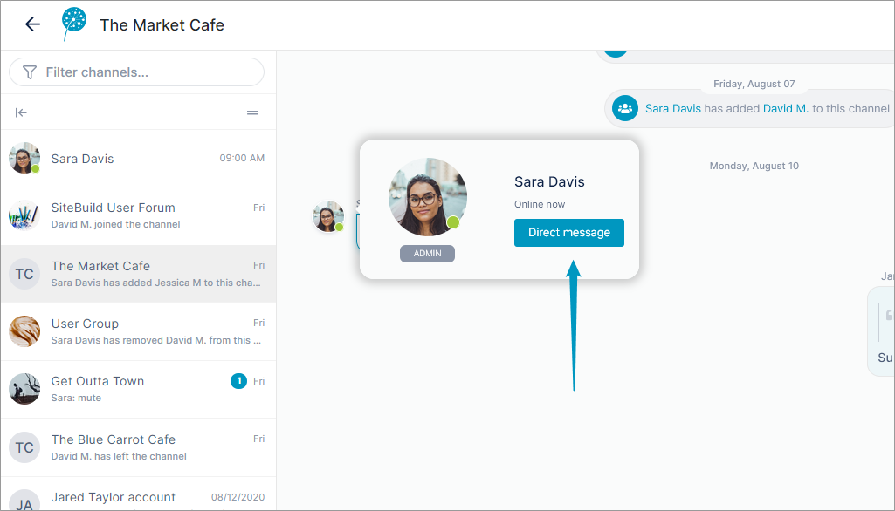
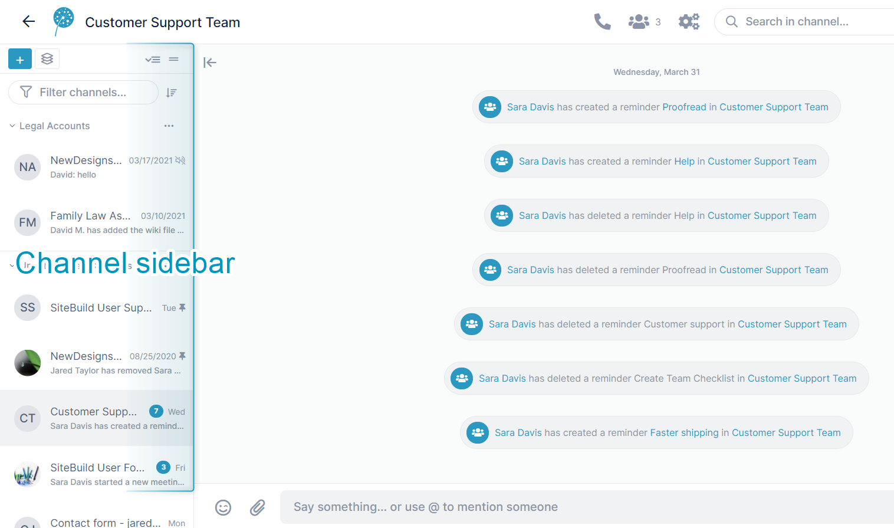
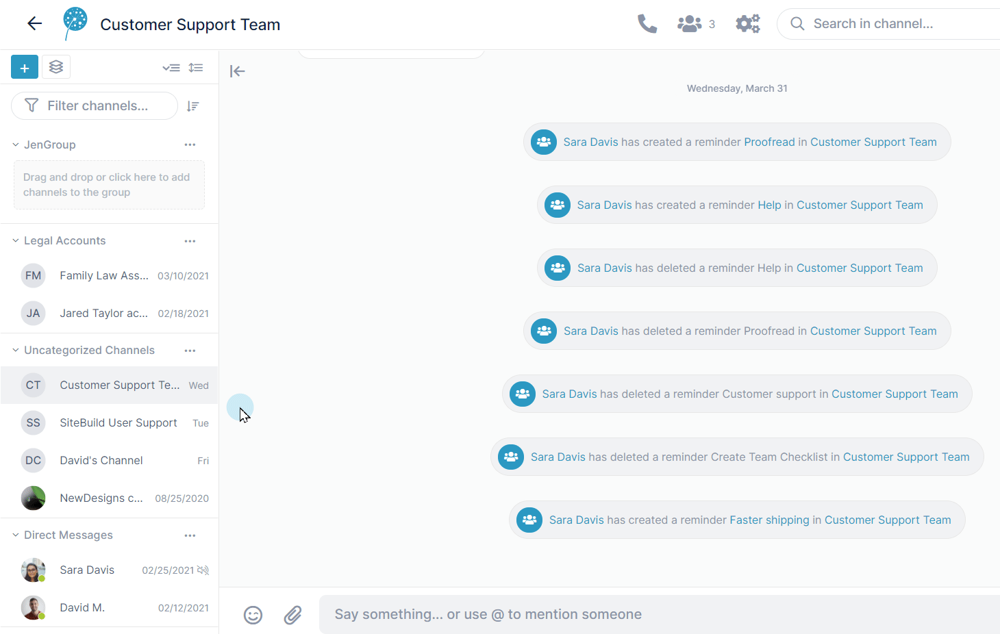
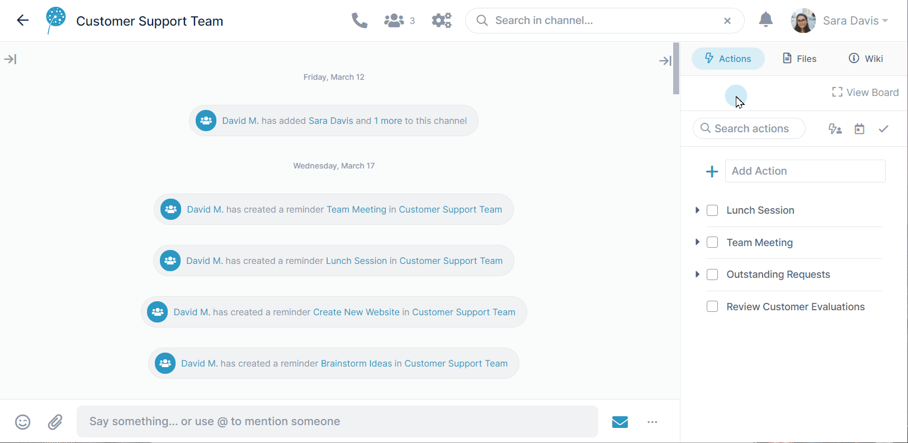

# Making Your Experience Easier

Now that you've seen how simple is is to collaborate in AirSend by sharing messages, documents, and actions, we're going to show you how easy it is to find things with AirSend's smart content search, channel grouping, and task organization in the Kanban board. 

## Content search

AirSend's content search is active in the dashboard and inside channels. The content search returns matching content in the following categories:

-   channel names
-   messages
-   files
-   actions
-   user names

When you search in the dashboard, you find matching content in all channels; when you search in a channel, you find matching content within that channel only.

As you type into the search box, AirSend displays up to three matches per category under the search box. To see all matches, click **Enter** or click **Show All** for one of the search categories.

## Direct messages and one-on-one channels

You can send a message to one other member of a channel by hovering over their icon and clicking **[Direct message](/messages/direct-messaging)**.   

A channel is created for the two of you where you can chat one-to-one.

## Pinned channels and channel grouping

The more you take advantage of AirSend's capabilities, the more channels you will see on your dashboard.

To make it easier to find specific channels, you can group your channels in ways that are meaningful to you in the channel sidebar that appears when you are inside a channel.  
  

Regardless of which channel you open, the channel sidebar on the left shows the same list of all your channels. By default, the sidebar shows channels grouped by **Groups you have created**, **Uncategorized  
Channels**, and **Direct Messages**. 

Click a channel's More (3 dot) icon and choose **Pin Channel** to make it a favorite that appears at the top of its category.  

You can also create your own channel groups which appear at the top of the list. Just click the **Create Group** button, name the group, and drag and drop channels into it.   

For additional ways you can make it easier to locate the channel you're looking for, see [Channel Sidebar: Finding Channels](/channels/sidebar).

## Task organization with the Kanban Board

You can view all your tasks and subtasks at once, combine, separate, and rearrange them in the Kanban board.  

To learn more about the Kanban Board, see [Actions in the Kanban Board](/actions/kanban).