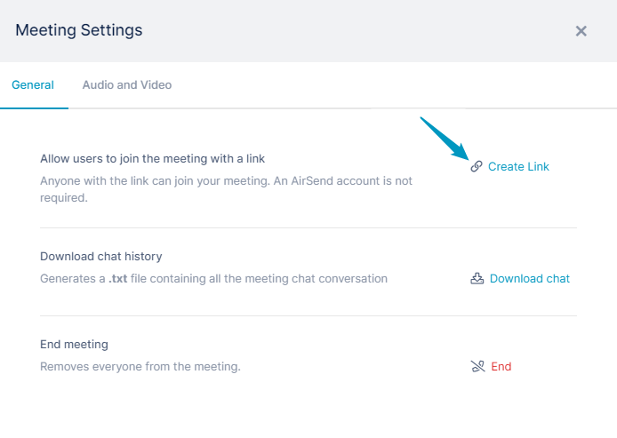
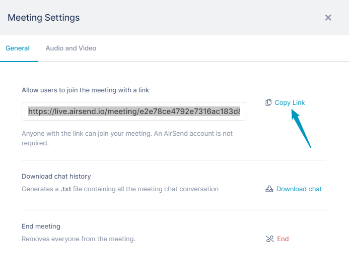
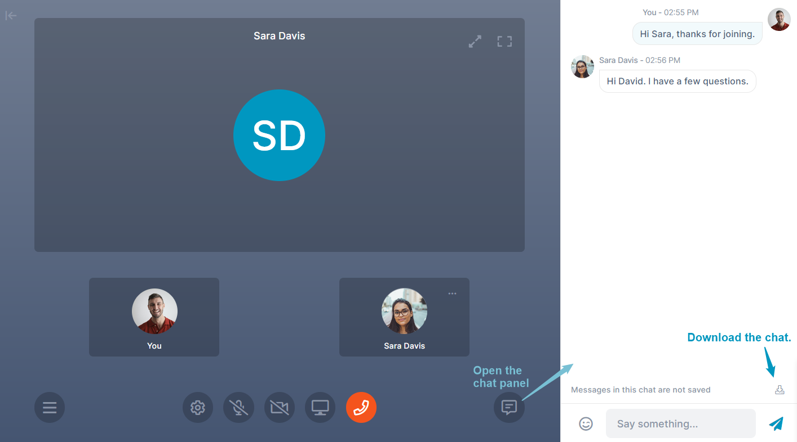

# Changing a Meeting from Private to Public

After you have begun a private meeting in a channel, you can make it public by generating a meeting link and sending it to users outside the channel.

**To change a meeting from private to public:**

1.  In the private meeting, click the Settings button.  
      
      
    The **Meeting Settings** dialog box opens.
2.  Click **Create Link**.  
      
    Once you click **Create Link**, the meeting becomes public for everyone in the meeting.  
      
3.  Click **Copy Link**.  
      
      
4.  Send the link to anyone you want to invite to join the meeting.
    
    Attendees who were in the meeting when it was private no longer have a connection between the channel and the meeting when it is made public.  When they click the Message icon, instead of returning to the channel, they open a message panel on the left.
      
    The content in the right panel is not automatically saved, but you can save it as a text file by clicking the download button at the bottom of the chat:  
    
    