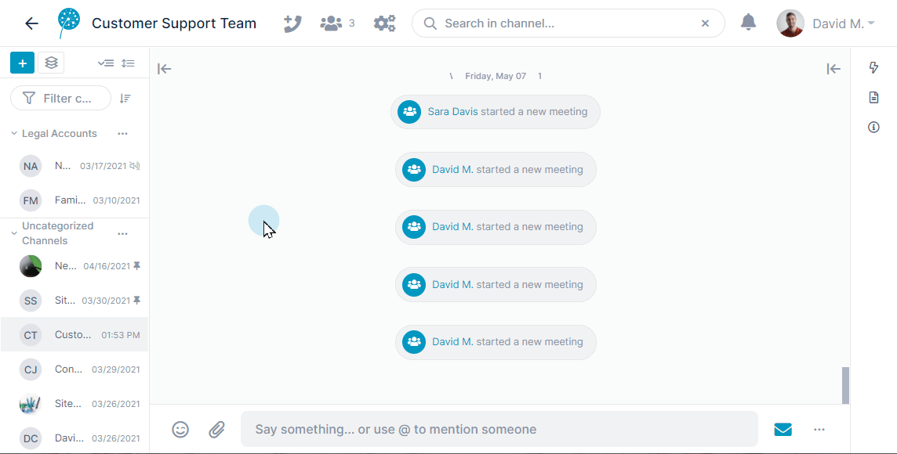
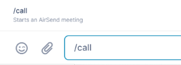
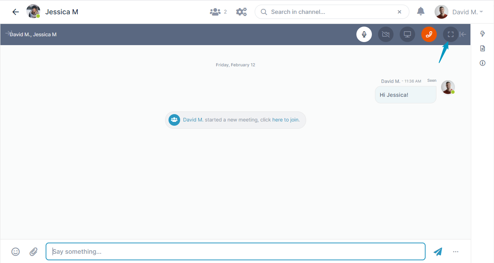
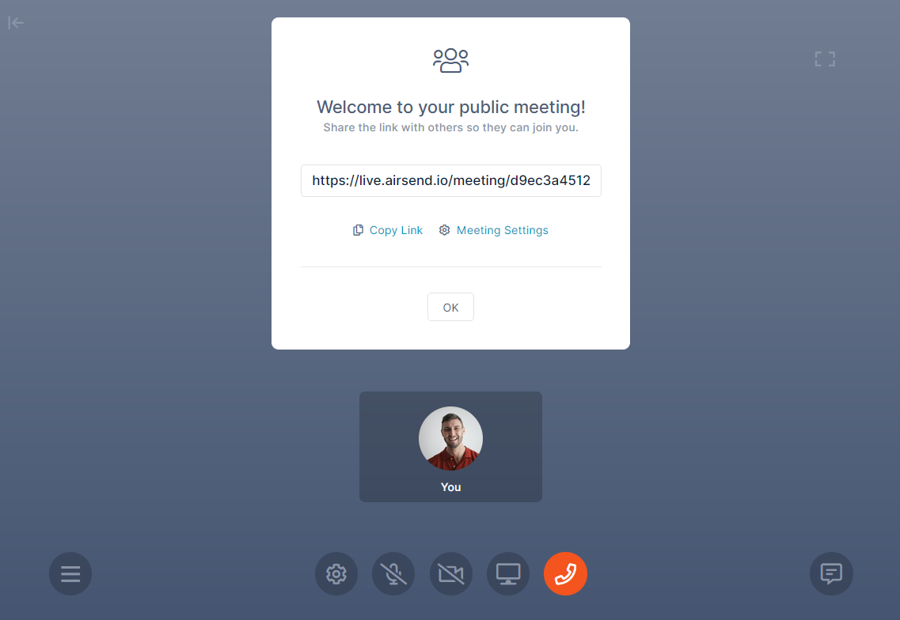
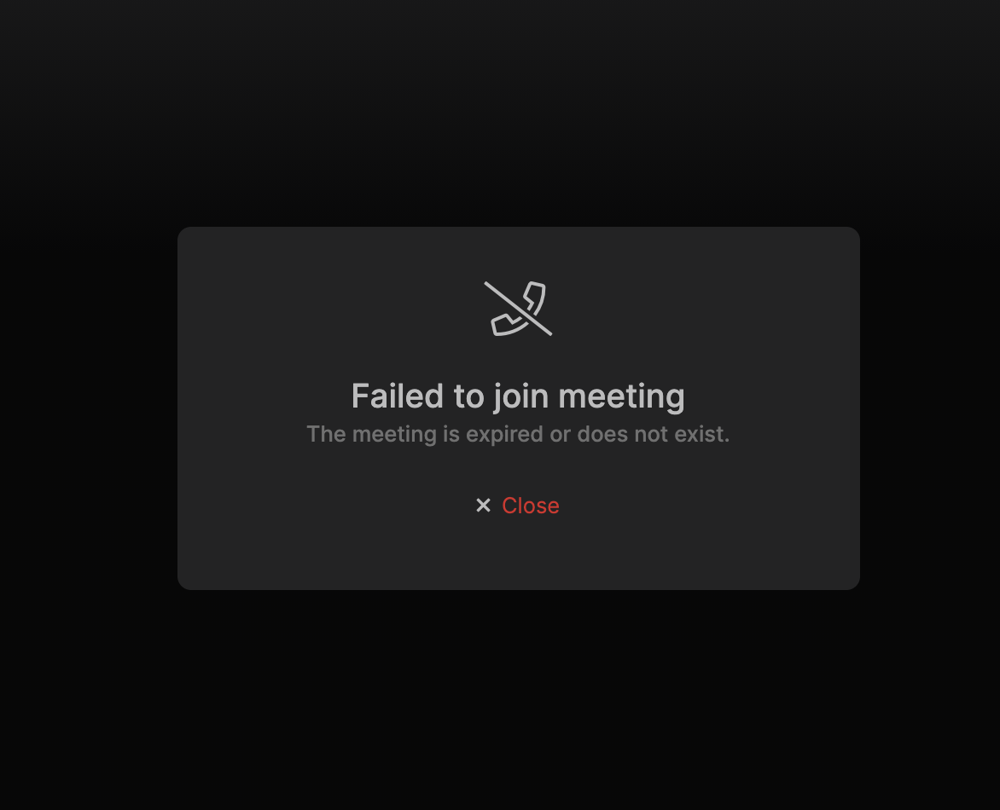
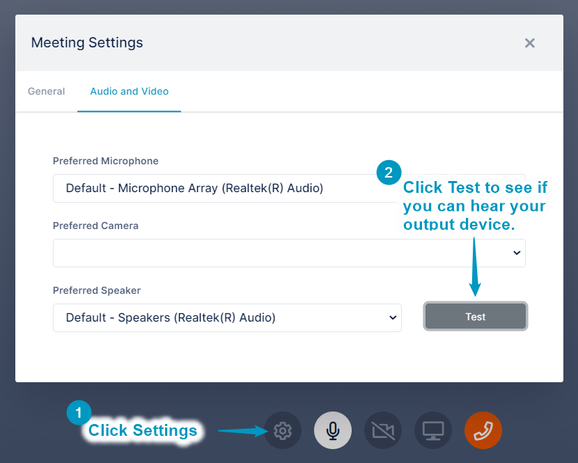

# Meeting in AirSend

In AirSend, you can meet with the members of a channel or have a public meeting that anyone with the meeting link can join.  
  

## Meeting with Channel Members

To begin a meeting with all members of a channel, open the channel, click the phone icon at the top of the screen, and choose **Start meeting for the channel members**. The other members of the channel will hear an alert letting them know that a meeting has begun, and receive a notification in the channel with a link for joining the meeting.

As soon as you start the meeting, you'll see your image on the screen with an alert that you've joined the meeting. You wil lalso see a red phone icon overlaying the channel in the channel navigation pane. As other members join the meeting, their faces will appear on the screen, and you can begin talking.

  

  

By default, meetings begin with your microphone enabled and your video disabled. 

<table><colgroup><col><col></colgroup><tbody><tr><td>To mute yourself, click the microphone icon.</td><td>

</td></tr><tr><td>To turn on your video, click the video icon.</td><td>

</td></tr><tr><td>To leave the meeting, click the phone icon.</td><td>

</td></tr><tr><td>To change your audio and video settings, get a meeting link, or download the chat of a meeting, click the settings icon. An option to end the meeting also appears for channel owners and admins.</td><td>

</td></tr><tr><td>To share your screen, click the screen icon. A message appears at the bottom of the shared screen with a link you can click to stop sharing.</td><td>

</td></tr><tr><td>To stop sharing your screen, click the <strong>Stop Sharing</strong> link in the message at the bottom of the screen.</td><td>

</td></tr></tbody></table>

  

You can also begin a meeting by entering /call in the chat bar:  

## Toggling between meeting view and message view

If you are in a meeting and want to go to message view, click the message icon in the lower right of the screen:  
  
  
Message view opens. It includes a toolbar with meeting view icons across the top.  
When you are ready to return to the meeting, click the expansion icon at the end of the toolbar.  
  

## Joining a meeting

If a meeting has been started in a channel that you're a member of, you'll hear an alert sound when someone starts a meeting and see a message about the meeting with a link for joining.

Click the link to join the meeting.  
  

## Moderator Actions

A meeting moderator has some control over the actions of other members of a meeting.

## Who is a meeting moderator?

-   In a public meeting, the moderator is the user who started the call.
-   In private (channel) meeting, a moderators are members with the roles manager, admin, and owner.

## What can moderators do?:

When a moderator clicks the three dots (...) in the icon for a user in the lower portion of the screen, a drop-down list with possible actions opens.  
A moderator always has the option of removing the user from the meeting. Other actions are listed depending on whether the user is using audio or video, or screen sharing, 

**Available Actions**

-   Mute microphone
-   Disable video
-   Disable screen sharing
-   Remove from the meeting  
      
      
       
    Although, as a moderator, you may stop an action, you cannot prevent the user from doing it again. For example, if you mute a user's microphone, the user may turn it back on, or if you remove a member from a meeting, the user may rejoin the meeting.

## Public Meetings

You can begin a public meeting from a channel or from the dashboard, but in either case, it is open to anyone who has the meeting link. If you open the meeting from a channel, members of the channel are not automatically invited to the meeting.

1.  Hover over the phone icon at the top of the page and click **Start public meeting**.  
      
      
    Your meeting begins, and the link for the meeting is shown.  
      
      
    
2.  Click **Copy Link**.
3.  Send the link to anyone you want to invite to the meeting.  
    When invitees click the link, the meeting screen opens and they are able to participate.

## Public meeting chats

You begin a chat from a public meeting the same way you begin a chat in a private meeting - by clicking the Chat icon in the lower-right corner of the screen.  
  
  
In a private meeting, the channel chat opens, but since a public meeting is not tied to a channel, the chat takes place in the right panel:  

The content in the right panel is not automatically saved, but you can save it as a text file by clicking the download button at the bottom of the chat:  

## Troubleshooting Meetings

## I can’t join a meeting

-   Check your computer and internet connection.
-   Check if your firewall or antivirus is blocking the app connection.
-   Check if the meeting is expired.  
    You should see the message:  
      
      
    

## I can’t see others

-   Check if the meeting is expanded.
    
    <table><colgroup><col><col></colgroup><tbody><tr><td>

When the meeting is not expanded, the expansion icon appears as:

</td><td>

When the meeting is expanded, the expansion icon appears as: 

</td></tr></tbody></table>
    

## I can’t hear others

-   Check if the browser tab is muted.
-   Try to reconnect.
-   Check your output device in the **Meeting Settings.  
    **  
      
    

## Others can’t hear me

-   Check if the browser or app has microphone permissions.  
    A message should have appeared.
-   Check your input device in the **Meeting Settings.  
    **  
      
    

## I can’t screen share

-   Check if the browser or app has screen sharing/recording permissions.  
    If you don’t see the screen share icon, that means your browser does not support this feature.  
    