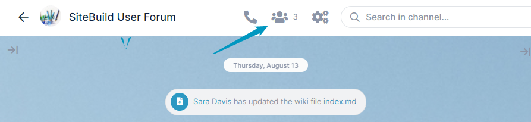
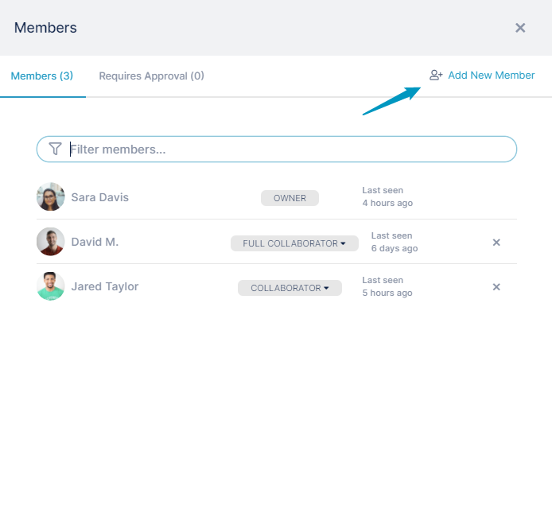
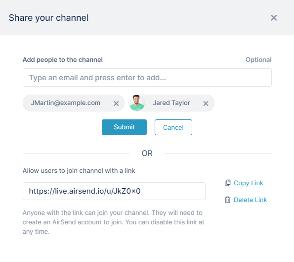
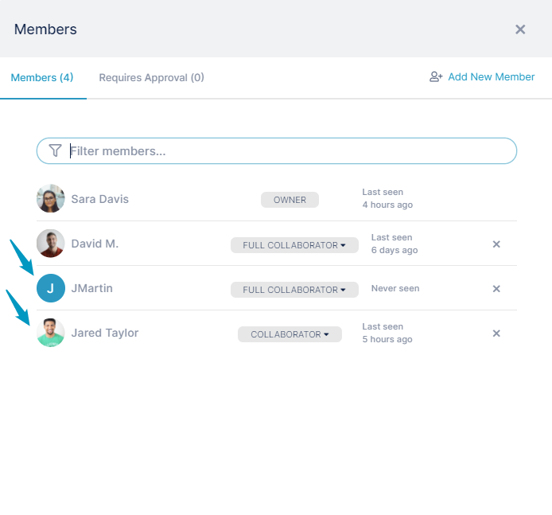

# Adding more members to a channel

If you are the creator of a channel, you may add additional members to it:

1.  Open the channel.
2.  In the toolbar, click the Members icon.  
      
    The Members dialog box opens.  Since you are the creator, and **Add New Member** button appears at the bottom.
3.  Click the **Add New Member** button.  
      
    An Add Member dialog box opens.
4.  Enter the new channel members' email addresses or add users with existing accounts.  
    
5.  Click **Submit.**  
    The newly added users are now members of the channel, and are listed with other members.  
      
    The new members receive emails telling them they have been added to the channel and giving them a view link for the channel as well as an email address to use to send messages to the channel. Existing AirSend members can log in to begin contributing to the channel. Non-AirSend members must create an AirSend account if they would like to contribute to the channel.  
    If non-AirSend members do not create AirSend accounts, they continue to have view access to the channel and receive, by email, messages sent to them from the channel and channel alerts.