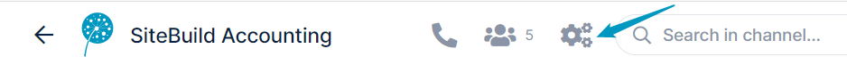
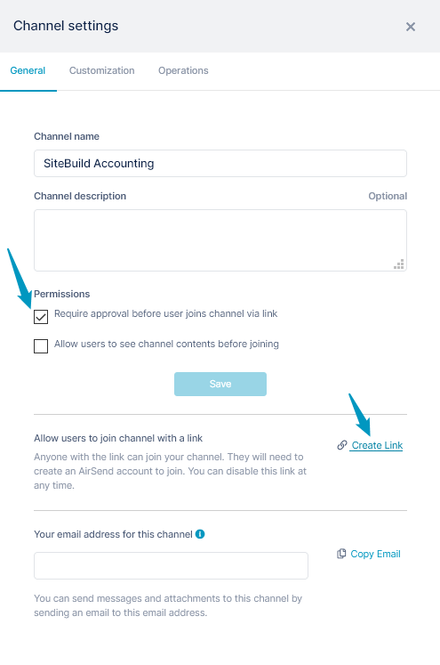
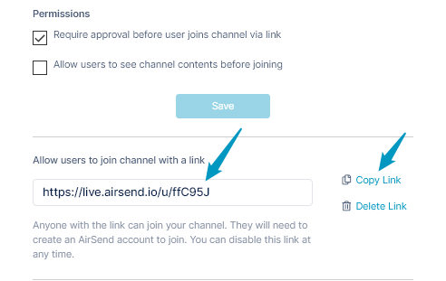
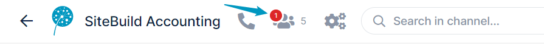
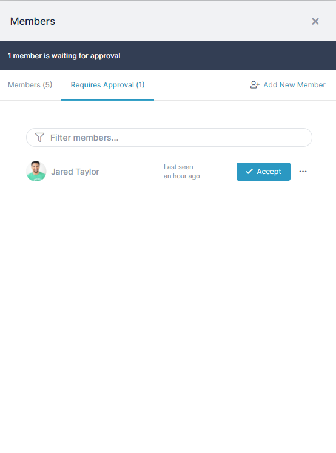
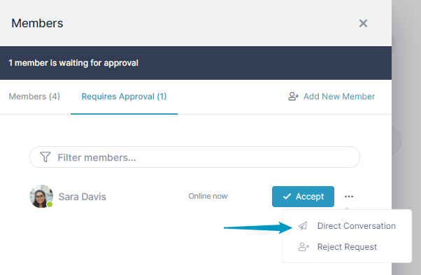

# Approving members

If you share a channel by sending a link to potential users, you have the option of requiring users to be approved before they can become members of the channel.

### To require approval before a user can join a channel

1.  Open the channel, and at the top, click the settings icon:  
      
      
    
2.  In the **Settings** window, in the **General** tab, under **Permissions**, check **Require approval before user joins channel via link**, and click **Save.  
    **
3.  If you have not already created and copied the link when you [created the channel](/channels), then you can do it now
    1.  Below the **Permissions** settings, click **Create Link**.  
        The link appears:
        
    2.  Click **Copy Link**.
4.  Paste the link into an email and send it to potential users, or post it on a web page.

### When users click the channel link

When users who want to join the channel click the link, the screen displays:  
  
When a user clicks **Ask to join channel**, the owner of the channel sees an alert on the members icon:  
  
  
  

### To approve a user as a channel member

1.  If you see an alert on the user icon of a channel that requires approval of users, click the icon.  
    The **Members** window opens.
2.  Click the **Requires Approval** tab.  
    The tab lists all users who have asked to join the channel.  
    
3.  To approve a user, click **Accept**.  
    The user receives a message that they have been added to the channel. Now when they enter the channel link, the channel opens.

### To direct message a user before approving

1.  If you need more information from a user before approving them as a channel member, click the three dots to the right of the **Accept** button and choose **Direct Conversation**.  
      
    AirSend immediately creates a direct message channel for you and the user, and you can immediately send a message to the user.   
    The user remains in the **Requires Approval** tab until you accept or reject the membership request.

### To reject the membership request

1.  To reject the user's request for membership to the channel, click the three dots to the right of the **Accept** button, and choose **Reject Request**.  
    The user is removed from the **Requires Approval** tab.  
    AirSend does not notify the user that their membership has been rejected. To notify the user, you must send a message manually.