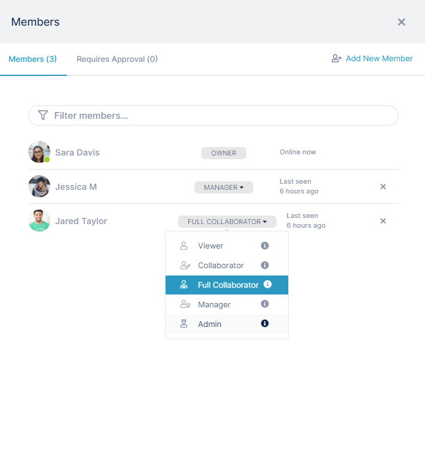

# Changing a Member's Type

If you are an **Owner** or an **Admin** of a channel, you can change the status of other channel members.

1.  Open the channel.
2.  In the toolbar, click the Manage members icon.  
      
    The Members dialog box opens.
3.  Click on the member's **Member Type** drop-down list and choose a new member type.  
    