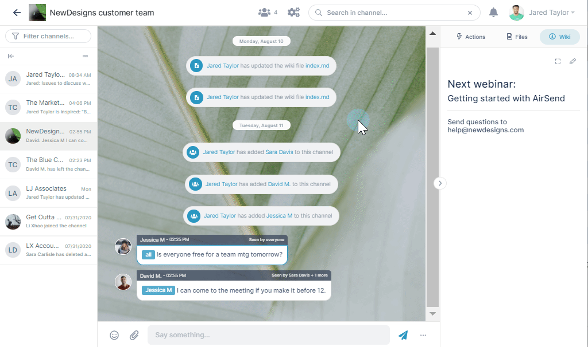
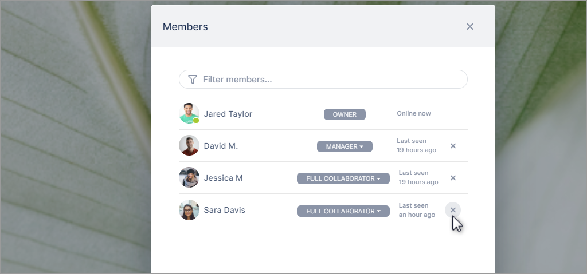
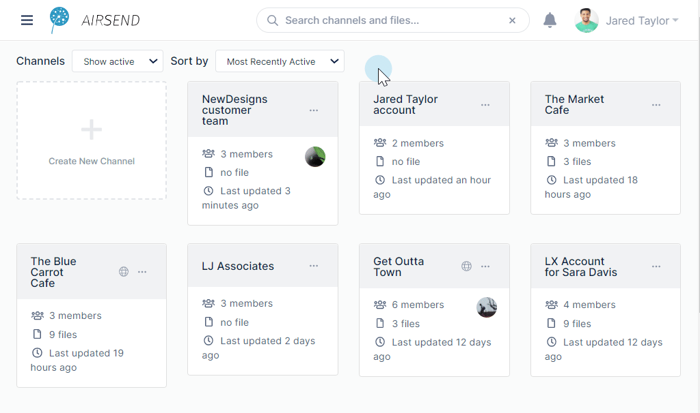

# If you're the owner

If you've created a channel, you're the owner, and initially, you'll take care of adding members and setting up its look and feel. But as you manage your channel, there are maintenance tasks you may want to do, such as promoting and deleting members, closing the channel, or exporting its contents. If for any reason you want to delete the channel, you can do that too.

## Promote Members

You can promote members to give them more privileges in a channel. 

By default, when you add members to channels, they are [full collaborators](/members/member-types). Full collaborators cannot add and remove members from the channel; to give a user that privilege and others, promote them to [manager](/members/member-types) or [admin](/members/member-types). 

To promote a member, click the members icon and change the member's type in the drop-down list:

## Remove members

Owners, admins, and managers can also remove members from a channel.  

## Customize the channel

If you're the owner, manager, or admin in a channel, you can customize it by adding your own logo and background. For help customizing a channel, see [Style and Customization](/customization).

## Close the channel

If you're the owner of a channel, you have the ability to close it. Closing a channel suspends it; it is still present and you can reactivate it, but it only appears when **Channels** is set to **Show closed** or **Show all**.

