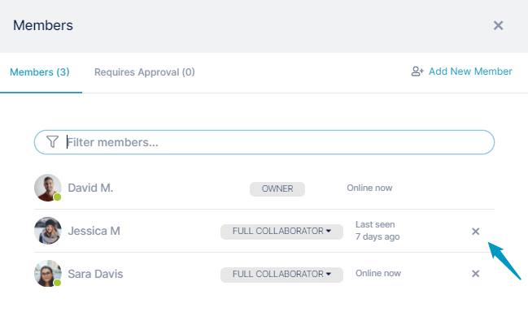

# Removing a member from a channel

You must be an [owner, admin, or manager](/members/member-types) to remove another member from a channel.

**To remove a member from a channel:**

-   In the opened channel, click the Members icon at the top of the channel and click **x** next to the member's name.  
      
    or
-   In the opened channel's chat bar, enter `/kick @username`  
    If you don't want the user to be able to rejoin the channel, enter `/kick @username --ban`  
    
      