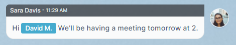
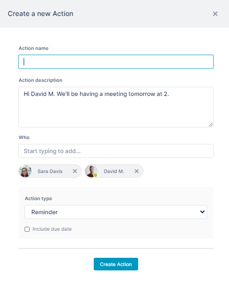
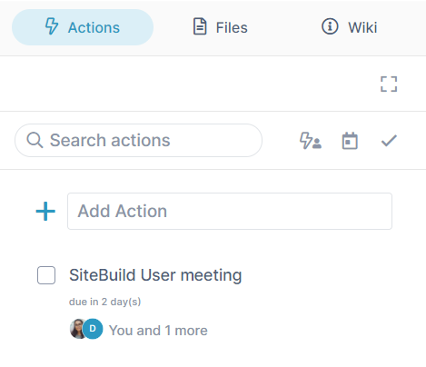
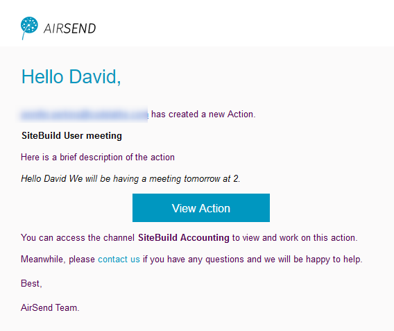

# Creating actions from messages

Since users often post messages that require some type of action, AirSend includes a feature that enables you to turn a message into an action.

For example, Sara might want to create a reminder action for this message about a meeting that she sends to David:  
  

To create an action from a message:

1.  Hover over the area to the left or the right of the message until you see the icons, then click the Action icon, and click **Remind**.  
      
      
      
    A Create a new action dialog box opens.   
    The message is automatically entered into **Action description** and the creator as well as the users mentioned in the message are added to **Who**, but you can edit these values.  
    
2.  Enter an **Action name**. It is the only required field.
3.  Assign additional users to the action by entering their names or emails into **Who.**
4.  Check **Include due date** to display **Due by** and **Time** fields.
5.  Click **Create action**.  
    The action appears in the right panel under actions.  
      
      
    The member assigned to the action receives an email with information about the action and a link for opening it:  
    