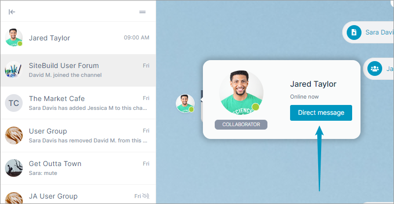
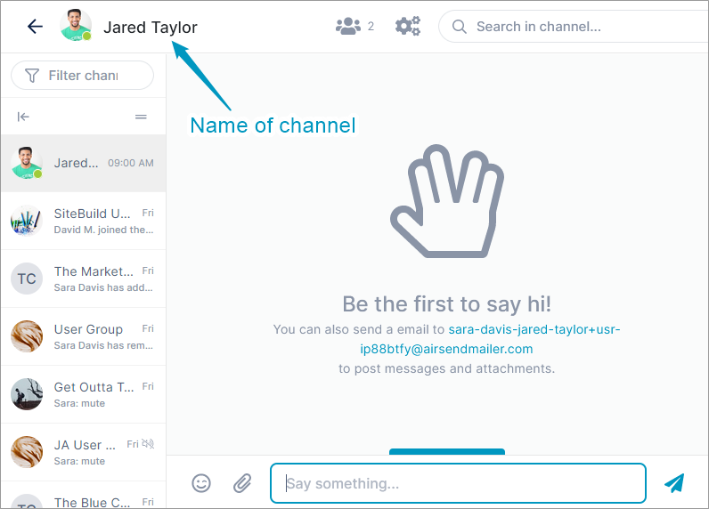

# Direct Messaging

AirSend lets you send a direct message (have a one-on-one conversation) with another user in a channel. When you initiate a direct message, a channel is automatically created that includes you and the other member, and the channel remains active unless you close or delete it later.

To create a direct message:

1.  Open a channel.
2.  Find a message sent by the channel member that you want to send the direct message to.
3.  Hover over the icon for the member, and click **Direct message**.  
      
    A channel with the name of the member is automatically created and opened. The members of the new channel are this member and you.  
    
4.  Use the channel as you use any other channel.  
    The channel remains active unless you [close or delete](/channels/closing-deleting-or-archiving-a-channel) it.  
      
    
    Currently, you cannot leave a direct messaging channel.