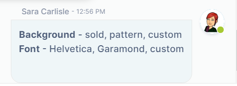

# Formatting message content

You can format the text and other content as you enter messages in a channel using Markdown, a simple formatting language that lets you enhance plain text with styling such as italics, bold print, and bullets. 

In the following example, the message input box includes a list of items preceded by asterisks. In the preview panel the asterisks appeared as bullets, which is how they appear in the actual wiki. You can also use the shortcuts in the text editor's menu bar to insert Markdown.   
 

When the message is sent, the asterisks appear as bullets:

  

There are a number of Markdown formatting symbols that you can use to enhance your messages. The following table shows how to enter Markdown into message text and how the formatted message appears after it is sent.

<table><colgroup><col><col><col></colgroup><tbody><tr><th>Markdown feature</th><th>In message input box</th><th>In sent message</th></tr><tr><td>
<strong>Bullets</strong> Asterisk followed by a space in front of a line is formatted as a bullet. To enter a new line in the message input box, press Shift+Enter.

For each level of bullets, indent 5 spaces.
</td><td>

</td><td>

</td></tr><tr><td>
<strong>Numbered list</strong>

A number followed by a period and then a space in front of a line is formatted as a number in a list. It doesn't matter what numbers you use; Markdown displays the list with increments of 1.

For each level of numbers, indent 5 spaces.

 
</td><td>

</td><td>

</td></tr><tr><td>
<strong>Italics</strong>

When asterisks or underscores precede and follow text without spaces, the text is formatted as italics.&nbsp;
</td><td>

</td><td>

</td></tr><tr><td>
<strong>Bold</strong>

When double-asterisks or double-underscores precede and follow text without spaces, the text is formatted as bold.&nbsp;
</td><td>

</td><td>

</td></tr><tr><td><strong>Headers</strong> When pound signs followed by a space precede a line of text, the text is formatted as a headers. Up to 6 levels of headers are supported. The number of pound signs indicates the level of the header.&nbsp;</td><td>

</td><td>

</td></tr><tr><td>
<strong>Quote</strong>

When a greater than sign precedes text, a vertical bar appears in front of the text and the text is indented to indicate that it is a quote.

To break out of a quote, you must enter Shift + Enter twice after the end of the quote.
</td><td>

</td><td>

</td></tr><tr><td>
<strong>Strikeout</strong>

When double-tildes precede and follow text, the text appears in strikeout format.
</td><td>

 

</td><td>

</td></tr><tr><td>
<strong>Backtick</strong>

When triple backticks surround words within a line , the words appear red.&nbsp;  When triple backticks appear on the lines before and after a block of code, code formatting is applied.&nbsp;
</td><td>

 
</td><td>

</td></tr></tbody></table>