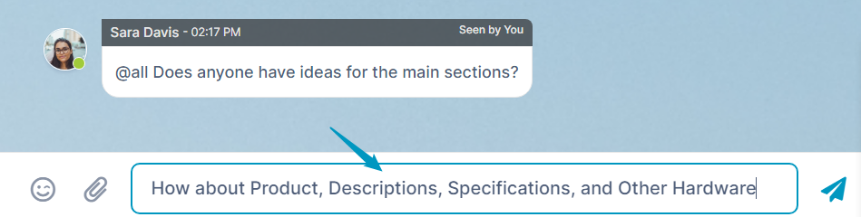
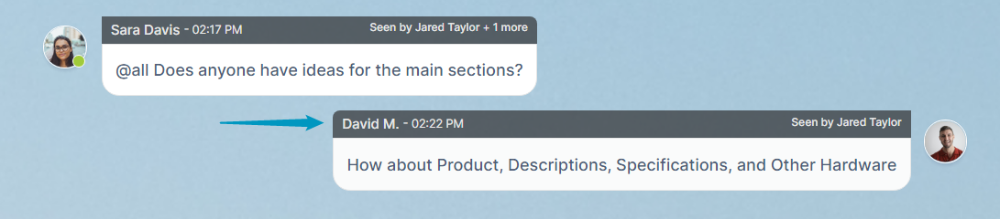
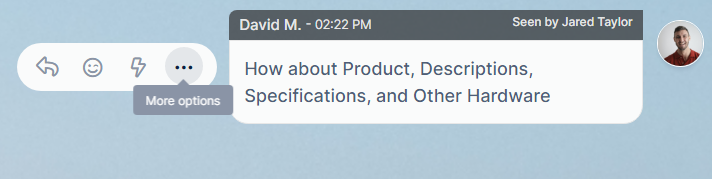

# Messaging inside an AirSend channel

When you send a message in an AirSend channel, all members of the channel can see it. You can alert specific members about a message, but it is always visible to all members. If you want to communicate privately with a member or members of the group, create another channel and only include them as members.

### Send a message in the messaging section

To send a message to all members of an AirSend channel, simply enter the message in the message input box and click enter or the send icon.  

Your message appears on the right side of the messaging section, with your picture or avatar next to it. It is available for everyone in the channel to see. Each message displays the sender, time sent, last user to view, and additional number of viewers in the bar above it.  
  
  

To add a file or image to a message, see [Add a file to a message](/files/add-a-file-to-a-message)

### Act on a message in the messaging section

Once a message appears in the messaging section, you or any member of the channel can hover their cursor over the message to see a set of action icons next to it:

<table><colgroup><col><col></colgroup><tbody><tr><td>

 

</td><td>

<table><thead><tr><th>
Icon
</th><th>
Function
</th></tr></thead><tbody><tr><td>

</td><td>Reply to this message.</td></tr><tr><td>

</td><td>React to this message with an emoji.</td></tr><tr><td>

</td><td>Add an action for this message.</td></tr><tr><td>

</td><td>
Hover your cursor over&nbsp;to access this icon. Opens the message so you can edit it.
</td></tr><tr><td>

</td><td>

Hover your cursor over&nbsp;to access this icon. Delete the message. A note that you have deleted the message remains where it originally appeared.

</td></tr></tbody></table>

</td></tr></tbody></table>

### Add a GIPHY!

AirSend supports adding GIPHYs to your messages. Just copy the link from GIPHY.com and paste it into your message.

