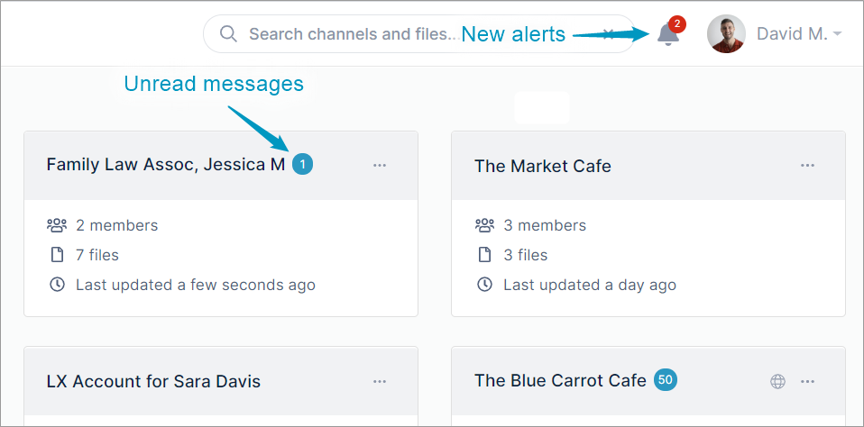
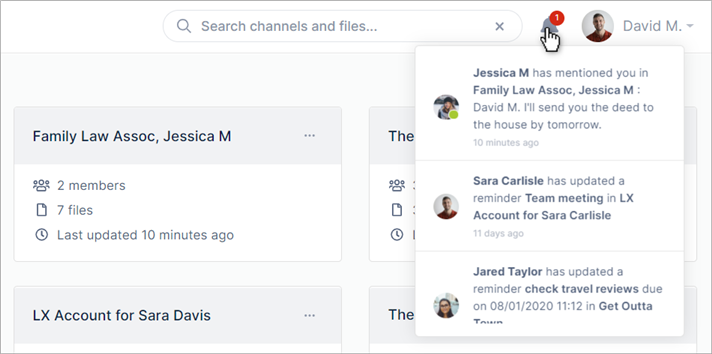
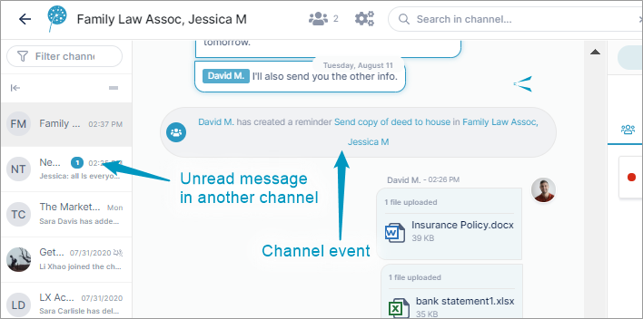
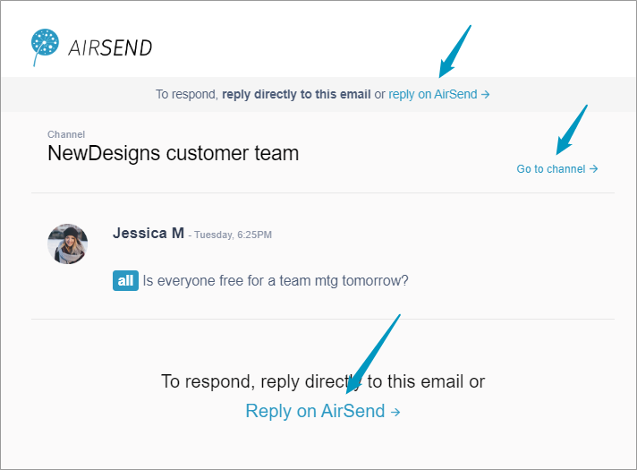

# Notifications in AirSend

AirSend notifications keep you informed about everything happening in your AirSend channels when you're signed into AirSend and when you aren't.

## You know if you have notifications as soon as you sign in

When you log in to AirSend, a notifications icon in the toolbar indicates the number of new alerts you have. Numbers overlaid on a channel tell you how many new messages have been added to the channel since you last checked.  
  

Click the toolbar's notifications icon to see a list of unread and recent notifications:

## AirSend keeps you updated while you're working in a channel

While you're working in a channel, you are kept informed about messages in other channels, channel events, and actions added by all channel members.

## Email notifications

By default, AirSend sends email notifications about channel events and messages to your email account. 

Inside the email notification, there are links that take you to the channel to view the action and respond to the message.

## Turning off notifications

You can turn off or mute notifications for your entire AirSend account or for individual channels. See [Changing notification settings](/using-airsend/changing-notification-settings) for help.